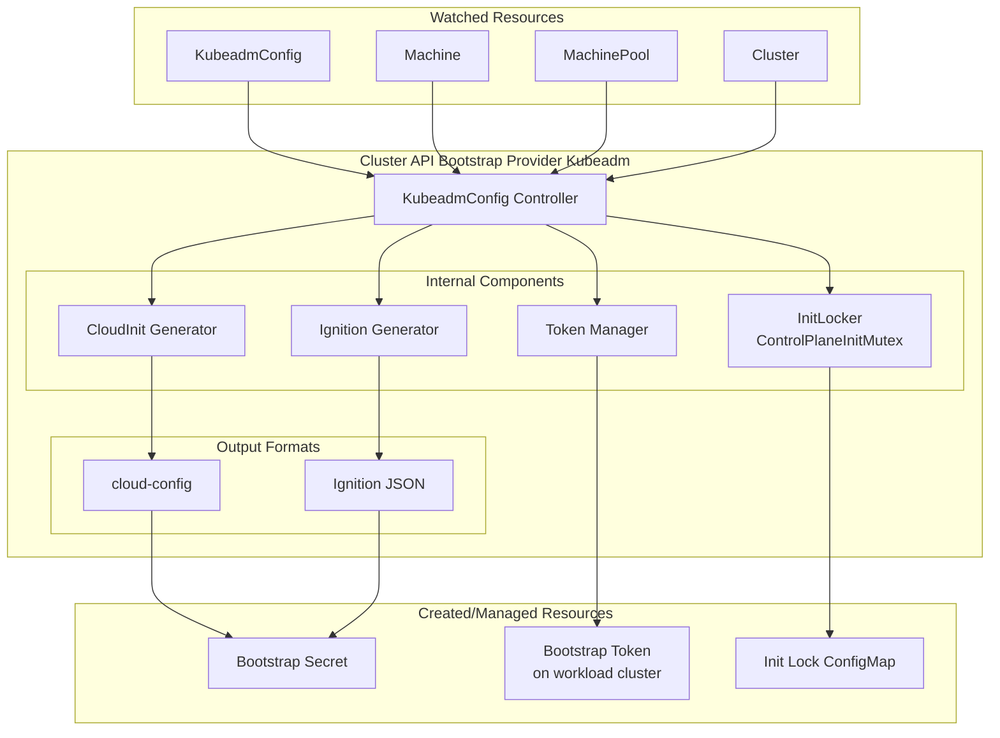
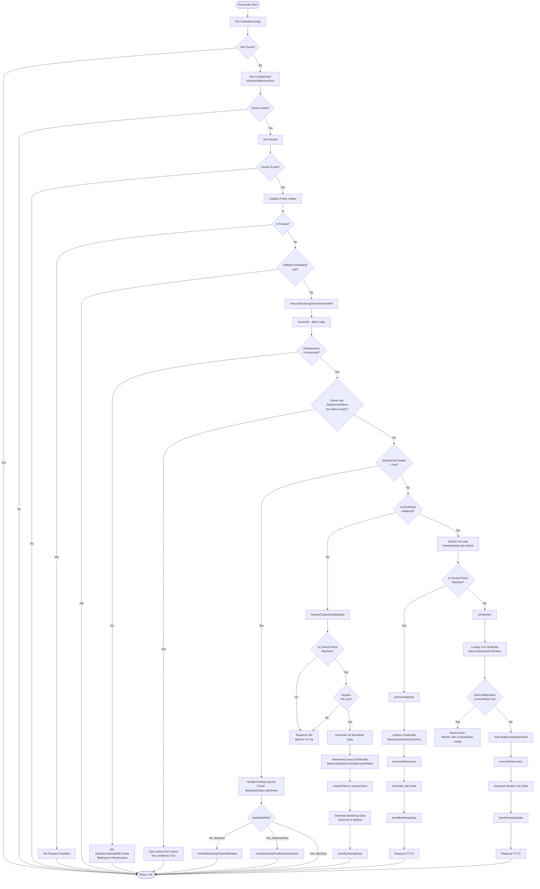
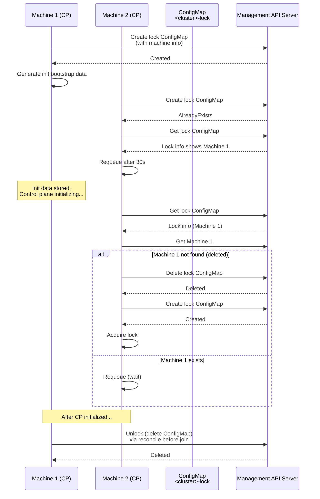
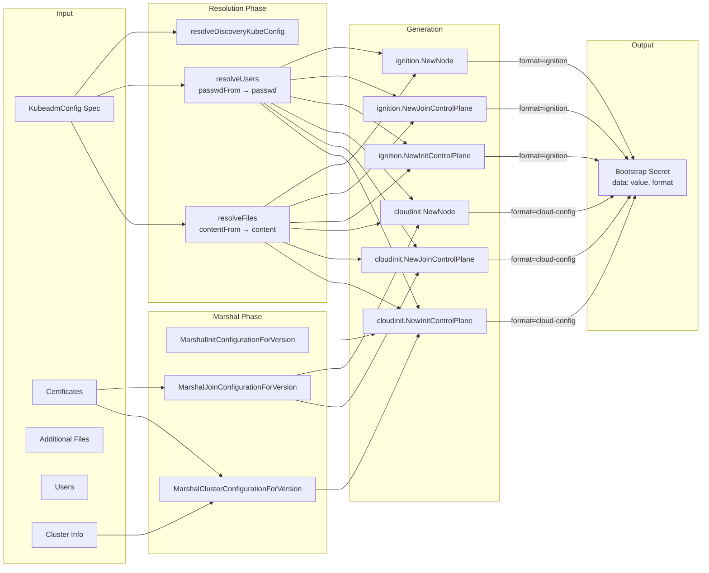
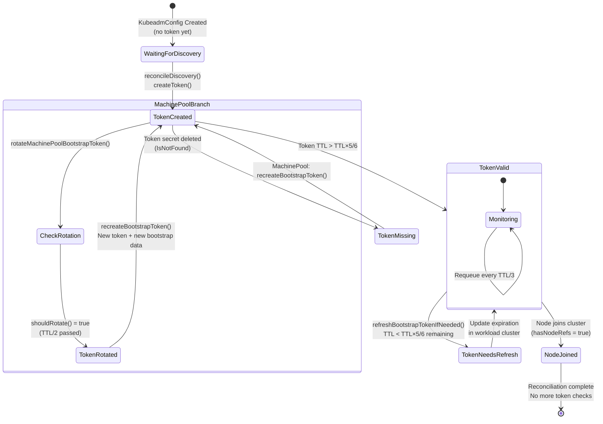

# KubeadmConfig Controller Documentation

## Overview

The **KubeadmConfigReconciler** is responsible for generating bootstrap data (cloud-init or Ignition) for Kubernetes nodes managed by Cluster API. It creates the necessary configuration for kubeadm to either initialize a new control plane (`kubeadm init`) or join existing clusters (`kubeadm join`).

**Source Code:** [kubeadmconfig_controller.go](../../bootstrap/kubeadm/internal/controllers/kubeadmconfig_controller.go)

## Architecture



## Controller Scope

### Watched Resources

| Resource | Watch Type | Purpose |
|:---------|:-----------|:--------|
| `KubeadmConfig` | Primary | Main resource being reconciled |
| `Machine` | Secondary (via `MachineToBootstrapMapFunc`) | Owner of KubeadmConfig for regular machines |
| `MachinePool` | Secondary (via `MachinePoolToBootstrapMapFunc`, feature-gated) | Owner of KubeadmConfig for machine pools |
| `Cluster` | Secondary (via `ClusterToKubeadmConfigs` + `ClusterCache.GetClusterSource`) | Infrastructure readiness and control plane endpoint |

### Owned/Managed Resources

| Resource | Location | Purpose |
|:---------|:---------|:--------|
| `Secret` (bootstrap data) | Management cluster | Stores generated cloud-init/Ignition data |
| `Secret` (bootstrap token) | Workload cluster (`kube-system` namespace) | Kubeadm bootstrap token for node joining |
| `ConfigMap` (init lock) | Management cluster | Mutex for control plane initialization (`<cluster-name>-lock`) |

## Conditions

### V1Beta2 Conditions

| Condition | Description |
|:----------|:------------|
| `Ready` | Summary condition aggregating DataSecretAvailable and CertificatesAvailable. True when all conditions are True. Uses custom merge strategy with reasons `Ready`, `NotReady`, or `ReadyUnknown`. |
| `DataSecretAvailable` | Bootstrap data secret has been created and is available |
| `CertificatesAvailable` | Required certificates for machine bootstrap are available |
| `Paused` | Indicates if reconciliation is paused (set via `paused.EnsurePausedCondition`) |

### Condition Reasons

| Reason | Condition | Description |
|:-------|:----------|:------------|
| `Ready` | Ready | All requirements met, KubeadmConfig is ready |
| `NotReady` | Ready | One or more requirements not met |
| `ReadyUnknown` | Ready | Readiness state is unknown |
| `Available` | DataSecretAvailable | Bootstrap secret created successfully |
| `NotAvailable` | DataSecretAvailable | Waiting for prerequisites (infrastructure, control plane, etc.) |
| `Available` | CertificatesAvailable | Certificates ready for machine bootstrap |
| `InternalError` | CertificatesAvailable | Unexpected failure when reading/generating certificates |

### V1Beta1 Conditions (Deprecated)

| Condition | Reasons |
|:----------|:--------|
| `DataSecretAvailable` | `WaitingForClusterInfrastructure`, `WaitingForControlPlaneAvailable`, `DataSecretGenerationFailed` |
| `CertificatesAvailable` | `CertificatesGenerationFailed`, `CertificatesCorrupted` |

### Condition Setting Pattern

The controller sets both v1beta1 and v1beta2 conditions simultaneously to maintain backward compatibility:
1. V1Beta1 conditions are set using `v1beta1conditions.MarkTrue/MarkFalse`
2. V1Beta2 conditions are set using `conditions.Set` with explicit `metav1.Condition`
3. The defer in `Reconcile` aggregates conditions into summary conditions for both API versions

## Reconciliation Flow



## Kubernetes Reconciler Transition Table (KRTT)

### Pre-Reconciliation Checks

| Observed Status | Desired Spec | Trigger / Condition | Reconciliation Action | Resulting Status |
|:----------------|:-------------|:--------------------|:----------------------|:-----------------|
| No KubeadmConfig | N/A | KubeadmConfig not found | Return early (no-op) | No change |
| KubeadmConfig exists, no owner reference | Spec defined | Owner (Machine/MachinePool) not yet assigned | Return OK, wait for owner reference to be set | No change |
| Owner exists, Cluster not found | Spec defined | Cluster reference resolution fails | Log "Cluster does not exist yet, waiting until it is created", return OK | No change |
| `DeletionTimestamp != nil` | N/A | KubeadmConfig marked for deletion | Return OK immediately (no finalizer logic, relies on garbage collection) | Resource deleted |
| Cluster or KubeadmConfig is paused | Any | `paused.EnsurePausedCondition` returns paused | Set `Paused` condition, return OK | `Paused=True` |

### Initial Control Plane Bootstrap

| Observed Status | Desired Spec | Trigger / Condition | Reconciliation Action | Resulting Status |
|:----------------|:-------------|:--------------------|:----------------------|:-----------------|
| `cluster.status.initialization.infrastructureProvisioned=false` | InitConfiguration defined | Cluster infrastructure not ready | Log "Cluster infrastructure is not ready, waiting", set conditions False with message: "Waiting for Cluster status.infrastructureReady to be true" | `DataSecretAvailable=False`, `Ready=False` |
| `infrastructureProvisioned=true`, `ControlPlaneInitialized=false`, is CP machine | InitConfiguration + ClusterConfiguration | First control plane machine needs init | 1. Acquire init lock (ConfigMap `<cluster>-lock`)<br/>2. Generate/lookup certificates based on ControlPlaneRef:<br/>   - If `Cluster.Spec.ControlPlaneRef` NOT defined: `LookupOrGenerateCached` (standalone CP)<br/>   - If `Cluster.Spec.ControlPlaneRef` defined: `LookupCached` only (KCP manages certs)<br/>3. Resolve files/users from secrets<br/>4. Generate cloud-init/Ignition via `handleClusterNotInitialized`<br/>5. Create bootstrap secret via `storeBootstrapData`<br/>6. Return OK (no requeue for init) | `DataSecretAvailable=True`, `CertificatesAvailable=True`, `Ready=True`, `status.dataSecretName` set, `status.initialization.dataSecretCreated=true` |
| `infrastructureProvisioned=true`, `ControlPlaneInitialized=false`, is CP machine, lock held by another | InitConfiguration | Another CP machine already initializing | Log "A control plane is already being initialized", requeue after 30s | No condition change, requeue |
| `infrastructureProvisioned=true`, `ControlPlaneInitialized=false`, is worker | JoinConfiguration | Worker waiting for CP initialization | Initialize DataSecretAvailable condition if missing, requeue after 30s | `DataSecretAvailable=False` (Message: "Waiting for Cluster control plane to be initialized") |

### Control Plane Join

| Observed Status | Desired Spec | Trigger / Condition | Reconciliation Action | Resulting Status |
|:----------------|:-------------|:--------------------|:----------------------|:-----------------|
| `ControlPlaneInitialized=true`, CP machine, `dataSecretCreated=false` | JoinConfiguration with ControlPlane | CP join triggered via `joinControlplane` | 1. Lookup certificates (`NewControlPlaneJoinCerts` + `EnsureAllExist`)<br/>2. `reconcileDiscovery` (token/CA hashes/endpoint)<br/>3. Generate join cloud-init/Ignition<br/>4. Store secret via `storeBootstrapData`<br/>5. Requeue after `TTL/3` | `DataSecretAvailable=True`, `CertificatesAvailable=True`, `Ready=True`, requeue for token refresh |
| `ControlPlaneInitialized=true`, CP machine, missing `ControlPlaneEndpoint` | JoinConfiguration | Waiting for LB endpoint via `reconcileDiscovery` | Log "Waiting for Cluster Controller to set Cluster.Spec.ControlPlaneEndpoint", requeue after 10s | Unchanged (waiting) |
| `ControlPlaneInitialized=true`, CP machine, certificates lookup fails | JoinConfiguration | Certificates not found or EnsureAllExist fails | Set `CertificatesAvailable=Unknown`, Reason: `InternalError`, return error | `Ready=Unknown`, requeue with backoff |

### Worker Join

| Observed Status | Desired Spec | Trigger / Condition | Reconciliation Action | Resulting Status |
|:----------------|:-------------|:--------------------|:----------------------|:-----------------|
| `ControlPlaneInitialized=true`, worker machine, `dataSecretCreated=false` | JoinConfiguration (no ControlPlane field) | Worker join triggered via `joinWorker` | 1. Lookup CA certificate (`NewCertificatesForWorker` + `EnsureAllExist`)<br/>2. Add `NodeUninitializedTaint` to JoinConfiguration copy (temporary, not persisted to spec)<br/>3. `reconcileDiscovery`<br/>4. Generate join cloud-init/Ignition<br/>5. Store secret via `storeBootstrapData`<br/>6. Requeue for token refresh (`TTL/3`) | `DataSecretAvailable=True`, `CertificatesAvailable=True`, `Ready=True` |
| Worker machine, `JoinConfiguration.ControlPlane` set | Invalid spec | Misconfiguration detected | Return error: "Machine is a Worker, but JoinConfiguration.ControlPlane is set in the KubeadmConfig object" | Error state, requeue with backoff |

### Bootstrap Token Management

Bootstrap tokens are only created/managed when `spec.JoinConfiguration.Discovery.BootstrapToken` is defined. For file-based discovery (`spec.JoinConfiguration.Discovery.File`), no tokens are created.

| Observed Status | Desired Spec | Trigger / Condition | Reconciliation Action | Resulting Status |
|:----------------|:-------------|:--------------------|:----------------------|:-----------------|
| `dataSecretCreated=true`, token exists, node not joined (`!hasNodeRefs`) | JoinConfiguration with BootstrapToken | Periodic token check (`TTL/3` interval) via `refreshBootstrapTokenIfNeeded` | Get token secret from workload cluster, check expiration timestamp | Requeue after `TTL/3` |
| `dataSecretCreated=true`, token expiring (`< TTL×5/6` remaining) | JoinConfiguration | Token near expiration detected | Extend token expiration in workload cluster secret, log refresh | Token TTL extended, requeue after `TTL/3` |
| `dataSecretCreated=true`, MachinePool owner, `hasNodeRefs=true` | JoinConfiguration | Token rotation check via `rotateMachinePoolBootstrapToken` | Call `shouldRotate()`, if true (past `TTL/2`): create new token via `recreateBootstrapToken` | New token, regenerated bootstrap data, requeue after `TTL/3` |
| `dataSecretCreated=true`, MachinePool, token secret missing | JoinConfiguration | Token deleted externally (IsNotFound) | Log "Bootstrap token secret not found", trigger `recreateBootstrapToken` | New token created, bootstrap data regenerated |

### Pivot/Restore Scenarios

| Observed Status | Desired Spec | Trigger / Condition | Reconciliation Action | Resulting Status |
|:----------------|:-------------|:--------------------|:----------------------|:-----------------|
| `status.initialization.dataSecretCreated=false` or `status.dataSecretName=""`, but `configOwner.DataSecretName()` is set | Any | Pivot/backup restore detected (status not preserved) | Sync `status.initialization.dataSecretCreated=true`, `status.dataSecretName` from owner, set all conditions to True | `DataSecretAvailable=True`, `CertificatesAvailable=True`, `Ready=True` |
| `status.initialization.dataSecretCreated=true`, v1beta2 conditions missing | Any | Upgrade to v1beta2 API | Set v1beta2 conditions (DataSecretAvailable, CertificatesAvailable) to True based on existing status | Conditions populated correctly |

### Deletion Handling

| Observed Status | Desired Spec | Trigger / Condition | Reconciliation Action | Resulting Status |
|:----------------|:-------------|:--------------------|:----------------------|:-----------------|
| `DeletionTimestamp != nil` | N/A | KubeadmConfig deletion | Return OK immediately (no finalizer logic, relies on ownerReference garbage collection) | Resource deleted |

### Error Handling

| Observed Status | Desired Spec | Trigger / Condition | Reconciliation Action | Resulting Status |
|:----------------|:-------------|:--------------------|:----------------------|:-----------------|
| Certificate generation fails (initial CP) | InitConfiguration | Crypto error or secret access failure | Set `CertificatesAvailable=Unknown`, Reason: `InternalError`, Message: "Please check controller logs for errors", return error, unlock init lock | Requeue with exponential backoff |
| Certificate lookup fails (join) | JoinConfiguration | Certificates not found or `EnsureAllExist` fails | Set `CertificatesAvailable=Unknown`, Reason: `InternalError`, return error | Requeue with exponential backoff |
| File resolution fails | Files with `contentFrom.secret` | Referenced secret missing or key not found | Set `DataSecretAvailable=False`, Reason: `NotAvailable`, Message: "Failed to read content from secrets for spec.files", return error | Requeue with backoff |
| User password resolution fails | Users with `passwdFrom.secret` | Referenced secret missing or key not found | Set `DataSecretAvailable=False`, Reason: `NotAvailable`, Message: "Failed to read password from secrets for spec.users", return error | Requeue with backoff |
| Bootstrap token creation fails | JoinConfiguration | Workload cluster unreachable or token creation error | Return wrapped error | Requeue with backoff |
| Init lock acquisition fails | InitConfiguration | Concurrent init attempt or ConfigMap creation conflict | Log "Cannot acquire the init lock", requeue after 30s | No condition change |
| Discovery kubeconfig resolution fails | JoinConfiguration.Discovery.File.KubeConfig | Marshal error | Set `DataSecretAvailable=False`, Message: "Failed to create kubeconfig for spec.joinConfiguration.discovery.file", return error | Requeue with backoff |

## Component Details

### InitLocker (ControlPlaneInitMutex)

The init locker ensures only one control plane machine runs `kubeadm init` by using a ConfigMap as a distributed lock in the management cluster.

**Implementation:** [control_plane_init_mutex.go](../../bootstrap/kubeadm/internal/locking/control_plane_init_mutex.go)

**Lock ConfigMap Details:**
- Name: `<cluster-name>-lock`
- Namespace: Same as Cluster
- Contains: JSON with `machineName` identifying the lock holder
- OwnerReference: Set to the Cluster object



### Bootstrap Data Generation

The controller generates bootstrap data in two formats based on `spec.format`:
- **cloud-config** (default): Standard cloud-init format
- **ignition**: CoreOS Ignition JSON format (requires `KubeadmBootstrapFormatIgnition` feature gate)



**Bootstrap Secret Structure:**
- Name: Same as KubeadmConfig name
- Namespace: Same as KubeadmConfig namespace
- Type: `cluster.x-k8s.io/secret`
- Data:
  - `value`: The bootstrap data (cloud-init or Ignition)
  - `format`: Either `cloud-config` or `ignition`
- Labels: `cluster.x-k8s.io/cluster-name: <cluster-name>`
- OwnerReference: KubeadmConfig (controller=true)

### Token Lifecycle

Bootstrap tokens are created on the **workload cluster** in the `kube-system` namespace as Secrets of type `bootstrap.kubernetes.io/token`.

**Token Secret Details:**
- Name: `bootstrap-token-<tokenID>`
- Namespace: `kube-system` (on workload cluster)
- Data includes: token-id, token-secret, expiration, usage flags, extra groups



**Token Refresh vs Rotation:**
- **Refresh** (Machines): Extends the expiration of the existing token without changing the token value
- **Rotation** (MachinePools only): Creates a completely new token and regenerates bootstrap data to enable future scale-ups

## Configuration Options

### Reconciler Configuration

| Field | Type | Default | Description |
|:------|:-----|:--------|:------------|
| `TokenTTL` | `time.Duration` | 15 minutes | Bootstrap token time-to-live |
| `WatchFilterValue` | `string` | "" | Label value for filtering watched resources |

### Token Timing

| Calculation | Formula | Default Value | Purpose |
|:------------|:--------|:--------------|:--------|
| Check interval | `TokenTTL / 3` | 5 minutes | How often to check token status via `tokenCheckRefreshOrRotationInterval()` |
| Skip refresh threshold | `TokenTTL * 5/6` | 12.5 minutes | Don't refresh if this much time remains via `skipTokenRefreshIfExpiringAfter()` |
| Rotation threshold | `TokenTTL / 2` | 7.5 minutes | Rotate MachinePool tokens after this via `shouldRotate()` |

## RBAC Requirements

```yaml
# KubeadmConfig and related resources
- apiGroups: ["bootstrap.cluster.x-k8s.io"]
  resources: ["kubeadmconfigs", "kubeadmconfigs/status", "kubeadmconfigs/finalizers"]
  verbs: ["get", "list", "watch", "create", "update", "patch", "delete"]

# Cluster API core resources
- apiGroups: ["cluster.x-k8s.io"]
  resources: ["clusters", "clusters/status", "machinesets", "machines", "machines/status", "machinepools", "machinepools/status"]
  verbs: ["get", "list", "watch"]

# Secrets and ConfigMaps for bootstrap data and init lock
- apiGroups: [""]
  resources: ["secrets", "configmaps"]
  verbs: ["get", "list", "watch", "create", "update", "patch", "delete"]

# Events for status reporting
- apiGroups: [""]
  resources: ["events"]
  verbs: ["create", "patch"]
```

## Feature Gates

| Feature Gate | Description | Impact |
|:-------------|:------------|:-------|
| `MachinePool` | Enable MachinePool support | Enables watching MachinePool resources and token rotation logic |
| `KubeadmBootstrapFormatIgnition` | Enable Ignition format | Allows `spec.format: ignition` for bootstrap data |

## Key Functions Reference

| Function | Location | Purpose |
|:---------|:---------|:--------|
| `Reconcile` | Controller | Main entry point, orchestrates reconciliation, handles patching in defer. The defer function sets summary conditions (v1beta1 and v1beta2 Ready), patches the object, and only sets ObservedGeneration on successful reconciliation |
| `reconcile` | Controller | Core reconciliation logic after initial checks (infrastructure, pivot, existing secret). Called after pause check and deletion check |
| `handleClusterNotInitialized` | Controller | Handles first CP machine init with locking, generates init bootstrap data |
| `joinControlplane` | Controller | Generates bootstrap data for control plane join (`kubeadm join --control-plane`) |
| `joinWorker` | Controller | Generates bootstrap data for worker node join (`kubeadm join`) |
| `reconcileDiscovery` | Controller | Configures bootstrap token discovery (token, CA hashes, API endpoint). Respects user-provided file discovery config, otherwise auto-generates token |
| `reconcileDiscoveryFile` | Controller | Handles file-based discovery kubeconfig generation. Auto-populates server and CA data from Cluster if not provided |
| `refreshBootstrapTokenIfNeeded` | Controller | Extends token TTL for pending nodes (non-MachinePool) |
| `rotateMachinePoolBootstrapToken` | Controller | Rotates tokens for MachinePool scale-ups |
| `recreateBootstrapToken` | Controller | Creates new token and regenerates bootstrap data |
| `storeBootstrapData` | Controller | Creates/updates bootstrap secret with cloud-init/Ignition data |
| `resolveFiles` | Controller | Resolves file content from secrets (`spec.files[].contentFrom`) |
| `resolveUsers` | Controller | Resolves user passwords from secrets (`spec.users[].passwdFrom`) |
| `ensureBootstrapSecretOwnersRef` | Controller | Ensures KubeadmConfig is the controller owner of bootstrap secret |
| `computeClusterConfigurationAndAdditionalData` | Controller | Computes additional kubeadm config from Cluster/Machine objects |

## Related Resources

- [KubeadmConfig API Types](../../api/bootstrap/kubeadm/v1beta2/kubeadmconfig_types.go)
- [Kubeadm Types & Conditions](../../api/bootstrap/kubeadm/v1beta2/kubeadm_types.go)
- [V1Beta1 Condition Constants](../../api/bootstrap/kubeadm/v1beta2/v1beta1_condition_consts.go)
- [CloudInit Package](../../bootstrap/kubeadm/internal/cloudinit/)
- [Ignition Package](../../bootstrap/kubeadm/internal/ignition/)
- [ConfigOwner Utility](../../bootstrap/util/configowner.go)
- [Init Locking](../../bootstrap/kubeadm/internal/locking/control_plane_init_mutex.go)
- [Token Management](../../bootstrap/kubeadm/internal/controllers/token.go)
- [Kubeadm Types Marshaling](../../bootstrap/kubeadm/types/)
