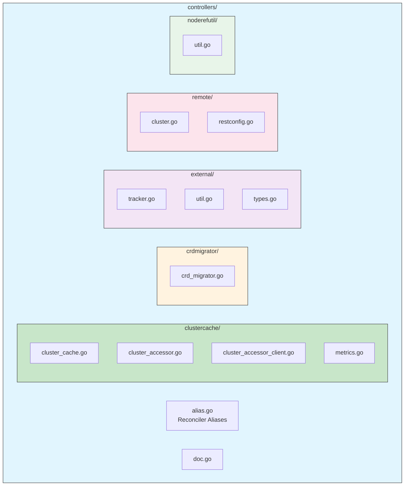
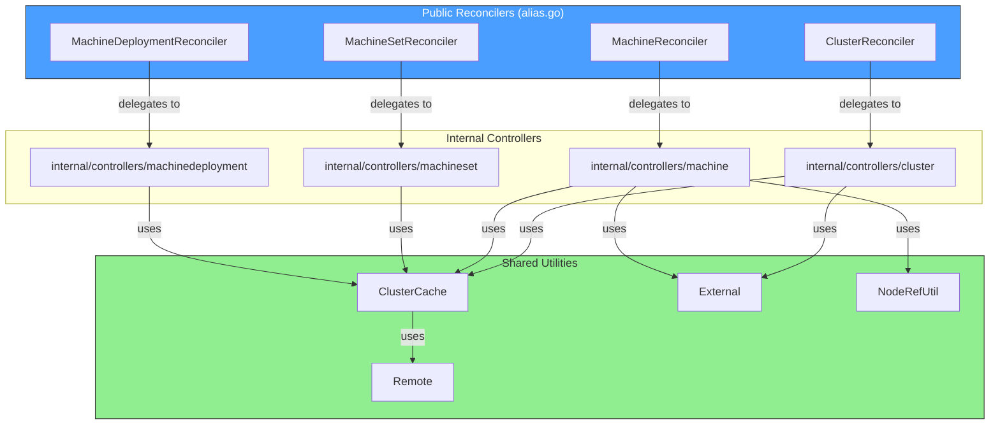

# Controllers Package Documentation

## Overview

The `controllers` package in Cluster API serves as the main entry point for controller reconcilers and shared controller utilities. This package provides:

1. **Reconciler Aliases** - Public wrappers around internal controller implementations
2. **ClusterCache** - Connection management for workload clusters
3. **CRDMigrator** - CRD storage version migration utilities
4. **External** - Utilities for working with external/provider objects
5. **Remote** - Client creation for remote workload clusters
6. **NodeRefUtil** - Node state evaluation utilities

## Package Structure



## Reconciler Aliases

The `alias.go` file provides public types that wrap internal reconciler implementations:

| Reconciler | Resource | Key Fields | Description |
|------------|----------|------------|-------------|
| `ClusterReconciler` | Cluster | Client, APIReader, ClusterCache, WatchFilterValue, RemoteConnectionGracePeriod | Reconciles Cluster objects |
| `MachineReconciler` | Machine | Client, APIReader, ClusterCache, RuntimeClient, WatchFilterValue, RemoteConditionsGracePeriod, AdditionalSyncMachineLabels, AdditionalSyncMachineAnnotations | Reconciles Machine objects, syncs labels/annotations |
| `MachineSetReconciler` | MachineSet | Client, APIReader, ClusterCache, PreflightChecks, WatchFilterValue | Reconciles MachineSet objects, supports preflight checks |
| `MachineDeploymentReconciler` | MachineDeployment | Client, APIReader, RuntimeClient, WatchFilterValue | Reconciles MachineDeployment objects |
| `MachineHealthCheckReconciler` | MachineHealthCheck | Client, ClusterCache, WatchFilterValue | Reconciles MachineHealthCheck objects |
| `ClusterTopologyReconciler` | Cluster (topology) | Client, ClusterCache, APIReader, RuntimeClient, WatchFilterValue | Reconciles managed topology for Clusters |
| `MachineDeploymentTopologyReconciler` | MachineDeployment | Client, APIReader, WatchFilterValue | Handles topology-owned MachineDeployment deletion and template cleanup |
| `MachineSetTopologyReconciler` | MachineSet | Client, APIReader, WatchFilterValue | Handles topology-owned MachineSet deletion and template cleanup |
| `ClusterClassReconciler` | ClusterClass | Client, RuntimeClient, WatchFilterValue | Reconciles ClusterClass objects, exposes `Reconcile()` for testing |
| `ClusterResourceSetReconciler` | ClusterResourceSet | Client, ClusterCache, WatchFilterValue | Reconciles ClusterResourceSet objects. SetupWithManager requires `partialSecretCache` parameter. |
| `ClusterResourceSetBindingReconciler` | ClusterResourceSetBinding | Client, WatchFilterValue | Reconciles ClusterResourceSetBinding objects |
| `MachinePoolReconciler` | MachinePool | Client, APIReader, ClusterCache, WatchFilterValue | Reconciles MachinePool objects |
| `ExtensionConfigReconciler` | ExtensionConfig | Client, APIReader, RuntimeClient, PartialSecretCache, ReadOnly, WatchFilterValue | Reconciles ExtensionConfig objects, supports read-only mode |

### Common Reconciler Fields

Most reconcilers share these common fields (not all reconcilers have all fields):

```go
// Common fields found across multiple reconcilers:
type CommonReconcilerFields struct {
    // Client is a cached client for reading/writing resources
    Client client.Client
    
    // APIReader is a live (non-cached) client for critical reads
    // (avoids race conditions from stale cache)
    // Used to list resources directly via the API server
    APIReader client.Reader
    
    // ClusterCache provides cached connections to workload clusters
    // Not all reconcilers need workload cluster access
    ClusterCache clustercache.ClusterCache
    
    // RuntimeClient is used for calling runtime extensions
    // Only present on reconcilers that use runtime hooks
    RuntimeClient runtimeclient.Client
    
    // WatchFilterValue filters resources by label before reconciliation
    // Used with predicates.ResourceHasFilterLabel
    WatchFilterValue string
}
```

## Sub-packages

### [ClusterCache](clustercache-controller.md)

Manages cached connections to workload clusters including:
- Cached and uncached clients
- REST configurations
- Health probing
- Watch management

### [CRDMigrator](crdmigrator-controller.md)

Handles CRD migrations during upgrades:
- Storage version migration
- ManagedFields cleanup

### [External](external-package.md)

Utilities for working with external/provider objects:
- Dynamic object tracking
- Template cloning
- Object status helpers

### [Remote](remote-package.md)

Client creation for remote workload clusters:
- REST configuration
- Client creation
- User-Agent management

### [NodeRefUtil](noderefutil-package.md)

Node state evaluation utilities:
- Node readiness checks
- Node availability checks
- Node reachability checks

## Component Interaction



## Setup Pattern

All reconcilers follow a consistent setup pattern:

```go
func (r *ReconcilerType) SetupWithManager(ctx context.Context, mgr ctrl.Manager, options controller.Options) error {
    return (&internalReconciler{
        Client:           r.Client,
        APIReader:        r.APIReader,
        ClusterCache:     r.ClusterCache,
        WatchFilterValue: r.WatchFilterValue,
        // ... other fields
    }).SetupWithManager(ctx, mgr, options)
}
```

### Special Setup Notes

| Reconciler | Special Setup Requirements |
|------------|---------------------------|
| `ClusterResourceSetReconciler` | `SetupWithManager()` requires an additional `partialSecretCache cache.Cache` parameter for partial secret caching |
| `ClusterClassReconciler` | Exposes `Reconcile(ctx, req)` method for testing ClusterClass reconciliation directly |
| `ExtensionConfigReconciler` | Supports `ReadOnly` mode and requires `PartialSecretCache` for extension secrets |

## Reconciler Kubernetes Reconciler Transition Table (KRTT) Overview

Since the main reconciler logic lives in `internal/controllers/`, the KRTT tables for each reconciler should be documented in those internal packages. The alias types in this package only delegate to internal implementations.

### Common Reconciler Patterns

| Pattern | Description | Example Reconcilers |
|---------|-------------|---------------------|
| **Cluster-scoped with ClusterCache** | Reconcilers that interact with workload clusters | `ClusterReconciler`, `MachineReconciler`, `MachineHealthCheckReconciler` |
| **Topology-aware** | Reconcilers that manage cluster topology and template cleanup | `ClusterTopologyReconciler`, `MachineDeploymentTopologyReconciler`, `MachineSetTopologyReconciler` |
| **Resource Management** | Reconcilers that manage Kubernetes resources on workload clusters | `ClusterResourceSetReconciler`, `ClusterResourceSetBindingReconciler` |
| **Runtime Extensions** | Reconcilers that interact with runtime extensions | `ExtensionConfigReconciler`, `ClusterClassReconciler` |

### KRTT for Alias Reconciler Setup

| Observed Status | Desired Spec | Trigger / Condition | Reconciliation Action | Resulting Status |
|:----------------|:-------------|:--------------------|:----------------------|:-----------------|
| Controller not set up | Reconciler configured | `SetupWithManager()` called | Create internal reconciler, delegate `SetupWithManager()` | Controller registered with manager |
| Missing required fields | Reconciler configured | `SetupWithManager()` called with nil fields | Return error or panic (depends on internal implementation) | Setup failed |
| Manager starting | Reconciler set up | Manager `Start()` called | Internal reconciler begins watching resources | Reconciler running |

## Usage Example

```go
package main

import (
    "context"
    "time"
    
    ctrl "sigs.k8s.io/controller-runtime"
    "sigs.k8s.io/controller-runtime/pkg/controller"
    
    "sigs.k8s.io/cluster-api/controllers"
    "sigs.k8s.io/cluster-api/controllers/clustercache"
    "sigs.k8s.io/cluster-api/controllers/remote"
)

func main() {
    ctx := context.Background()
    mgr, _ := ctrl.NewManager(cfg, ctrl.Options{})
    
    // Setup ClusterCache (returns ClusterCache interface)
    clusterCache, _ := clustercache.SetupWithManager(ctx, mgr, clustercache.Options{
        SecretClient:     secretClient,
        WatchFilterValue: "",
        Client: clustercache.ClientOptions{
            Timeout:   10 * time.Second,
            QPS:       20,
            Burst:     30,
            UserAgent: remote.DefaultClusterAPIUserAgent("cluster-api-controller"),
        },
    }, controller.Options{})
    
    // Setup Cluster Reconciler
    clusterReconciler := &controllers.ClusterReconciler{
        Client:                      mgr.GetClient(),
        APIReader:                   mgr.GetAPIReader(),
        ClusterCache:                clusterCache,
        RemoteConnectionGracePeriod: 10 * time.Minute,
    }
    _ = clusterReconciler.SetupWithManager(ctx, mgr, controller.Options{})
    
    // Setup Machine Reconciler (requires RuntimeClient)
    machineReconciler := &controllers.MachineReconciler{
        Client:        mgr.GetClient(),
        APIReader:     mgr.GetAPIReader(),
        ClusterCache:  clusterCache,
        RuntimeClient: runtimeClient, // from exp/runtime/client
    }
    _ = machineReconciler.SetupWithManager(ctx, mgr, controller.Options{})
    
    // ... setup other reconcilers
    
    mgr.Start(ctx)
}
```

## Documentation Index

| Document | Description | Key KRTT Tables |
|----------|-------------|-----------------|
| [clustercache-controller.md](clustercache-controller.md) | ClusterCache controller and workload cluster connection management | Reconcile, Connect/Disconnect, Health Checking, Watch Management |
| [crdmigrator-controller.md](crdmigrator-controller.md) | CRD migration controller for storage version and managedFields | Main Reconcile, Storage Version Migration, ManagedFields Cleanup |
| [external-package.md](external-package.md) | External object utilities for provider resources | ObjectTracker Watch, External Object Operations |
| [remote-package.md](remote-package.md) | Remote cluster client creation utilities | NewClusterClient, RESTConfig |
| [noderefutil-package.md](noderefutil-package.md) | Node state evaluation utilities | Node State Evaluation, Node Availability |

## KRTT Summary

Each sub-package documentation contains detailed Kubernetes Reconciler Transition Tables (KRTT) that document:

1. **Observed Status** - Current state of the resource
2. **Desired Spec** - Intended state from the specification
3. **Trigger / Condition** - What triggers the reconciliation
4. **Reconciliation Action** - Idempotent action taken
5. **Resulting Status** - Updated status after action

See individual package documentation for complete KRTT tables.
