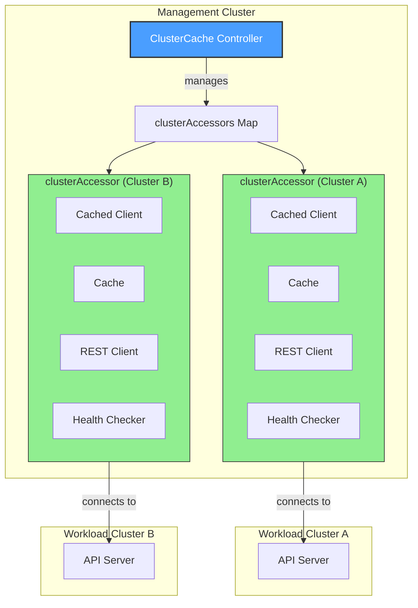
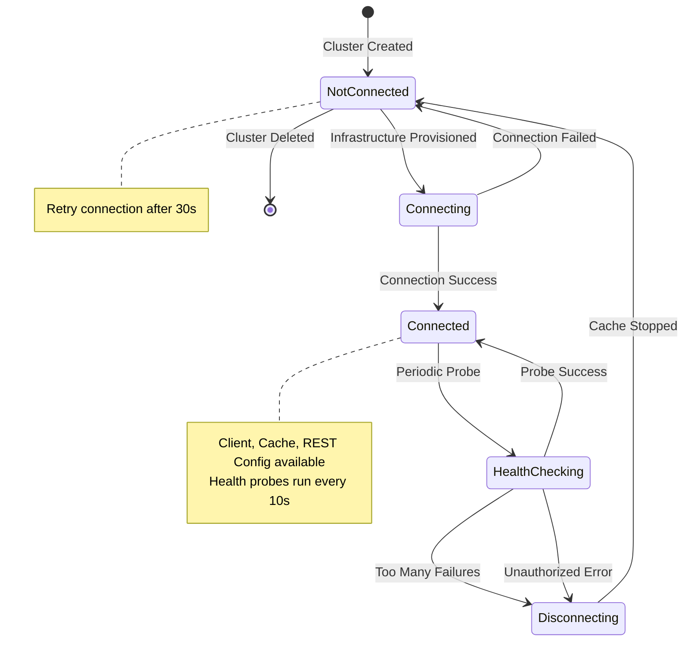
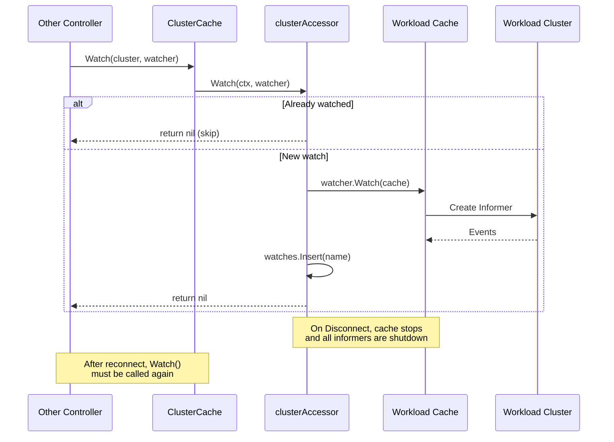
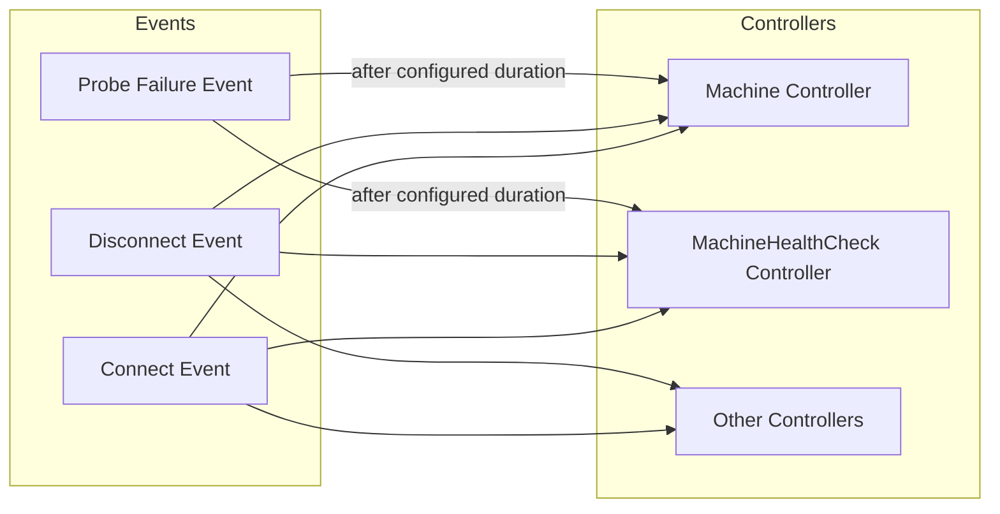

# ClusterCache Controller

## Overview

The **ClusterCache** is a core infrastructure component in Cluster API that manages cached connections to workload clusters. It provides cached clients, caches, and REST configurations for communicating with workload clusters efficiently. The ClusterCache reconciles Cluster objects and maintains `clusterAccessor` instances that handle the lifecycle of connections to each workload cluster.

## Architecture



## Key Components

### ClusterCache Interface

The `ClusterCache` interface provides methods for:

| Method | Description |
|--------|-------------|
| `GetClient()` | Returns a cached client for a workload cluster |
| `GetReader()` | Returns a cached read-only client |
| `GetUncachedClient()` | Returns a live (uncached) client |
| `GetRESTConfig()` | Returns REST configuration for a cluster |
| `GetClientCertificatePrivateKey()` | ⚠️ **Deprecated** - Returns a cached RSA private key for client certificates (will be removed) |
| `Watch()` | Establishes watches on workload cluster resources |
| `GetHealthCheckingState()` | Returns `HealthCheckingState` with `LastProbeTime`, `LastProbeSuccessTime`, `ConsecutiveFailures` |
| `GetClusterSource()` | Returns a `source.Source` for Cluster connect/disconnect events |

### clusterAccessor

Each `clusterAccessor` manages the connection to a single workload cluster:

- **Connection State**: REST config, cached client, uncached client, cache
- **Health Checking State**: Last probe time, success time, consecutive failures
- **Watches**: Tracks informers/watches added to the cache

## Connection Lifecycle



## Kubernetes Reconciler Transition Table (KRTT)

### ClusterCache Reconciler

| Observed Status | Desired Spec | Trigger / Condition | Reconciliation Action | Resulting Status |
|:----------------|:-------------|:--------------------|:----------------------|:-----------------|
| No clusterAccessor exists | Cluster exists | Cluster object created/updated | `getOrCreateClusterAccessor()` creates entry in map | clusterAccessor created (not connected) |
| `Status.Initialization.InfrastructureProvisioned=false` | Cluster exists | Reconcile triggered | Skip connection attempt, no requeue (wait for status update) | No change, wait for infra |
| Not connected, no recent error | `Status.Initialization.InfrastructureProvisioned=true` | Reconcile triggered | Call `accessor.Connect()` to create client/cache | Connected=true, `lastProbeSuccessTime=now`, `consecutiveFailures=0` |
| Not connected, recent error | `Status.Initialization.InfrastructureProvisioned=true` | Reconcile within `ConnectionCreationRetryInterval` (30s) | Skip connection, requeue after remaining interval | No change, requeue with remaining duration |
| Connected | `InfrastructureProvisioned=true` | Health probe interval elapsed | Execute `HealthCheck()` - GET "/" on apiserver | LastProbeTime updated, consecutiveFailures=0 |
| Connected, probe failed | `InfrastructureProvisioned=true` | Health probe returned error | Increment consecutiveFailures | consecutiveFailures++, requeue for next probe |
| Connected, `consecutiveFailures >= 5` | `InfrastructureProvisioned=true` | FailureThreshold exceeded | Call `Disconnect()`, stop cache | Connected=false, requeue for reconnect |
| Connected | `InfrastructureProvisioned=true` | Unauthorized error from probe | Immediate `Disconnect()` (kubeconfig rotated) | Connected=false, immediate requeue |
| clusterAccessor exists | Cluster deleted | `DeletionTimestamp != nil` | Call `Disconnect()`, delete from map, cleanup sources | clusterAccessor removed |

### clusterAccessor Connect/Disconnect

| Observed Status | Desired Spec | Trigger / Condition | Reconciliation Action | Resulting Status |
|:----------------|:-------------|:--------------------|:----------------------|:-----------------|
| `connection=nil` | Connect requested | `Connect()` called | Create REST config from kubeconfig secret | REST config created |
| REST config ready | Connect requested | Connection creation | Create cached client, uncached client, start cache | Clients and cache ready |
| Cache starting | Connect requested | Cache.Start() called | Wait for cache to sync (`InitialSyncTimeout`: 5 minutes) | Cache synced, informers ready |
| All components ready | Connect requested | Successful creation | Generate client cert private key (if needed) | `connection` populated, `lastProbeSuccessTime=now` |
| Connection creation failed | Connect requested | Any error during creation | Set `lastConnectionCreationErrorTime`, increment failures | `connection=nil`, error returned |
| `connection!=nil` | Disconnect requested | `Disconnect()` called | Stop cache (stops all informers) | `connection=nil`, cache stopped |

### Health Checking

| Observed Status | Desired Spec | Trigger / Condition | Reconciliation Action | Resulting Status |
|:----------------|:-------------|:--------------------|:----------------------|:-----------------|
| `lastProbeTime` > interval ago | Connected | `HealthCheck()` called | Execute `GET /` against apiserver with 5s timeout | `lastProbeTime=now` |
| Probe succeeded | Connected | 200 OK response | Reset failures, update success time | `consecutiveFailures=0`, `lastProbeSuccessTime=now` |
| Probe failed (non-auth) | Connected | Non-2xx or timeout | Increment failure counter | `consecutiveFailures++` |
| Probe failed (unauthorized) | Connected | 401 Unauthorized | Signal immediate disconnect | `unauthorizedErrorOccurred=true` |
| `consecutiveFailures >= 5` | Connected | Threshold exceeded | Signal disconnect needed | `tooManyConsecutiveFailures=true` |

## Watch Management



## Configuration Options

### CacheOptions

| Option | Description | Default |
|--------|-------------|---------|
| `SyncPeriod` | Sync period for the cache | None |
| `ByObject` | Per-GVK cache restrictions | None |
| `Indexes` | Cache indexes to add | None |

### ClientOptions

| Option | Description | Default |
|--------|-------------|---------|
| `Timeout` | REST client timeout | 10s |
| `QPS` | Max queries per second | 20 |
| `Burst` | Max burst queries | 30 |
| `UserAgent` | HTTP user agent | Required |
| `Cache.DisableFor` | Objects to never cache | None |

### HealthProbe Configuration (Internal Defaults)

These values are configured internally in `buildClusterAccessorConfig()`:

| Option | Description | Default |
|--------|-------------|---------|
| `Timeout` | Health probe HTTP timeout | 5 seconds |
| `Interval` | Time between health probes | 10 seconds |
| `FailureThreshold` | Consecutive failures before disconnect | 5 |
| `ConnectionCreationRetryInterval` | Retry interval after connection failure | 30 seconds |

## Cluster Source Events

The ClusterCache can send events to controllers watching for cluster connectivity changes:



## Error Handling

| Error Type | Behavior | Requeue Strategy |
|------------|----------|------------------|
| `ErrClusterNotConnected` | Returned when cluster has no active connection | Caller should handle gracefully |
| Connection creation failed | Set error time, increment failures | Requeue after 30s |
| Health probe failed | Increment consecutive failures | Requeue after 10s |
| Unauthorized error | Immediate disconnect | Immediate requeue |
| Cluster not found (GET) | Log and return without requeue | No requeue |

## Thread Safety

The ClusterCache uses careful locking to ensure thread safety without blocking reconcilers:

- **clusterAccessorsLock**: RWMutex for accessing the `clusterAccessors` map
- **clusterSourcesLock**: RWMutex for cluster event sources  
- **lockedStateLock** (per accessor): RWMutex for connection state in `clusterAccessorLockedState`

**Critical Design Decision**: Connection creation (`Connect()`) is intentionally done WITHOUT holding a lock to avoid blocking other reconcilers that call `GetClient()`. The lock is only acquired after connection creation succeeds or fails to update the state.

**Locking Pattern** (from code comments):
```go
// lockedStateLock should never be held for an extended period of time
// (e.g. during connection creation) to ensure regular controllers are
// not blocked when calling e.g. GetClient().
```

## Metrics

| Metric | Type | Labels | Description |
|--------|------|--------|-------------|
| `capi_cluster_cache_connection_up` | Gauge | cluster_name, cluster_namespace | 1 if connected, 0 if not |
| `capi_cluster_cache_healthcheck` | Gauge | cluster_name, cluster_namespace | 1 if last probe succeeded, 0 if not |
| `capi_cluster_cache_healthchecks_total` | Counter | cluster_name, cluster_namespace, status | Total health checks by result (status: success/error) |

## Usage Example

```go
// Setup ClusterCache with manager
clusterCache, err := clustercache.SetupWithManager(ctx, mgr, clustercache.Options{
    SecretClient:     secretCachingClient,
    WatchFilterValue: watchFilterValue,
    Client: clustercache.ClientOptions{
        Timeout:   10 * time.Second,
        QPS:       20,
        Burst:     30,
        UserAgent: remote.DefaultClusterAPIUserAgent("controller-name"),
    },
}, controller.Options{})

// Get client for workload cluster
client, err := clusterCache.GetClient(ctx, client.ObjectKey{
    Namespace: "default",
    Name:      "my-cluster",
})
if errors.Is(err, clustercache.ErrClusterNotConnected) {
    // Handle not connected case
    return ctrl.Result{}, nil
}

// Add watch on workload cluster
err = clusterCache.Watch(ctx, clusterKey, clustercache.NewWatcher(clustercache.WatcherOptions{
    Name:         "machine-node-watcher",
    Watcher:      r,
    Kind:         &corev1.Node{},
    EventHandler: handler.EnqueueRequestsFromMapFunc(r.nodeToMachine),
}))
```
