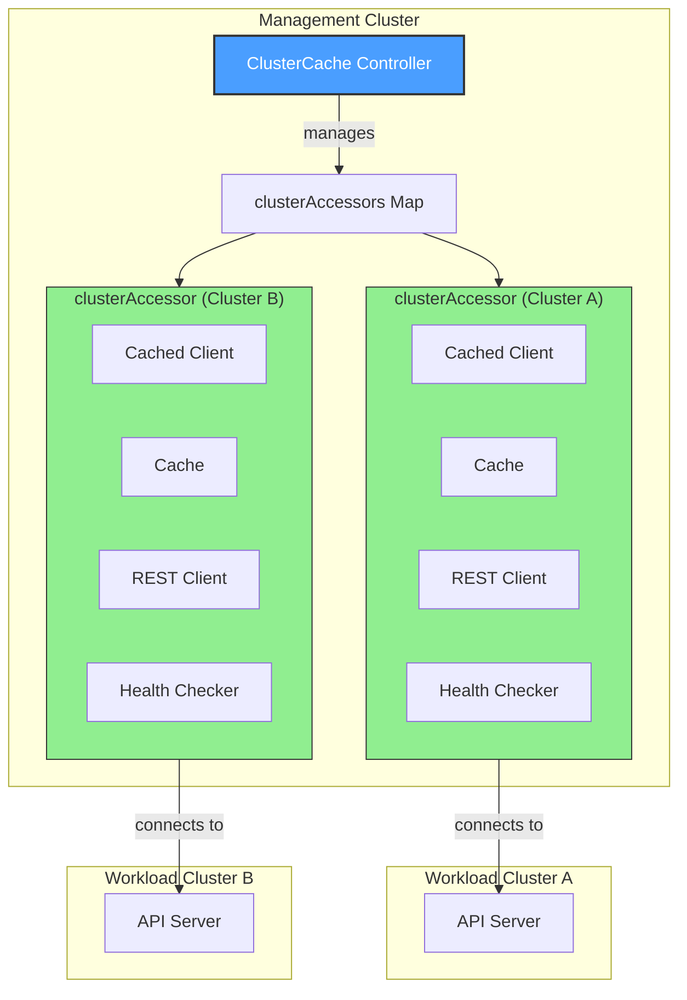
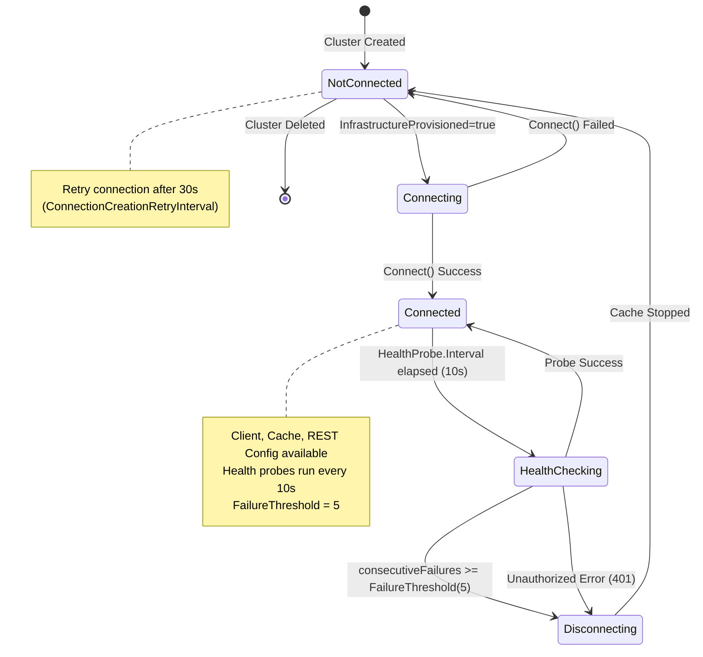
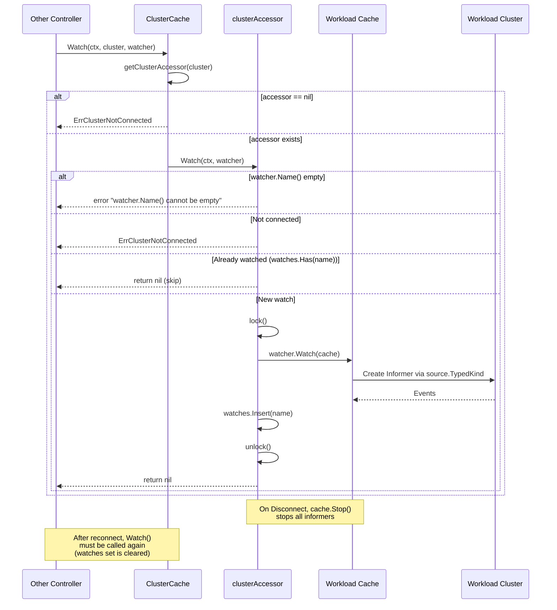
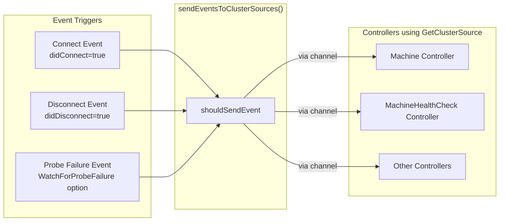

# ClusterCache Controller

## Overview

The **ClusterCache** is a core infrastructure component in Cluster API that manages cached connections to workload clusters. It provides cached clients, caches, and REST configurations for communicating with workload clusters efficiently. The ClusterCache reconciles Cluster objects and maintains `clusterAccessor` instances that handle the lifecycle of connections to each workload cluster.

## Architecture



## Key Components

### ClusterCache Interface

The `ClusterCache` interface provides methods for:

| Method | Description |
|--------|-------------|
| `GetClient(ctx, cluster)` | Returns a cached client for a workload cluster |
| `GetReader(ctx, cluster)` | Returns a cached read-only client (returns the cachedClient) |
| `GetUncachedClient(ctx, cluster)` | Returns a live (uncached) client for direct API calls |
| `GetRESTConfig(ctx, cluster)` | Returns REST configuration for a cluster |
| `GetClientCertificatePrivateKey(ctx, cluster)` | ⚠️ **Deprecated** - Returns a cached RSA private key for client certificates (will be removed as it's outside scope of ClusterCache) |
| `Watch(ctx, cluster, watcher)` | Establishes watches on workload cluster resources. Each unique watch (by `watcher.Name()`) is only added once after Connect |
| `GetHealthCheckingState(ctx, cluster)` | Returns `HealthCheckingState` with `LastProbeTime`, `LastProbeSuccessTime`, `ConsecutiveFailures` |
| `GetClusterSource(controllerName, mapFunc, opts...)` | Returns a `source.Source` for Cluster connect/disconnect events. Supports `WatchForProbeFailure(time.Duration)` option |

### clusterAccessor

Each `clusterAccessor` manages the connection to a single workload cluster:

- **Connection State**: REST config, cached client, uncached client, cache
- **Health Checking State**: Last probe time, success time, consecutive failures
- **Watches**: Tracks informers/watches added to the cache

## Connection Lifecycle



## Kubernetes Reconciler Transition Table (KRTT)

### ClusterCache Reconciler

| Observed Status | Desired Spec | Trigger / Condition | Reconciliation Action | Resulting Status |
|:----------------|:-------------|:--------------------|:----------------------|:-----------------|
| No clusterAccessor exists | Cluster exists | Cluster object created/updated | `getOrCreateClusterAccessor()` creates entry in map | clusterAccessor created (not connected) |
| Cluster not found | N/A | `client.Get()` returns NotFound | Call `Disconnect()`, `deleteClusterAccessor()`, `cleanupClusterSourcesForCluster()` | clusterAccessor removed |
| `Status.Initialization.InfrastructureProvisioned=false` | Cluster exists | Reconcile triggered | Skip connection attempt, no requeue (wait for status update) | No change, wait for infra |
| Not connected, no recent error | `Status.Initialization.InfrastructureProvisioned=true` | Reconcile triggered | Call `accessor.Connect()` to create client/cache | Connected=true, `lastProbeSuccessTime=now`, `consecutiveFailures=0` |
| Not connected, recent error | `Status.Initialization.InfrastructureProvisioned=true` | Reconcile within `ConnectionCreationRetryInterval` (30s) | Skip connection via `shouldRequeue()`, requeue after remaining interval | No change, requeue with remaining duration |
| Connect failed | `InfrastructureProvisioned=true` | `Connect()` returns error | Set `lastConnectionCreationErrorTime=now`, increment consecutiveFailures | connected=false, requeue after 30s |
| Connected | `InfrastructureProvisioned=true` | Health probe interval (10s) elapsed | Execute `HealthCheck()` - GET "/" on apiserver with 5s timeout | `lastProbeTime` updated |
| Connected, probe succeeded | `InfrastructureProvisioned=true` | Health probe returned success | Reset failures, update success time | `consecutiveFailures=0`, `lastProbeSuccessTime=now`, requeue after 10s |
| Connected, probe failed | `InfrastructureProvisioned=true` | Health probe returned non-auth error | Increment consecutiveFailures | `consecutiveFailures++`, requeue for next probe |
| Connected, `consecutiveFailures >= 5` | `InfrastructureProvisioned=true` | FailureThreshold exceeded | Call `Disconnect()`, stop cache | Connected=false, requeue after 30s (ConnectionCreationRetryInterval) |
| Connected | `InfrastructureProvisioned=true` | Unauthorized (401) error from probe | Immediate `Disconnect()` (kubeconfig rotated) | Connected=false, immediate requeue (1ms) |
| Reconcile complete | N/A | After all phases | `sendEventsToClusterSources()` for connect/disconnect events | Events sent to registered sources |
| clusterAccessor exists | Cluster deleted | `DeletionTimestamp != nil` (via NotFound) | Call `Disconnect()`, `deleteClusterAccessor()`, `cleanupClusterSourcesForCluster()` | clusterAccessor removed |

### clusterAccessor Connect/Disconnect

| Observed Status | Desired Spec | Trigger / Condition | Reconciliation Action | Resulting Status |
|:----------------|:-------------|:--------------------|:----------------------|:-----------------|
| `connection=nil` | Connect requested | `Connect()` called, not already connected | Create REST config from kubeconfig secret via `createConnection()` | REST config, clients, cache created |
| REST config ready | Connect requested | `createConnection()` succeeds | Create cachedClient, uncachedClient, start stoppableCache | Clients and cache ready |
| Cache starting | Connect requested | Cache.Start() called | Wait for cache to sync (`InitialSyncTimeout`: 5 minutes) | Cache synced, informers ready |
| All components ready | Connect requested | First successful connect | Generate `clientCertificatePrivateKey` (if not disabled and not already generated) | `connection` populated, `lastProbeSuccessTime=now`, `consecutiveFailures=0` |
| Connection creation failed | Connect requested | Any error during `createConnection()` | Set `lastConnectionCreationErrorTime=now`, increment `consecutiveFailures`, set `lastProbeTime=now` | `connection=nil`, metrics updated (`connectionUp=0`), error returned |
| `connection!=nil` | Disconnect requested | `Disconnect()` called | Stop cache via `cache.Stop()` (non-blocking, stops all informers) | `connection=nil`, cache stopped, metrics updated (`connectionUp=0`) |
| Already connected | Connect requested | `Connect()` called when already connected | Skip with log "Skipping connect, already connected" | No change |
| Already disconnected | Disconnect requested | `Disconnect()` called when not connected | Skip with log "Skipping disconnect, already disconnected" | No change |

### Health Checking

| Observed Status | Desired Spec | Trigger / Condition | Reconciliation Action | Resulting Status |
|:----------------|:-------------|:--------------------|:----------------------|:-----------------|
| Not connected | N/A | `HealthCheck()` called | Skip with log "Skipping health check, not connected", return `(false, false)` | No change |
| `lastProbeTime` > interval ago | Connected | `HealthCheck()` called | Execute `GET /` against apiserver via `restClient.Get().AbsPath("/").Timeout(5s).DoRaw(ctx)` | `lastProbeTime=now` |
| Probe succeeded | Connected | 200 OK response | Reset failures, update success time, update metrics | `consecutiveFailures=0`, `lastProbeSuccessTime=now`, `healthCheck=1`, `healthChecksTotal{status=success}++` |
| Probe failed (non-auth) | Connected | Non-2xx or timeout | Increment failure counter, log with threshold info, update metrics | `consecutiveFailures++`, `healthCheck=0`, `healthChecksTotal{status=error}++` |
| Probe failed (unauthorized) | Connected | 401 Unauthorized via `apierrors.IsUnauthorized()` | Signal immediate disconnect, increment failures | `consecutiveFailures++`, returns `(tooManyConsecutiveFailures, unauthorizedErrorOccurred=true)` |
| `consecutiveFailures >= 5` | Connected | Threshold (`HealthProbe.FailureThreshold`) exceeded | Signal disconnect needed | Returns `(tooManyConsecutiveFailures=true, unauthorizedErrorOccurred)` |

### Watch Management

| Observed Status | Desired Spec | Trigger / Condition | Reconciliation Action | Resulting Status |
|:----------------|:-------------|:--------------------|:----------------------|:-----------------|
| `watcher.Name()` empty | Watch requested | `Watch()` called with empty name | Return error "watcher.Name() cannot be empty" | Error returned |
| Not connected | Watch requested | `Watch()` called when `connection=nil` | Return `ErrClusterNotConnected` | Error returned |
| Watch already exists | Watch requested | `watches.Has(watcher.Name())` returns true | Log "Skip creation of watch...", return nil | No change |
| New watch | Watch requested | `watches.Has()` returns false | Call `watcher.Watch(cache)`, add to `watches` set | Watch created, informer started, `watches.Insert(name)` |
| Watch creation failed | Watch requested | `watcher.Watch()` returns error | Return wrapped error | Error returned, watch not added |

## Watch Management



## Configuration Options

### CacheOptions

| Option | Description | Default |
|--------|-------------|---------|
| `SyncPeriod` | Sync period for the cache | None |
| `ByObject` | Per-GVK cache restrictions | None |
| `Indexes` | Cache indexes to add | None |

### ClientOptions

| Option | Description | Default |
|--------|-------------|---------|
| `Timeout` | REST client timeout | 10s |
| `QPS` | Max queries per second | 20 |
| `Burst` | Max burst queries | 30 |
| `UserAgent` | HTTP user agent | Required |
| `Cache.DisableFor` | Objects to never cache | None |

### HealthProbe Configuration (Internal Defaults)

These values are configured internally in `buildClusterAccessorConfig()`:

| Option | Description | Default |
|--------|-------------|---------|
| `Timeout` | Health probe HTTP timeout for `DoRaw()` call | 5 seconds |
| `Interval` | Time between health probes (via `shouldRequeue()`) | 10 seconds |
| `FailureThreshold` | Consecutive failures before disconnect | 5 |
| `ConnectionCreationRetryInterval` | Retry interval after connection failure | 30 seconds |
| `InitialSyncTimeout` | Timeout waiting for cache to sync after start | 5 minutes |
| `defaultRequeueAfter` | Fallback requeue duration if no other applies | 10 seconds |

## Cluster Source Events

The ClusterCache can send events to controllers watching for cluster connectivity changes via `GetClusterSource()`:



### Event Trigger Conditions

| Trigger | Condition | Description |
|---------|-----------|-------------|
| Connect | `didConnect=true` | Sent immediately after successful `Connect()` |
| Disconnect | `didDisconnect=true` | Sent immediately after `Disconnect()` |
| Probe Failure Duration | `lastProbeSuccessTime + failureDuration < now` AND `lastEventSentTime < shouldSendEventTime` | Sent when health probes haven't succeeded for the configured `WatchForProbeFailure` duration |

## Error Handling

| Error Type | Behavior | Requeue Strategy |
|------------|----------|------------------|
| `ErrClusterNotConnected` | Returned when cluster has no active connection (accessor=nil or connection=nil) | Caller should handle gracefully |
| Connection creation failed | Set `lastConnectionCreationErrorTime`, increment `consecutiveFailures`, set `lastProbeTime` | Requeue after `ConnectionCreationRetryInterval` (30s) |
| Health probe failed (non-auth) | Increment `consecutiveFailures`, update metrics | Requeue after `HealthProbe.Interval` (10s) |
| Health probe unauthorized (401) | `unauthorizedErrorOccurred=true`, immediate disconnect | Immediate requeue (1ms) |
| `consecutiveFailures >= FailureThreshold` | `tooManyConsecutiveFailures=true`, disconnect | Requeue after `ConnectionCreationRetryInterval` (30s) |
| Cluster not found (GET) | `Disconnect()`, delete accessor, cleanup sources | No requeue (return nil) |
| Error getting Cluster object | Log error, return with requeue | Requeue after `defaultRequeueAfter` (10s) |

## Thread Safety

The ClusterCache uses careful locking to ensure thread safety without blocking reconcilers:

- **clusterAccessorsLock**: RWMutex for accessing the `clusterAccessors` map
- **clusterSourcesLock**: RWMutex for cluster event sources  
- **lockedStateLock** (per accessor): RWMutex for connection state in `clusterAccessorLockedState`

**Critical Design Decision**: Connection creation (`Connect()`) is intentionally done WITHOUT holding a lock to avoid blocking other reconcilers that call `GetClient()`. The lock is only acquired after connection creation succeeds or fails to update the state.

**Locking Pattern** (from code comments):
```go
// lockedStateLock should never be held for an extended period of time
// (e.g. during connection creation) to ensure regular controllers are
// not blocked when calling e.g. GetClient().
```

## Metrics

| Metric | Type | Labels | Description |
|--------|------|--------|-------------|
| `capi_cluster_cache_connection_up` | Gauge | cluster_name, cluster_namespace | 1 if connected, 0 if not |
| `capi_cluster_cache_healthcheck` | Gauge | cluster_name, cluster_namespace | 1 if last probe succeeded, 0 if not |
| `capi_cluster_cache_healthchecks_total` | Counter | cluster_name, cluster_namespace, status | Total health checks by result (status: success/error) |

## Usage Example

```go
// Setup ClusterCache with manager
clusterCache, err := clustercache.SetupWithManager(ctx, mgr, clustercache.Options{
    SecretClient:     secretCachingClient,
    WatchFilterValue: watchFilterValue,
    Client: clustercache.ClientOptions{
        Timeout:   10 * time.Second,
        QPS:       20,
        Burst:     30,
        UserAgent: remote.DefaultClusterAPIUserAgent("controller-name"),
    },
}, controller.Options{})

// Get client for workload cluster
client, err := clusterCache.GetClient(ctx, client.ObjectKey{
    Namespace: "default",
    Name:      "my-cluster",
})
if errors.Is(err, clustercache.ErrClusterNotConnected) {
    // Handle not connected case
    return ctrl.Result{}, nil
}

// Add watch on workload cluster
err = clusterCache.Watch(ctx, clusterKey, clustercache.NewWatcher(clustercache.WatcherOptions{
    Name:         "machine-node-watcher",
    Watcher:      r,
    Kind:         &corev1.Node{},
    EventHandler: handler.EnqueueRequestsFromMapFunc(r.nodeToMachine),
}))
```
