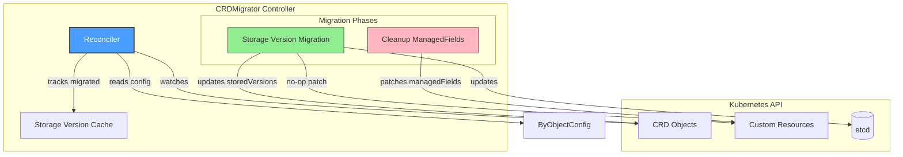
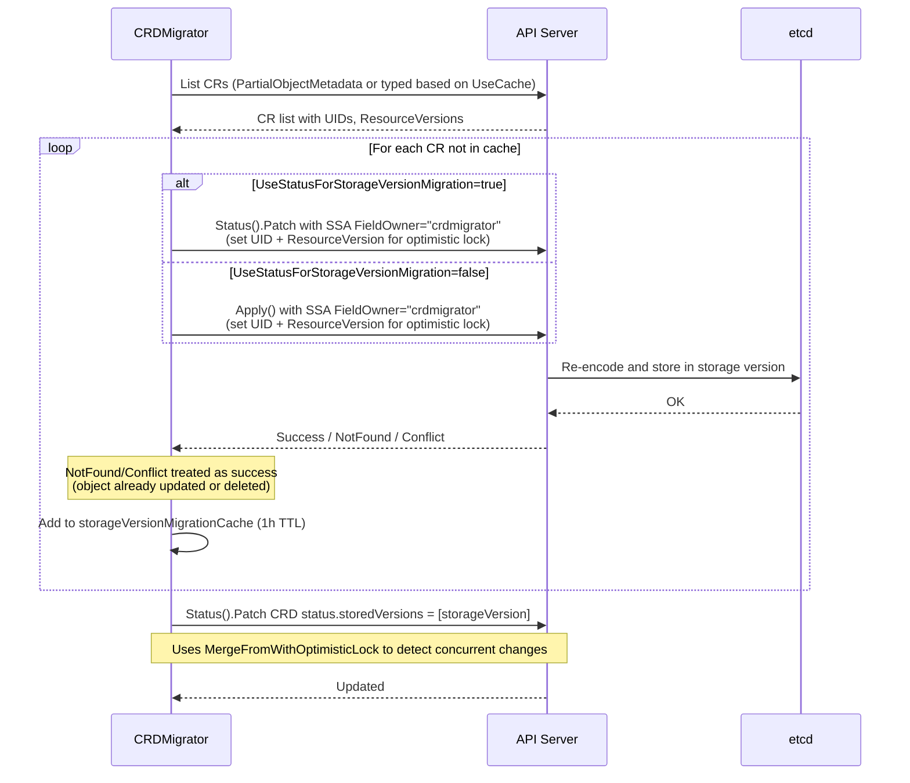
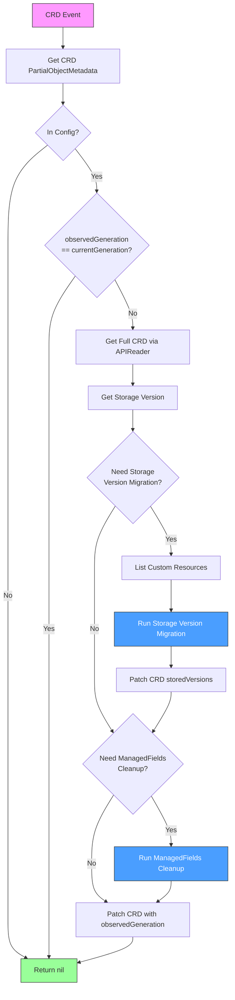

# CRDMigrator Controller

## Overview

The **CRDMigrator** is a controller responsible for managing Custom Resource Definition (CRD) migrations in Cluster API. It handles two critical migration phases:

1. **Storage Version Migration**: Ensures all custom resources are stored in the current storage version in etcd
2. **ManagedFields Cleanup**: Removes managedFields entries that reference API versions no longer served

This controller is essential for smooth Cluster API upgrades when API versions change.

## Migration Phases

The CRDMigrator supports two phases defined as `Phase` type (string):

```go
type Phase string

var (
    // StorageVersionMigrationPhase - if .status.storedVersions != [storageVersion],
    // a no-op patch is applied to all CRs to ensure they are stored in current storageVersion
    StorageVersionMigrationPhase Phase = "StorageVersionMigration"

    // CleanupManagedFieldsPhase - removes managedFields entries that contain
    // apiVersions that are not served anymore
    CleanupManagedFieldsPhase    Phase = "CleanupManagedFields"
)
```

## Architecture



## Migration Phases

### Phase 1: Storage Version Migration

When a CRD's storage version changes, existing resources in etcd may still be stored in the old version. This phase:

1. Detects when `.status.storedVersions != [currentStorageVersion]`
2. Applies a no-op SSA patch (using field manager `crdmigrator`) to each CR to trigger re-storage in the new version
3. Sets UID and ResourceVersion on the patch for optimistic locking
4. Updates `.status.storedVersions` to `[storageVersion]` with optimistic locking



### Phase 2: ManagedFields Cleanup

After API versions are removed, managedFields may still reference the old versions, causing issues. This phase:

1. Identifies managedFields entries with non-served API versions (not in `crd.Spec.Versions` with `Served=true`)
2. Removes those entries via JSON patch (with resourceVersion for optimistic locking)
3. Adds a seeding entry if all managedFields would be removed (to prevent SSA from inferring defaults)
4. Uses `retry.RetryOnConflict` for concurrent modification handling

```mermaid
flowchart TD
    Start[Start Cleanup] --> List[List all CRs]
    List --> CheckEmpty{len&#40;managedFields&#41; == 0?}
    
    CheckEmpty -->|Yes| Skip[Skip CR]
    CheckEmpty -->|No| Check{Has managedFields<br/>with non-served version?}
    
    Check -->|No| Skip
    Check -->|Yes| Filter[removeManagedFieldsWithNotServedGroupVersion]
    
    Filter --> Empty{All fields<br/>removed?}
    
    Empty -->|Yes| Seed[Add seeding managedFieldEntry<br/>with f:metadata/f:name]
    Empty -->|No| Patch[JSON Patch managedFields<br/>with resourceVersion]
    
    Seed --> Patch
    Patch --> Conflict{Conflict Error?}
    
    Conflict -->|Yes| Retry[Retry with fresh GET<br/>based on UseCache setting]
    Conflict -->|No| Done[CR Updated]
    Retry --> Filter
    
    Skip --> Next{More CRs?}
    Done --> Next
    
    Next -->|Yes| CheckEmpty
    Next -->|No| Complete[Phase Complete]
```



## Kubernetes Reconciler Transition Table (KRTT)

### Main Reconcile Loop

| Observed Status | Desired Spec | Trigger / Condition | Reconciliation Action | Resulting Status |
|:----------------|:-------------|:--------------------|:----------------------|:-----------------|
| CRD exists, not in config | N/A | CRD event | Skip reconciliation (`configByCRDName` lookup fails) | No change |
| CRD not found | N/A | CRD deleted | `client.IgnoreNotFound()` returns without error | N/A |
| `observedGeneration == currentGeneration` | CRD unchanged | Reconcile event | Skip reconciliation (annotation `cluster.x-k8s.io/crd-migration-observed-generation` matches) | No change |
| `storedVersions != [storageVersion]` | Storage migration needed | CRD generation changed, `crdMigrationPhasesToRun.Has(StorageVersionMigration)` | Run `reconcileStorageVersionMigration()` phase, then patch CRD `status.storedVersions` | `storedVersions = [storageVersion]` |
| Storage migration complete or skipped | N/A | `crdMigrationPhasesToRun.Has(CleanupManagedFields)` | Run `reconcileCleanupManagedFields()` phase | ManagedFields cleaned |
| All phases complete | N/A | Successful reconciliation | Patch CRD with `CRDMigrationObservedGenerationAnnotation = currentGeneration` | `observedGeneration = currentGeneration` |
| Any phase failed | N/A | Error returned from phase | Do NOT patch observedGeneration annotation, return error | Reconcile will retry |

### Storage Version Migration Phase

| Observed Status | Desired Spec | Trigger / Condition | Reconciliation Action | Resulting Status |
|:----------------|:-------------|:--------------------|:----------------------|:-----------------|
| `storedVersions == [storageVersion]` | N/A | `storageVersionMigrationRequired()` returns false | Skip phase | No change |
| No CRs exist | Phase enabled | `len(customResourceObjects) == 0` | Skip phase (return nil) | No change |
| CR in cache (same CRD generation) | Migration needed | `storageVersionMigrationCache.Has()` returns true | Refresh cache entry via `Add()`, skip patch | Cache entry refreshed |
| CR not in cache | Migration needed | Cache miss | Apply SSA no-op patch (via `Apply()` or `Status().Patch()` based on config) | CR re-stored, added to cache |
| SSA patch returns NotFound | CR deleted | `apierrors.IsNotFound()` | Continue to next CR (no error aggregated) | N/A |
| SSA patch returns Conflict | CR modified | `apierrors.IsConflict()` | Continue to next CR (already updated by another client) | N/A |
| SSA patch fails with other error | Migration error | Any other error | Aggregate error via `kerrors.NewAggregate`, continue to next CR | Error aggregated |
| All CRs migrated | Phase complete | Iteration done | `Status().Patch()` CRD `status.storedVersions` with `MergeFromWithOptimisticLock` | `storedVersions = [storageVersion]` |

### ManagedFields Cleanup Phase

| Observed Status | Desired Spec | Trigger / Condition | Reconciliation Action | Resulting Status |
|:----------------|:-------------|:--------------------|:----------------------|:-----------------|
| No CRs exist | N/A | `len(customResourceObjects) == 0` | Skip phase (return nil) | No change |
| CR has no managedFields | N/A | `len(obj.GetManagedFields()) == 0` | Skip CR | No change |
| CR has only served versions | N/A | `removeManagedFieldsWithNotServedGroupVersion()` returns `removed=false` | Skip CR | No change |
| CR has non-served versions | Cleanup needed | Non-served `apiVersion` in managedFields | Remove non-served entries, prepare JSON patch | ManagedFields filtered |
| All managedFields removed | Empty fields | After removal `len(managedFields) == 0` | Add seeding managedFieldEntry with `f:metadata/f:name` using first entry's Manager/Operation | Seeding entry added |
| JSON patch succeeds | Cleanup complete | `client.Patch()` returns nil or NotFound | Continue to next CR | CR updated (or deleted) |
| JSON patch Conflict | CR modified | `apierrors.IsConflict()` | `retry.RetryOnConflict`: re-GET object (using Client or APIReader based on UseCache), retry patch | Retried with fresh data |
| JSON patch fails (other) | Cleanup failed | Other error from Patch | Aggregate error, continue to next CR | Error aggregated |

### Error Handling

| Observed Status | Desired Spec | Trigger / Condition | Reconciliation Action | Resulting Status |
|:----------------|:-------------|:--------------------|:----------------------|:-----------------|
| Migration phase failed | N/A | Aggregated errors | Return error, don't update annotation | Reconcile will retry |
| Cleanup phase failed | N/A | Aggregated errors | Return error, don't update annotation | Reconcile will retry |
| CRD patch failed | N/A | Patch error | Return error | Reconcile will retry |
| Optimistic lock conflict | CRD changed | Status patch | Error returned, requeue | Requeue with new generation |

## Configuration

### ByObjectConfig

Configuration per object type for migration behavior:

| Field | Type | Description |
|-------|------|-------------|
| `UseCache` | bool | Use cached client for listing. When `false`, uses `PartialObjectMetadataList` via APIReader to minimize memory (with pagination limit=500). When `true`, uses the typed Go object from scheme via cached Client. **Only enable if controller already has informer for this type to avoid creating new informers.** |
| `UseStatusForStorageVersionMigration` | bool | Use status subresource (`client.Status().Patch()`) for no-op SSA patches instead of direct resource patch via `client.Apply()` (which is the default). Useful to avoid mutating/validating webhook errors that would block the no-op updates. |

### SkipCRDMigrationPhases

Phases can be skipped via the `SkipCRDMigrationPhases` field:

| Value | Effect |
|-------|--------|
| `StorageVersionMigrationPhase` | Skip the storage version migration phase |
| `CleanupManagedFieldsPhase` | Skip the managedFields cleanup phase |

> **Note**: Invalid phase values will cause `SetupWithManager` to return an error.

## Flow Diagram



## Cache Strategy

The CRDMigrator uses a time-based cache (`util/cache.Cache`) to track successfully migrated resources:

```mermaid
flowchart LR
    subgraph Cache["Storage Version Migration Cache (1h TTL)"]
        Entry1["Key: Machine default/m1 5"]
        Entry2["Key: Cluster default/c1 3"]
    end
    
    Reconciler -->|Check Has()| Cache
    Cache -->|Hit| Skip[Refresh via Add, Skip Migration]
    Cache -->|Miss| Migrate[Run Migration]
    Migrate -->|Success| Add[Add() to Cache]
    Add --> Cache
```

Key format: `{Kind} {Namespace/Name} {CRDGeneration}`

```go
type objectEntry struct {
    Kind string
    client.ObjectKey  // Namespace/Name
    CRDGeneration int64
}

func (r objectEntry) Key() string {
    return fmt.Sprintf("%s %s %d", r.Kind, r.String(), r.CRDGeneration)
}
```

> **Note**: The cache is initialized with 1 hour TTL via `cache.New[objectEntry](1 * time.Hour)` in `setup()`.

## Idempotency

The CRDMigrator is designed to be fully idempotent:

1. **Generation Tracking**: Uses `cluster.x-k8s.io/crd-migration-observed-generation` annotation to skip already-processed CRD generations
2. **Cache Deduplication**: Tracks migrated resources to avoid redundant patches (1 hour TTL). Even on cache hit, entry is refreshed to avoid re-migration on partial failures.
3. **Conflict Handling**: NotFound and Conflict errors from SSA patches are treated as success (resource already updated or deleted)
4. **Optimistic Locking**: 
   - SSA patches use UID and ResourceVersion to detect concurrent modifications
   - CRD status patches use `MergeFromWithOptimisticLock`
   - ManagedFields cleanup uses JSON patch with resourceVersion
5. **Retry on Conflict**: ManagedFields cleanup uses `retry.RetryOnConflict` with fresh GET on conflict

## Important Notes

1. **Memory Consideration**: When `UseCache=false`, the controller uses `PartialObjectMetadataList` with pagination (limit=500) to minimize memory usage

2. **Webhook Avoidance**: Use `UseStatusForStorageVersionMigration=true` for objects with strict webhooks that might reject the no-op updates

3. **Watch Filtering**: Uses `ResourceIsChanged` predicate to filter out re-sync events (only processes actual CRD changes)

4. **PartialObjectMetadata Watch**: Uses metadata-only informer for CRDs (`builder.OnlyMetadata`) to reduce memory footprint

5. **Pre-requisites**: `Client`, `APIReader`, and `Config` must all be set, otherwise `setup()` returns an error

6. **Seeding ManagedField**: When all managedFields are removed, a minimal seeding entry for `f:metadata/f:name` is added using the first removed entry's Manager and Operation to prevent SSA from inferring defaults
