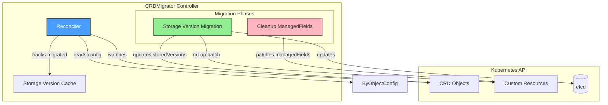
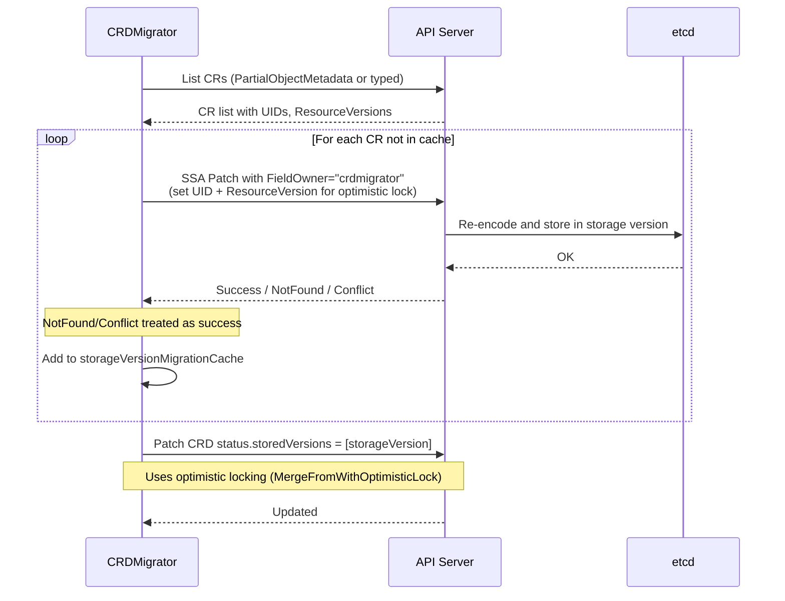
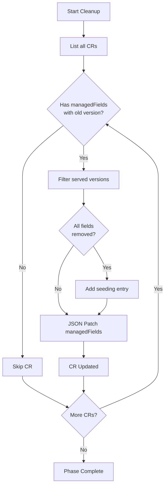
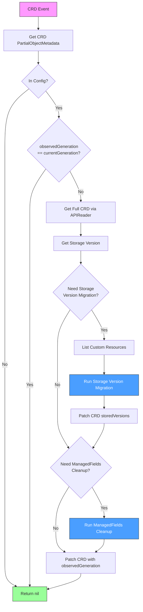

# CRDMigrator Controller

## Overview

The **CRDMigrator** is a controller responsible for managing Custom Resource Definition (CRD) migrations in Cluster API. It handles two critical migration phases:

1. **Storage Version Migration**: Ensures all custom resources are stored in the current storage version in etcd
2. **ManagedFields Cleanup**: Removes managedFields entries that reference API versions no longer served

This controller is essential for smooth Cluster API upgrades when API versions change.

## Migration Phases

The CRDMigrator supports two phases defined as `Phase` type (string):

```go
type Phase string

var (
    StorageVersionMigrationPhase Phase = "StorageVersionMigration"
    CleanupManagedFieldsPhase    Phase = "CleanupManagedFields"
)
```

## Architecture



## Migration Phases

### Phase 1: Storage Version Migration

When a CRD's storage version changes, existing resources in etcd may still be stored in the old version. This phase:

1. Detects when `.status.storedVersions != [currentStorageVersion]`
2. Applies a no-op SSA patch (using field manager `crdmigrator`) to each CR to trigger re-storage in the new version
3. Updates `.status.storedVersions` to `[storageVersion]`



### Phase 2: ManagedFields Cleanup

After API versions are removed, managedFields may still reference the old versions, causing issues. This phase:

1. Identifies managedFields entries with non-served API versions
2. Removes those entries via JSON patch
3. Adds a seeding entry if all managedFields would be removed



## Kubernetes Reconciler Transition Table (KRTT)

### Main Reconcile Loop

| Observed Status | Desired Spec | Trigger / Condition | Reconciliation Action | Resulting Status |
|:----------------|:-------------|:--------------------|:----------------------|:-----------------|
| CRD exists, not in config | N/A | CRD event | Skip reconciliation (not configured) | No change |
| CRD not found | N/A | CRD deleted | Return without error | N/A |
| `observedGeneration == currentGeneration` | CRD unchanged | Reconcile event | Skip reconciliation (annotation `cluster.x-k8s.io/crd-migration-observed-generation` matches) | No change |
| `storedVersions != [storageVersion]` | Storage migration needed | CRD generation changed | Run storage version migration phase | `storedVersions = [storageVersion]` |
| Storage migration complete | N/A | After SVM phase | Run managedFields cleanup phase | ManagedFields cleaned |
| All phases complete | N/A | Successful reconciliation | Patch CRD with observedGeneration annotation | `observedGeneration = currentGeneration` |

### Storage Version Migration Phase

| Observed Status | Desired Spec | Trigger / Condition | Reconciliation Action | Resulting Status |
|:----------------|:-------------|:--------------------|:----------------------|:-----------------|
| `storedVersions == [storageVersion]` | N/A | Check condition | Skip phase (not required) | No change |
| CR not in cache | Migration needed | CR iteration | Apply SSA no-op patch | CR re-stored, added to cache |
| CR in cache (same CRD gen) | Migration needed | CR iteration | Refresh cache entry, skip patch | Cache refreshed |
| SSA patch returns NotFound | CR deleted | Patch error | Continue to next CR | N/A |
| SSA patch returns Conflict | CR modified | Patch error | Continue to next CR (already updated) | N/A |
| SSA patch fails | Migration error | Other error | Aggregate error, continue | Error aggregated |
| All CRs migrated | Phase complete | Iteration done | Patch CRD status.storedVersions | `storedVersions = [storageVersion]` |

### ManagedFields Cleanup Phase

| Observed Status | Desired Spec | Trigger / Condition | Reconciliation Action | Resulting Status |
|:----------------|:-------------|:--------------------|:----------------------|:-----------------|
| No CRs exist | N/A | Empty list | Skip phase | No change |
| CR has no managedFields | N/A | CR check | Skip CR | No change |
| CR has only served versions | N/A | Version check | Skip CR | No change |
| CR has non-served versions | Cleanup needed | Version check | Remove non-served entries | ManagedFields updated |
| All managedFields removed | Empty fields | After removal | Add seeding managedField entry | Seeding entry added |
| JSON patch conflict | CR modified | Conflict error | Retry with fresh GET | Retried |
| JSON patch NotFound | CR deleted | Patch error | Continue to next CR | N/A |

### Error Handling

| Observed Status | Desired Spec | Trigger / Condition | Reconciliation Action | Resulting Status |
|:----------------|:-------------|:--------------------|:----------------------|:-----------------|
| Migration phase failed | N/A | Aggregated errors | Return error, don't update annotation | Reconcile will retry |
| Cleanup phase failed | N/A | Aggregated errors | Return error, don't update annotation | Reconcile will retry |
| CRD patch failed | N/A | Patch error | Return error | Reconcile will retry |
| Optimistic lock conflict | CRD changed | Status patch | Error returned, requeue | Requeue with new generation |

## Configuration

### ByObjectConfig

Configuration per object type for migration behavior:

| Field | Type | Description |
|-------|------|-------------|
| `UseCache` | bool | Use cached client for listing. When `false`, uses `PartialObjectMetadataList` via APIReader to minimize memory. When `true`, uses the typed Go object from scheme. **Only enable if controller already has informer for this type.** |
| `UseStatusForStorageVersionMigration` | bool | Use status subresource (`client.Status().Patch()`) for no-op SSA patches instead of direct resource patch. Useful to avoid mutating/validating webhook errors. |

### SkipCRDMigrationPhases

Phases can be skipped via configuration:

| Value | Effect |
|-------|--------|
| `StorageVersionMigration` | Skip the storage version migration phase |
| `CleanupManagedFields` | Skip the managedFields cleanup phase |

## Flow Diagram



## Cache Strategy

The CRDMigrator uses a time-based cache (`util/cache.Cache`) to track successfully migrated resources:

```mermaid
flowchart LR
    subgraph Cache["Storage Version Migration Cache (1h TTL)"]
        Entry1["Key: Machine default/m1 5"]
        Entry2["Key: Cluster default/c1 3"]
    end
    
    Reconciler -->|Check Has()| Cache
    Cache -->|Hit| Skip[Skip Migration]
    Cache -->|Miss| Migrate[Run Migration]
    Migrate -->|Success| Add[Add() to Cache]
    Add --> Cache
```

Key format: `{Kind} {Namespace/Name} {CRDGeneration}`

```go
type objectEntry struct {
    Kind string
    client.ObjectKey  // Namespace/Name
    CRDGeneration int64
}

func (r objectEntry) Key() string {
    return fmt.Sprintf("%s %s %d", r.Kind, r.String(), r.CRDGeneration)
}
```

## Idempotency

The CRDMigrator is designed to be fully idempotent:

1. **Generation Tracking**: Uses `cluster.x-k8s.io/crd-migration-observed-generation` annotation to skip already-processed CRD generations
2. **Cache Deduplication**: Tracks migrated resources to avoid redundant patches (1 hour TTL)
3. **Conflict Handling**: NotFound and Conflict errors are treated as success (resource already updated)
4. **Optimistic Locking**: CRD status patches use optimistic locking to detect concurrent modifications

## Usage Example

```go
migrator := &crdmigrator.CRDMigrator{
    Client:    mgr.GetClient(),
    APIReader: mgr.GetAPIReader(),
    Config: map[client.Object]crdmigrator.ByObjectConfig{
        &clusterv1.Cluster{}:  {UseCache: true},
        &clusterv1.Machine{}:  {UseCache: true},
        &clusterv1.MachineSet{}: {UseCache: true},
        &infrav1.DockerCluster{}: {
            UseCache: false,
            UseStatusForStorageVersionMigration: true, // Avoid webhooks
        },
    },
    SkipCRDMigrationPhases: []crdmigrator.Phase{}, // Run all phases
}

if err := migrator.SetupWithManager(ctx, mgr, controller.Options{}); err != nil {
    return err
}
```

## Important Notes

1. **Memory Consideration**: When `UseCache=false`, the controller uses `PartialObjectMetadataList` to minimize memory usage
2. **Webhook Avoidance**: Use `UseStatusForStorageVersionMigration=true` for objects with strict webhooks
3. **Watch Filtering**: Uses `ResourceIsChanged` predicate to filter out re-sync events (only processes actual CRD changes)
4. **PartialObjectMetadata Watch**: Uses metadata-only informer for CRDs to reduce memory footprint
