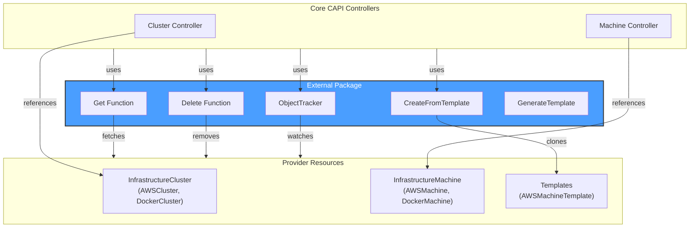
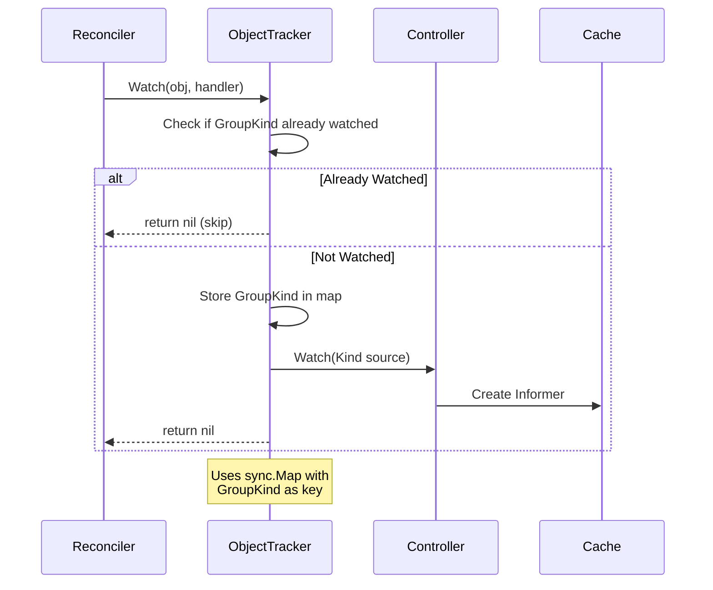
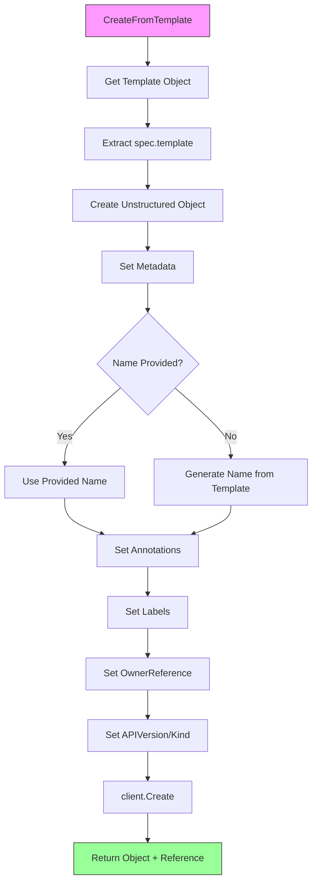
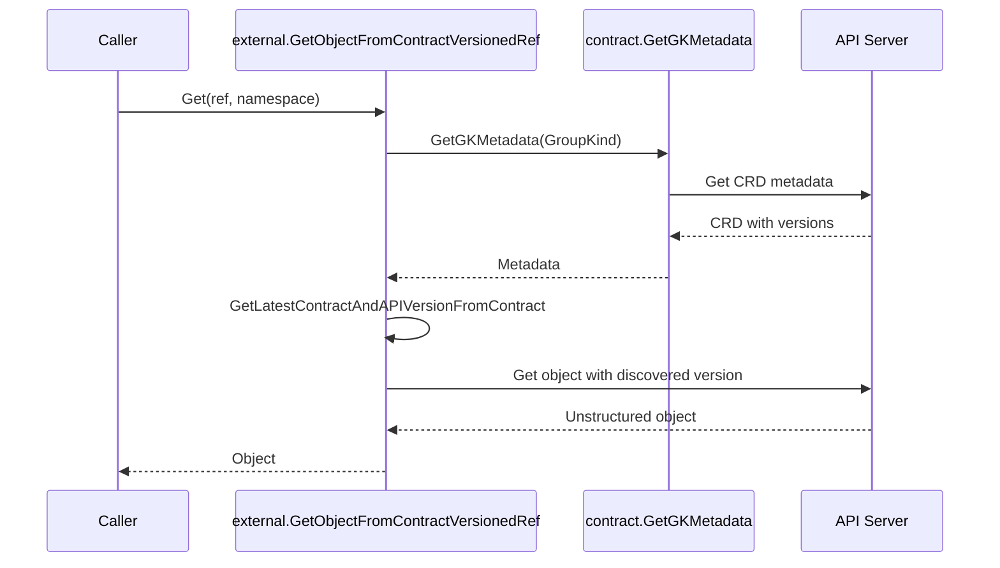
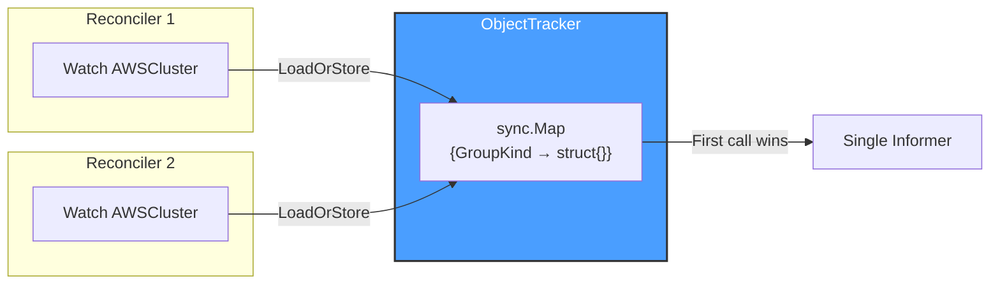

# External Package

## Overview

The **external** package provides utilities for working with external unstructured objects in Cluster API. These utilities enable controllers to interact with infrastructure provider objects (like `AWSCluster`, `DockerMachine`, etc.) without having compile-time dependencies on specific provider types.

This package is essential for the plugin architecture of Cluster API, where the core controllers need to work with provider-specific resources dynamically.

## Architecture



## Key Components

### ObjectTracker

The `ObjectTracker` is a helper for dynamically adding watches on external unstructured objects:

```go
type ObjectTracker struct {
    Controller      controller.Controller  // Required: The controller to add watches to
    Cache           cache.Cache            // Required: Cache for creating informers
    Scheme          *runtime.Scheme        // Required: Scheme for predicate filtering
    PredicateLogger *logr.Logger           // Required: Logger for ResourceNotPaused predicate
}
```

**Important**: All four fields must be set before calling `Watch()`, otherwise an error is returned.

**Purpose**: Ensures each external object type is watched only once per GroupKind, even if multiple resources reference it with different versions.



### Utility Functions

| Function | Description | Returns |
|----------|-------------|--------|
| `Get` | Fetches an external unstructured object by `*corev1.ObjectReference` | `(*unstructured.Unstructured, error)` |
| `GetObjectFromContractVersionedRef` | Fetches object using `ContractVersionedObjectReference` with automatic version discovery via CRD contract | `(*unstructured.Unstructured, error)` |
| `Delete` | Deletes an external unstructured object by `*corev1.ObjectReference` | `error` |
| `CreateFromTemplate` | Creates a new object from a template (calls `GenerateTemplate` + `client.Create`) | `(*unstructured.Unstructured, ContractVersionedObjectReference, error)` |
| `GenerateTemplate` | Generates an unstructured object from a template's `spec.template` field | `(*unstructured.Unstructured, error)` |
| `FailuresFrom` | Extracts `status.failureReason` and `status.failureMessage` from object | `(string, string, error)` |
| `IsReady` | Checks if `status.ready` is `true` | `(bool, error)` |

## Template Cloning Process



### Template Annotations

When cloning from a template, these annotations are automatically added:

| Annotation | Value |
|------------|-------|
| `cluster.x-k8s.io/cloned-from-name` | Original template name |
| `cluster.x-k8s.io/cloned-from-groupkind` | Template's GroupKind |

### Template Labels

| Label | Value |
|-------|-------|
| `cluster.x-k8s.io/cluster-name` | Owning cluster name |
| Custom labels | Passed via `Labels` parameter |

## Contract-Versioned Reference Handling

The `GetObjectFromContractVersionedRef` function handles version discovery for contract-based references:



## Kubernetes Reconciler Transition Table (KRTT)

### ObjectTracker Watch

| Observed Status | Desired Spec | Trigger / Condition | Reconciliation Action | Resulting Status |
|:----------------|:-------------|:--------------------|:----------------------|:-----------------|
| Tracker fields not all set | Watch requested | `Watch()` called | Return error "all of Controller, Cache, Scheme and PredicateLogger must be set" | Error returned |
| GroupKind not tracked | Watch requested | First `Watch()` call for GroupKind | `sync.Map.LoadOrStore()` stores key, `Controller.Watch()` creates informer with `ResourceNotPaused` predicate | GroupKind tracked, informer running |
| GroupKind already tracked | Watch requested | Subsequent `Watch()` for same GroupKind | `LoadOrStore()` returns early (no-op) | No change |
| Watch creation failed | Watch requested | `Controller.Watch()` returns error | Delete key from sync.Map, return wrapped error | GroupKind not tracked, error returned |

### External Object Operations

| Operation | Trigger / Condition | Action | Result on Success | Result on Error |
|:----------|:--------------------|:-------|:------------------|:----------------|
| `Get` | ObjectReference provided | Fetch via client.Get | Return *Unstructured | Wrapped error |
| `GetObjectFromContractVersionedRef` | ContractVersionedRef provided | Discover version, then fetch | Return *Unstructured | Wrapped error |
| `Delete` | ObjectReference provided | Delete via client.Delete | nil | Wrapped error |
| `CreateFromTemplate` | Template + config provided | Clone template, create object | Return object + ref | Wrapped error |

### ReconcileOutput

The `ReconcileOutput` type is returned by external reconciliation helpers:

```go
type ReconcileOutput struct {
    // RequeueAfter if greater than 0, tells the Controller to requeue
    // the reconcile key after the Duration.
    // Note: Code comment indicates this field may be refactored in future
    // to embed ctrl.Result instead.
    RequeueAfter time.Duration
    
    // Result contains the fetched/reconciled external object
    Result *unstructured.Unstructured
}
```

## Usage Examples

### Getting an External Object

```go
// Using ObjectReference
ref := &corev1.ObjectReference{
    APIVersion: "infrastructure.cluster.x-k8s.io/v1beta1",
    Kind:       "AWSCluster",
    Name:       "my-cluster",
    Namespace:  "default",
}
obj, err := external.Get(ctx, client, ref)

// Using ContractVersionedObjectReference (auto version discovery)
cvRef := clusterv1.ContractVersionedObjectReference{
    APIGroup: "infrastructure.cluster.x-k8s.io",
    Kind:     "AWSCluster",
    Name:     "my-cluster",
}
obj, err := external.GetObjectFromContractVersionedRef(ctx, client, cvRef, "default")
```

### Tracking External Watches

```go
tracker := &external.ObjectTracker{
    Controller:      ctrl,
    Cache:           mgr.GetCache(),
    Scheme:          mgr.GetScheme(),
    PredicateLogger: &log,
}

// Watch will only add the informer once per GVK
infraCluster := &unstructured.Unstructured{}
infraCluster.SetGroupVersionKind(schema.GroupVersionKind{
    Group:   "infrastructure.cluster.x-k8s.io",
    Version: "v1beta1",
    Kind:    "AWSCluster",
})

err := tracker.Watch(log, infraCluster, 
    handler.EnqueueRequestForOwner(scheme, mgr.GetRESTMapper(), &clusterv1.Cluster{}))
```

### Creating from Template

```go
output, ref, err := external.CreateFromTemplate(ctx, &external.CreateFromTemplateInput{
    Client:      client,
    TemplateRef: machineTemplateRef,
    Namespace:   machine.Namespace,
    Name:        machine.Name,
    ClusterName: machine.Spec.ClusterName,
    OwnerRef: &metav1.OwnerReference{
        APIVersion: clusterv1.GroupVersion.String(),
        Kind:       "Machine",
        Name:       machine.Name,
        UID:        machine.UID,
    },
    Labels: map[string]string{
        clusterv1.MachineControlPlaneLabel: "",
    },
})
```

### Checking External Object Status

```go
obj, err := external.Get(ctx, client, ref)
if err != nil {
    return err
}

// Check readiness
ready, err := external.IsReady(obj)
if err != nil {
    return err
}

// Check for failures
reason, message, err := external.FailuresFrom(obj)
if err != nil {
    return err
}
if reason != "" {
    log.Error(nil, "External object failed", "reason", reason, "message", message)
}
```

## Thread Safety

The `ObjectTracker` uses `sync.Map` for thread-safe storage of tracked GVKs:



## Important Notes

1. **Unstructured Objects**: All external objects are handled as `*unstructured.Unstructured` to avoid compile-time dependencies on provider types

2. **Template Suffix Stripping**: When generating from templates, the "Template" suffix is automatically stripped from the Kind (e.g., `AWSMachineTemplate` → `AWSMachine`)

3. **Predicate Filtering**: The ObjectTracker automatically adds `ResourceNotPaused` predicate to all watches

4. **Error Wrapping**: All errors are wrapped with context about the operation and object being processed
