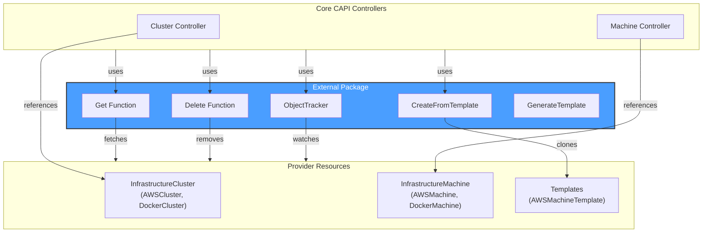
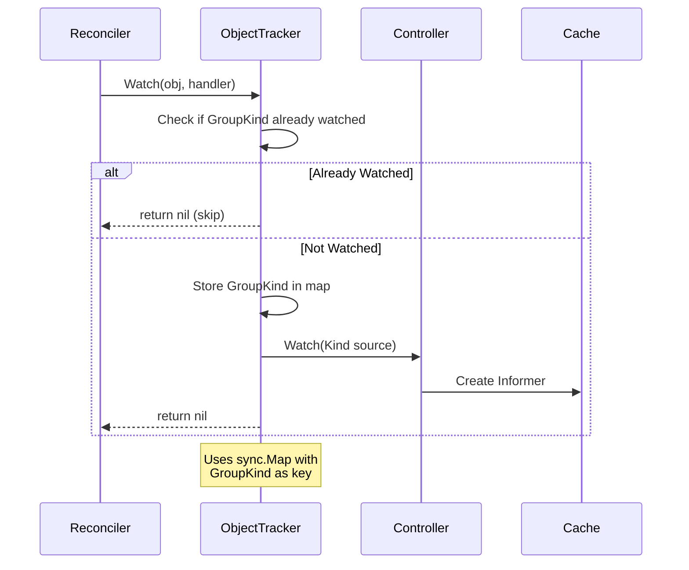
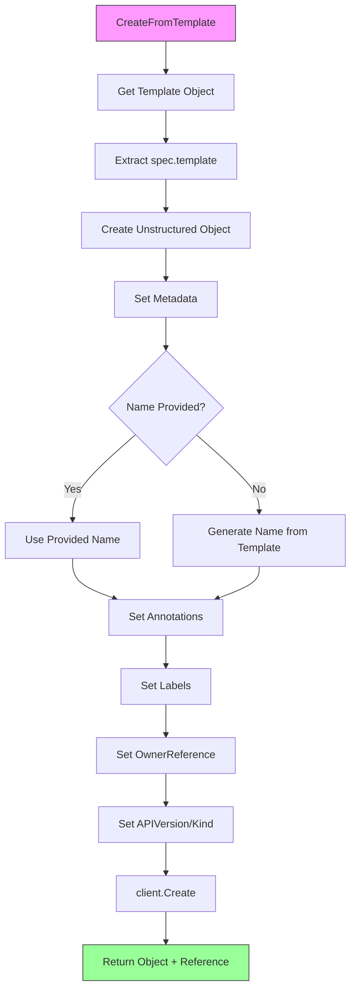
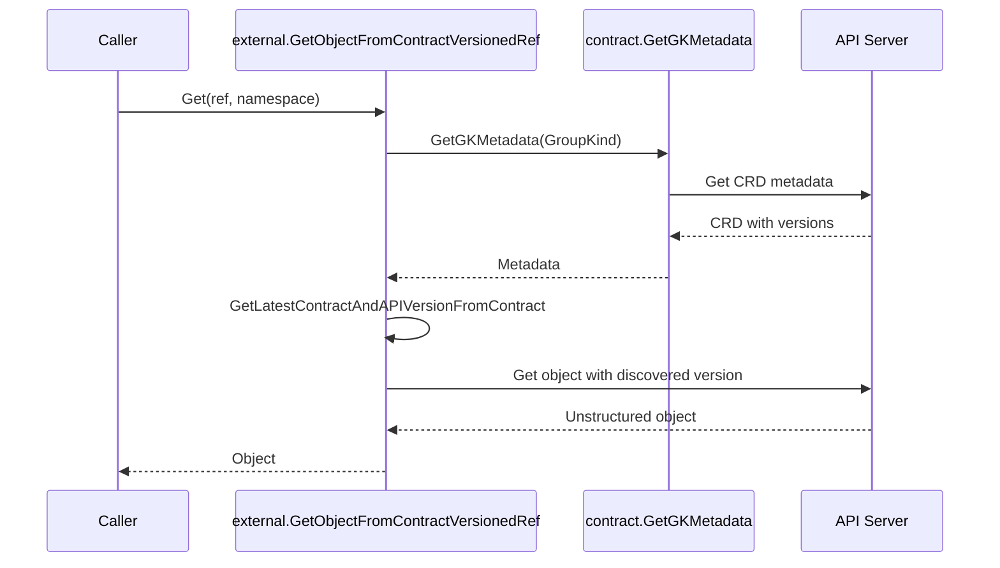
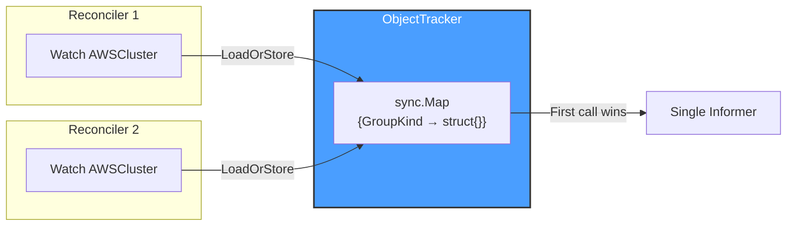

# External Package

## Overview

The **external** package provides utilities for working with external unstructured objects in Cluster API. These utilities enable controllers to interact with infrastructure provider objects (like `AWSCluster`, `DockerMachine`, etc.) without having compile-time dependencies on specific provider types.

This package is essential for the plugin architecture of Cluster API, where the core controllers need to work with provider-specific resources dynamically.

## Architecture



## Key Components

### ObjectTracker

The `ObjectTracker` is a helper for dynamically adding watches on external unstructured objects:

```go
type ObjectTracker struct {
    m sync.Map  // internal map for tracking watched GroupKinds

    Controller      controller.Controller  // Required: The controller to add watches to
    Cache           cache.Cache            // Required: Cache for creating informers
    Scheme          *runtime.Scheme        // Required: Scheme for predicate filtering
    PredicateLogger *logr.Logger           // Required: Logger for ResourceNotPaused predicate
}
```

**Important**: All four exported fields must be set before calling `Watch()`, otherwise an error is returned: `"all of Controller, Cache, Scheme and PredicateLogger must be set for object tracker"`.

**Purpose**: Ensures each external object type is watched only once per GroupKind (using `gvk.GroupKind().String()` as key), even if multiple resources reference it with different versions.



### Utility Functions

| Function | Description | Returns |
|----------|-------------|--------|
| `Get(ctx, c, ref)` | Fetches an external unstructured object by `*corev1.ObjectReference` | `(*unstructured.Unstructured, error)` |
| `GetObjectFromContractVersionedRef(ctx, c, ref, namespace)` | Fetches object using `ContractVersionedObjectReference` with automatic version discovery via CRD contract | `(*unstructured.Unstructured, error)` |
| `Delete(ctx, c, ref)` | Deletes an external unstructured object by `*corev1.ObjectReference` | `error` |
| `CreateFromTemplate(ctx, in)` | Creates a new object from a template (calls `GenerateTemplate` + `client.Create`) | `(*unstructured.Unstructured, ContractVersionedObjectReference, error)` |
| `GenerateTemplate(in)` | Generates an unstructured object from a template's `spec.template` field (tolerates missing template) | `(*unstructured.Unstructured, error)` |
| `FailuresFrom(obj)` | Extracts `status.failureReason` and `status.failureMessage` from object | `(string, string, error)` |
| `IsReady(obj)` | Checks if `status.ready` is `true` AND exists | `(bool, error)` |

## Template Cloning Process



### Template Annotations

When cloning from a template, these annotations are automatically added:

| Annotation | Value |
|------------|-------|
| `cluster.x-k8s.io/cloned-from-name` | Original template name (`TemplateClonedFromNameAnnotation`) |
| `cluster.x-k8s.io/cloned-from-groupkind` | Template's GroupKind string (`TemplateClonedFromGroupKindAnnotation`) |

### Template Labels

| Label | Value |
|-------|-------|
| `cluster.x-k8s.io/cluster-name` | Owning cluster name (`ClusterNameLabel`) |
| Custom labels | Passed via `Labels` parameter in input |

### Generated Object Properties

| Property | Behavior |
|----------|----------|
| Name | Uses `in.Name` if set, otherwise generates via `names.SimpleNameGenerator.GenerateName(template.Name + "-")` |
| Namespace | Set to `in.Namespace` |
| APIVersion | Inherits from template if not set in `spec.template` |
| Kind | Inherits from template, with "Template" suffix stripped (`strings.TrimSuffix(kind, TemplateSuffix)`) |
| OwnerReferences | Set to `[*in.OwnerRef]` if provided |
| ResourceVersion, UID, SelfLink, Finalizers | Cleared (set to empty/nil) |

## Contract-Versioned Reference Handling

The `GetObjectFromContractVersionedRef` function handles version discovery for contract-based references:



## Kubernetes Reconciler Transition Table (KRTT)

### ObjectTracker Watch

| Observed Status | Desired Spec | Trigger / Condition | Reconciliation Action | Resulting Status |
|:----------------|:-------------|:--------------------|:----------------------|:-----------------|
| Tracker fields not all set | Watch requested | `Watch()` called with nil Controller/Cache/Scheme/PredicateLogger | Return error "all of Controller, Cache, Scheme and PredicateLogger must be set for object tracker" | Error returned |
| GroupKind not tracked | Watch requested | First `Watch()` call for GroupKind | `sync.Map.LoadOrStore(gvk.GroupKind().String(), struct{}{})` stores key, `Controller.Watch(source.Kind(...))` creates informer with `ResourceNotPaused` predicate appended | GroupKind tracked, informer running |
| GroupKind already tracked | Watch requested | Subsequent `Watch()` for same GroupKind | `LoadOrStore()` returns `loaded=true`, return nil early | No change (idempotent) |
| Watch creation failed | Watch requested | `Controller.Watch()` returns error | `m.Delete(key)` removes from map, return wrapped error | GroupKind not tracked, error returned |

### External Object Operations

| Operation | Trigger / Condition | Action | Result on Success | Result on Error |
|:----------|:--------------------|:-------|:------------------|:----------------|
| `Get(ctx, c, ref)` | ObjectReference provided, `ref != nil` | Create Unstructured with GVK/Name/Namespace from ref, call `c.Get()` | Return `*Unstructured` | Wrapped error: "failed to retrieve {Kind} {namespace/name}" |
| `Get(ctx, c, nil)` | ObjectReference is nil | Return immediately | N/A | Error: "cannot get object - object reference not set" |
| `GetObjectFromContractVersionedRef(ctx, c, ref, ns)` | ContractVersionedRef provided, `ref.IsDefined()=true` | Discover API version via `contract.GetGKMetadata` + `GetLatestContractAndAPIVersionFromContract`, then `c.Get()` | Return `*Unstructured` | Wrapped error or generic error if CRD not found |
| `GetObjectFromContractVersionedRef(ctx, c, ref, ns)` | `!ref.IsDefined()` | Return immediately | N/A | Error: "cannot get object - object reference not set" |
| `Delete(ctx, c, ref)` | ObjectReference provided | Create Unstructured with GVK/Name/Namespace, call `c.Delete()` | nil | Wrapped error: "failed to delete {Kind} {namespace/name}" |
| `CreateFromTemplate(ctx, in)` | Template + config provided | `Get()` template, `GenerateTemplate()`, `client.Create()` | Return `(*Unstructured, ContractVersionedObjectReference)` | Wrapped error from any step |
| `GenerateTemplate(in)` | Template input provided | Extract `spec.template` (tolerates not found), apply metadata transformations | Return `*Unstructured` | Wrapped error if extraction fails |

### ReconcileOutput

The `ReconcileOutput` type is returned by external reconciliation helpers:

```go
type ReconcileOutput struct {
    // RequeueAfter if greater than 0, tells the Controller to requeue
    // the reconcile key after the Duration.
    // Note: Code comment indicates this field may be refactored in future
    // to embed ctrl.Result instead.
    RequeueAfter time.Duration
    
    // Result contains the fetched/reconciled external object
    Result *unstructured.Unstructured
}
```

## Usage Examples

### Getting an External Object

```go
// Using ObjectReference
ref := &corev1.ObjectReference{
    APIVersion: "infrastructure.cluster.x-k8s.io/v1beta1",
    Kind:       "AWSCluster",
    Name:       "my-cluster",
    Namespace:  "default",
}
obj, err := external.Get(ctx, client, ref)

// Using ContractVersionedObjectReference (auto version discovery)
cvRef := clusterv1.ContractVersionedObjectReference{
    APIGroup: "infrastructure.cluster.x-k8s.io",
    Kind:     "AWSCluster",
    Name:     "my-cluster",
}
obj, err := external.GetObjectFromContractVersionedRef(ctx, client, cvRef, "default")
```

### Tracking External Watches

```go
tracker := &external.ObjectTracker{
    Controller:      ctrl,
    Cache:           mgr.GetCache(),
    Scheme:          mgr.GetScheme(),
    PredicateLogger: &log,
}

// Watch will only add the informer once per GVK
infraCluster := &unstructured.Unstructured{}
infraCluster.SetGroupVersionKind(schema.GroupVersionKind{
    Group:   "infrastructure.cluster.x-k8s.io",
    Version: "v1beta1",
    Kind:    "AWSCluster",
})

err := tracker.Watch(log, infraCluster, 
    handler.EnqueueRequestForOwner(scheme, mgr.GetRESTMapper(), &clusterv1.Cluster{}))
```

### Creating from Template

```go
output, ref, err := external.CreateFromTemplate(ctx, &external.CreateFromTemplateInput{
    Client:      client,
    TemplateRef: machineTemplateRef,
    Namespace:   machine.Namespace,
    Name:        machine.Name,
    ClusterName: machine.Spec.ClusterName,
    OwnerRef: &metav1.OwnerReference{
        APIVersion: clusterv1.GroupVersion.String(),
        Kind:       "Machine",
        Name:       machine.Name,
        UID:        machine.UID,
    },
    Labels: map[string]string{
        clusterv1.MachineControlPlaneLabel: "",
    },
})
```

### Checking External Object Status

```go
obj, err := external.Get(ctx, client, ref)
if err != nil {
    return err
}

// Check readiness
ready, err := external.IsReady(obj)
if err != nil {
    return err
}

// Check for failures
reason, message, err := external.FailuresFrom(obj)
if err != nil {
    return err
}
if reason != "" {
    log.Error(nil, "External object failed", "reason", reason, "message", message)
}
```

## Thread Safety

The `ObjectTracker` uses `sync.Map` for thread-safe storage of tracked GVKs:



## Important Notes

1. **Unstructured Objects**: All external objects are handled as `*unstructured.Unstructured` to avoid compile-time dependencies on provider types

2. **Template Suffix Stripping**: When generating from templates, the "Template" suffix is automatically stripped from the Kind (e.g., `AWSMachineTemplate` → `AWSMachine`) using `strings.TrimSuffix(kind, clusterv1.TemplateSuffix)`

3. **Predicate Filtering**: The ObjectTracker automatically appends `predicates.ResourceNotPaused(o.Scheme, *o.PredicateLogger)` predicate to all watches

4. **Error Wrapping**: All errors are wrapped with context about the operation and object being processed using `errors.Wrapf`

5. **Contract Version Discovery**: `GetObjectFromContractVersionedRef` uses `contract.GetGKMetadata` and `contract.GetLatestContractAndAPIVersionFromContract` to automatically discover the correct API version

6. **Template Tolerance**: `GenerateTemplate` tolerates templates without `spec.template` field by using an empty template as replacement
