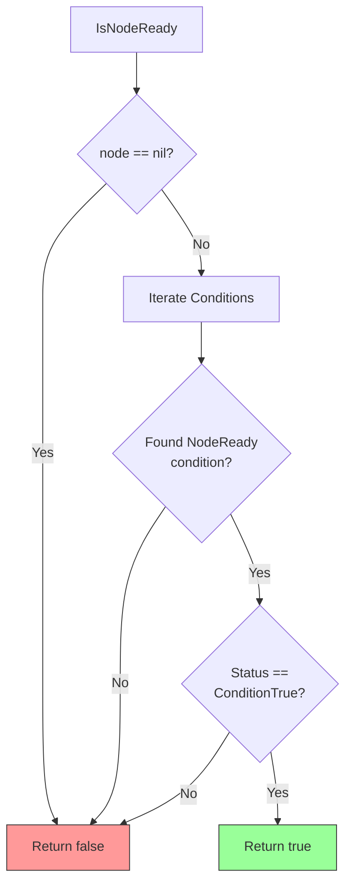
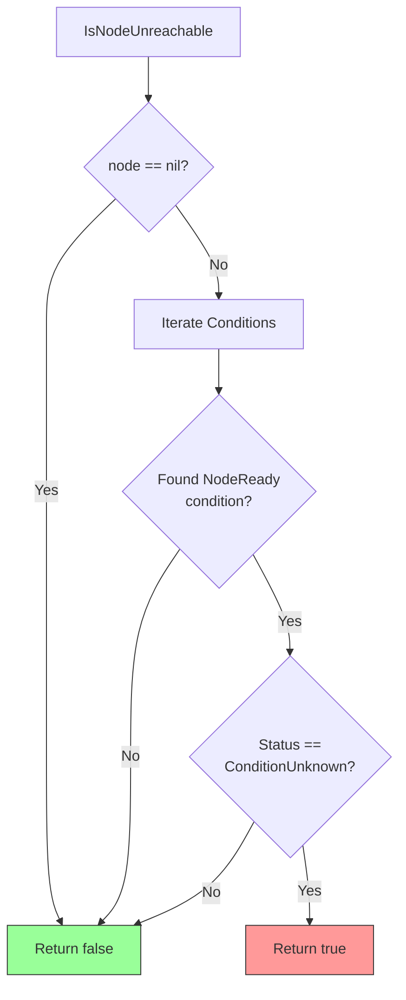
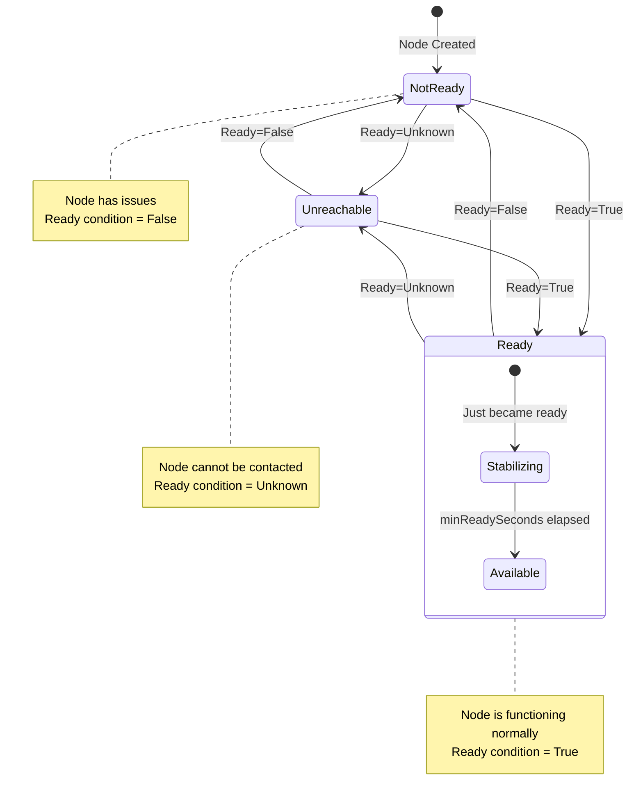
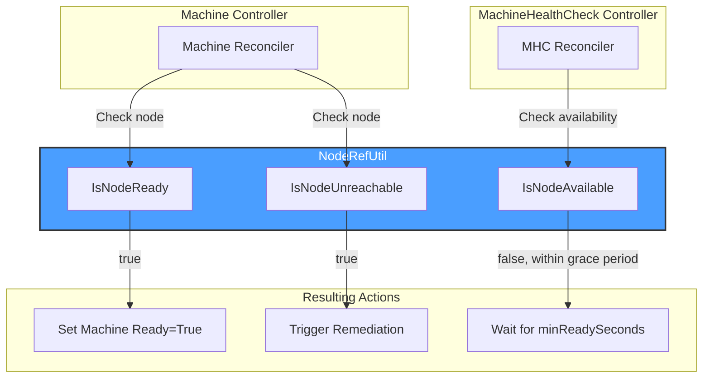

# NodeRefUtil Package

## Overview

The **noderefutil** package provides utility functions for working with Kubernetes Node objects in the context of Cluster API. These utilities help determine node availability, readiness, and reachability states.

## Functions

### IsNodeAvailable

Determines if a node is available for workloads based on readiness and minimum ready seconds.

```go
func IsNodeAvailable(node *corev1.Node, minReadySeconds int32, now metav1.Time) bool
```

**Logic:**
1. Returns `false` if node is not ready (`IsNodeReady()` returns false)
2. Returns `true` immediately if `minReadySeconds == 0`
3. Otherwise, checks if `LastTransitionTime + minReadySeconds < now.Time` (using `time.Duration(minReadySeconds) * time.Second`)

**Logic Flow:**

```mermaid
flowchart TD
    Start[IsNodeAvailable] --> CheckReady{IsNodeReady&#40;node&#41;?}
    CheckReady -->|false| ReturnFalse[Return false]
    CheckReady -->|true| CheckMinReady{minReadySeconds == 0?}
    
    CheckMinReady -->|Yes| ReturnTrue[Return true]
    CheckMinReady -->|No| GetCondition[GetReadyCondition&#40;&node.Status&#41;]
    
    GetCondition --> CheckTransition{!LastTransitionTime.IsZero&#40;&#41;<br/>AND<br/>LastTransitionTime.Add&#40;duration&#41;.Before&#40;now.Time&#41;?}
    CheckTransition -->|Yes| ReturnTrue
    CheckTransition -->|No| ReturnFalse
    
    style ReturnTrue fill:#9f9,stroke:#333
    style ReturnFalse fill:#f99,stroke:#333
```



### IsNodeReady

Checks if a node has the `Ready` condition set to `True`.

```go
func IsNodeReady(node *corev1.Node) bool
```



### IsNodeUnreachable

Determines if a node is unreachable (Ready condition is `Unknown`).

```go
func IsNodeUnreachable(node *corev1.Node) bool
```



### GetReadyCondition

Extracts the Ready condition from a node's status.

```go
func GetReadyCondition(status *corev1.NodeStatus) *corev1.NodeCondition
```

**Returns**: `*corev1.NodeCondition` for the `corev1.NodeReady` type, or `nil` if:
- `status` is `nil`
- No condition with type `NodeReady` exists in `status.Conditions`

**Implementation**: Iterates through `status.Conditions` and returns a pointer to the condition where `Type == corev1.NodeReady`.

## Node States



## Kubernetes Reconciler Transition Table (KRTT)

### Node State Evaluation

| Observed Status | Input | Function | Result | Use Case |
|:----------------|:------|:---------|:-------|:---------|
| `Ready=True` (`corev1.ConditionTrue`) | valid node | `IsNodeReady()` | `true` | Check if node can accept workloads |
| `Ready=False` (`corev1.ConditionFalse`) | valid node | `IsNodeReady()` | `false` | Node has reported problems |
| `Ready=Unknown` (`corev1.ConditionUnknown`) | valid node | `IsNodeReady()` | `false` | Node is unreachable (kubelet not reporting) |
| No Ready condition | valid node | `IsNodeReady()` | `false` | Node hasn't reported status yet |
| N/A | `node=nil` | `IsNodeReady()` | `false` | Node doesn't exist |
| `Ready=Unknown` | valid node | `IsNodeUnreachable()` | `true` | Node lost contact with control plane |
| `Ready=True` | valid node | `IsNodeUnreachable()` | `false` | Node is reachable and healthy |
| `Ready=False` | valid node | `IsNodeUnreachable()` | `false` | Node reachable but unhealthy |
| No Ready condition | valid node | `IsNodeUnreachable()` | `false` | Cannot determine unreachability (no condition to check) |
| N/A | `node=nil` | `IsNodeUnreachable()` | `false` | Node doesn't exist |

### Node Availability Evaluation

| Observed Status | minReadySeconds | Elapsed Since LastTransitionTime | Result |
|:----------------|:----------------|:--------------------------------|:-------|
| `Ready=False` | Any | Any | `false` (fails IsNodeReady check) |
| `Ready=True` | 0 | Any | `true` (minReadySeconds bypass) |
| `Ready=True` | 30 | < 30s | `false` (not yet stable) |
| `Ready=True` | 30 | >= 30s | `true` (stable and ready) |
| `Ready=Unknown` | Any | Any | `false` (fails IsNodeReady check) |
| `Ready=True`, `LastTransitionTime.IsZero()=true` | > 0 | N/A | `false` (safety check - zero time fails Before comparison) |

## Usage Examples

### Checking Node Availability for MachineHealthCheck

```go
import "sigs.k8s.io/cluster-api/controllers/noderefutil"

func (r *MachineHealthCheckReconciler) isNodeHealthy(node *corev1.Node, mhc *clusterv1.MachineHealthCheck) bool {
    // Check if node is ready and has been ready for minReadySeconds
    return noderefutil.IsNodeAvailable(node, mhc.Spec.MinReadySeconds, metav1.Now())
}
```

### Detecting Unreachable Nodes for Machine Remediation

```go
import "sigs.k8s.io/cluster-api/controllers/noderefutil"

func (r *MachineReconciler) shouldRemediate(node *corev1.Node) bool {
    // Check if node is unreachable (Ready=Unknown)
    if noderefutil.IsNodeUnreachable(node) {
        log.Info("Node is unreachable, may need remediation", "node", node.Name)
        return true
    }
    return false
}
```

### Getting Detailed Node Status

```go
import "sigs.k8s.io/cluster-api/controllers/noderefutil"

func logNodeStatus(node *corev1.Node) {
    readyCondition := noderefutil.GetReadyCondition(&node.Status)
    if readyCondition == nil {
        log.Info("Node has no Ready condition")
        return
    }
    
    log.Info("Node status",
        "ready", readyCondition.Status,
        "reason", readyCondition.Reason,
        "message", readyCondition.Message,
        "lastTransition", readyCondition.LastTransitionTime)
}
```

## Integration with Machine Lifecycle



## Important Notes

1. **Nil Safety**: All functions safely handle `nil` node inputs by returning `false` as the first check

2. **Condition Iteration**: Functions iterate through `node.Status.Conditions` to find the `corev1.NodeReady` type

3. **MinReadySeconds**: The availability check uses `LastTransitionTime.Add(time.Duration(minReadySeconds) * time.Second).Before(now.Time)`, not when the node was created

4. **Unknown vs False**: 
   - `Ready=Unknown` (`corev1.ConditionUnknown`) indicates network/communication issues (unreachable)
   - `Ready=False` (`corev1.ConditionFalse`) indicates the kubelet detected problems (not ready but reachable)

5. **Thread Safety**: These are pure utility functions with no state - safe for concurrent use

6. **GetReadyCondition Returns Pointer**: Returns a pointer to the actual condition in the slice, allowing callers to access `LastTransitionTime` and other fields
