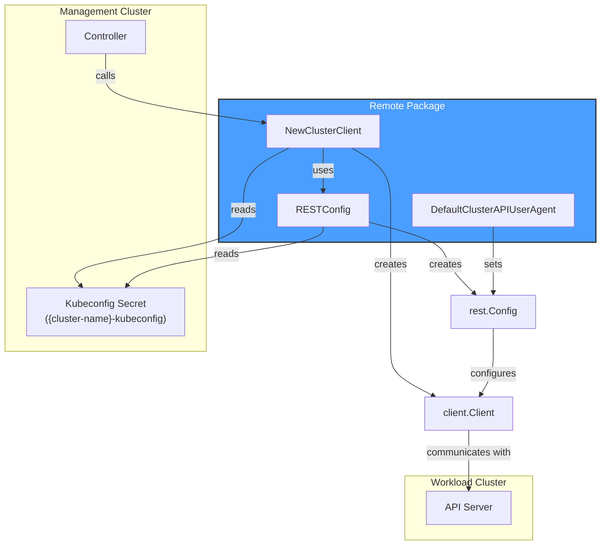
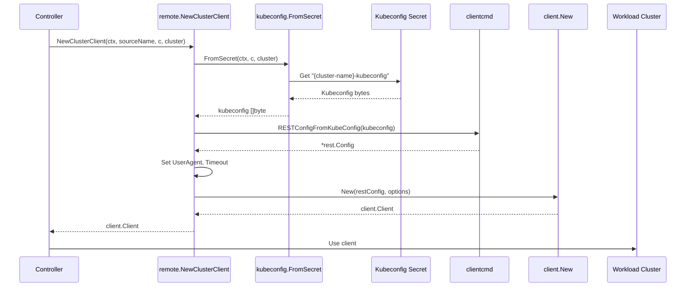
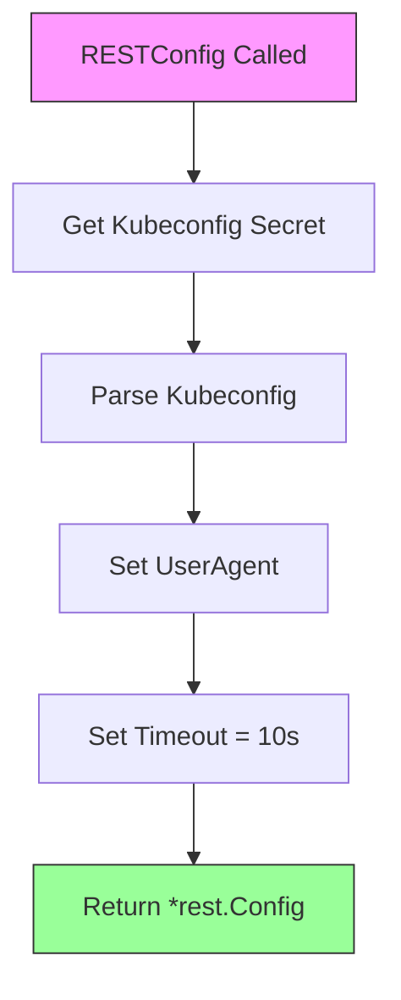
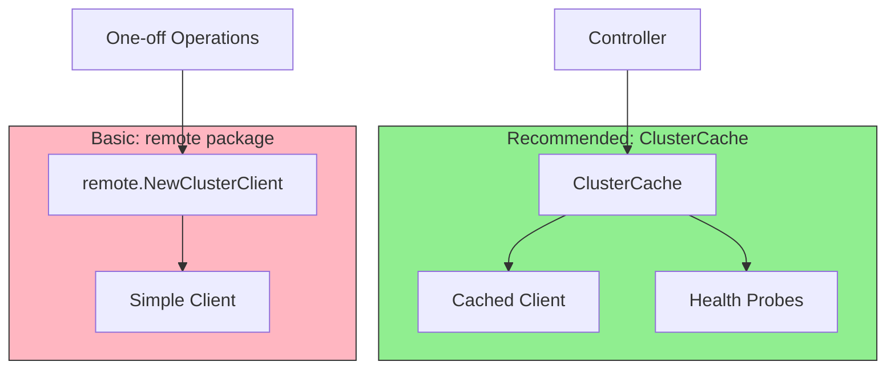

# Remote Package

## Overview

The **remote** package provides standalone utilities for creating clients and REST configurations to communicate with remote workload clusters. It handles the retrieval of kubeconfig secrets and the creation of properly configured Kubernetes clients.

> **Note**: This package provides basic, non-cached client creation. For production use with connection management, health probing, and caching, use the `clustercache` package instead.

## Architecture



## Key Components

### Functions

| Function | Description |
|----------|-------------|
| `NewClusterClient(ctx, sourceName, c, cluster)` | Creates a new client for interacting with a remote workload cluster. Uses `RESTConfig()` internally and inherits scheme from management cluster client. |
| `RESTConfig(ctx, sourceName, c, cluster)` | Returns a REST configuration for a workload cluster. Sets UserAgent and Timeout (10s). |
| `DefaultClusterAPIUserAgent(sourceName)` | Builds a standardized User-Agent string from binary name, version, source name, OS/arch, and git commit |

### ClusterClientGetter Type

```go
// ClusterClientGetter returns a new remote client.
type ClusterClientGetter func(ctx context.Context, sourceName string, c client.Client, cluster client.ObjectKey) (client.Client, error)
```

This type allows for dependency injection of the cluster client creation function, useful for testing.

## Client Creation Flow



## REST Configuration

The `RESTConfig` function creates a properly configured `*rest.Config`:



### Configuration Details

| Setting | Value | Source |
|---------|-------|--------|
| UserAgent | `{binary}/{version} {source} ({os}/{arch}) cluster.x-k8s.io/{commit}` | `DefaultClusterAPIUserAgent()` |
| Timeout | 10 seconds | `defaultClientTimeout` constant |
| Scheme | Inherited from management cluster client | Passed via `client.Options{Scheme: c.Scheme()}` |

```go
const (
    defaultClientTimeout = 10 * time.Second
)
```

## User-Agent Format

The `DefaultClusterAPIUserAgent` function builds a standardized User-Agent string:

```
{command}/{version} {sourceName} ({os}/{arch}) cluster.x-k8s.io/{commit}
```

Example:
```
manager/1.5.0 cluster-controller (linux/amd64) cluster.x-k8s.io/abc1234
```

```mermaid
flowchart LR
    subgraph Components
        Command[Command<br/>filepath.Base&#40;os.Args[0]&#41;]
        Version[Version<br/>version.Get&#40;&#41;.GitVersion]
        Source[Source Name<br/>controller name]
        OS[OS/Arch<br/>runtime.GOOS/GOARCH]
        Commit[Commit<br/>version.Get&#40;&#41;.GitCommit]
    end
    
    Command --> UA[User-Agent String]
    Version --> UA
    Source --> UA
    OS --> UA
    Commit --> UA
```

### User-Agent Helper Functions (restconfig.go)

| Function | Purpose |
|----------|--------|
| `adjustCommand(p string)` | Extracts binary name from `os.Args[0]` path via `filepath.Base()`. Returns "unknown" if empty. |
| `adjustVersion(v string)` | Strips pre-release suffixes by splitting on `-` and taking first segment (e.g., `1.5.0-alpha.1` → `1.5.0`). Returns "unknown" if empty. |
| `adjustSourceName(c string)` | Returns "unknown" if source name is empty |
| `adjustCommit(c string)` | Truncates git commit to first 7 characters. Returns "unknown" if empty. |
| `buildUserAgent(...)` | Internal function that assembles the User-Agent string in format: `{command}/{version} {sourceName} ({os}/{arch}) cluster.x-k8s.io/{commit}` |

## Kubernetes Reconciler Transition Table (KRTT)

### NewClusterClient

| Observed Status | Desired Spec | Trigger / Condition | Reconciliation Action | Resulting Status |
|:----------------|:-------------|:--------------------|:----------------------|:-----------------|
| Kubeconfig secret `{cluster-name}-kubeconfig` exists | Client needed | `NewClusterClient()` called | Call `RESTConfig()` to get `*rest.Config`, then `client.New(restConfig, client.Options{Scheme: c.Scheme()})` | `client.Client` returned |
| Kubeconfig secret missing | Client needed | `NewClusterClient()` called | `kcfg.FromSecret()` returns error | Wrapped error: "failed to retrieve kubeconfig secret for Cluster {namespace}/{name}" |
| Invalid kubeconfig data | Client needed | `clientcmd.RESTConfigFromKubeConfig()` fails | Parse error | Wrapped error: "failed to create REST configuration for Cluster {namespace}/{name}" |
| REST config valid | Client needed | `client.New()` fails | Client creation error | Wrapped error: "failed to create client for Cluster {namespace}/{name}" |

### RESTConfig

| Observed Status | Desired Spec | Trigger / Condition | Reconciliation Action | Resulting Status |
|:----------------|:-------------|:--------------------|:----------------------|:-----------------|
| Kubeconfig secret exists | REST config needed | `RESTConfig()` called | Retrieve secret via `kcfg.FromSecret()`, parse via `clientcmd.RESTConfigFromKubeConfig()`, set `UserAgent` and `Timeout=10s` | `*rest.Config` returned |
| Kubeconfig secret missing | REST config needed | `kcfg.FromSecret()` error | Return wrapped error | Error: "failed to retrieve kubeconfig secret for Cluster {namespace}/{name}" |
| Invalid kubeconfig format | REST config needed | `clientcmd.RESTConfigFromKubeConfig()` failure | Return wrapped error | Error: "failed to create REST configuration for Cluster {namespace}/{name}" |

## Usage Examples

### Creating a Remote Client

```go
import "sigs.k8s.io/cluster-api/controllers/remote"

// Create a client for a workload cluster
clusterKey := client.ObjectKey{
    Namespace: "default",
    Name:      "my-workload-cluster",
}

remoteClient, err := remote.NewClusterClient(ctx, "my-controller", mgmtClient, clusterKey)
if err != nil {
    return errors.Wrap(err, "failed to create remote client")
}

// Use the remote client
nodes := &corev1.NodeList{}
if err := remoteClient.List(ctx, nodes); err != nil {
    return err
}
```

### Getting REST Config Only

```go
import "sigs.k8s.io/cluster-api/controllers/remote"

restConfig, err := remote.RESTConfig(ctx, "my-controller", mgmtClient, clusterKey)
if err != nil {
    return err
}

// Use the REST config with custom client options
customClient, err := client.New(restConfig, client.Options{
    Scheme: myScheme,
    Mapper: myMapper,
})
```

### Using ClusterClientGetter for Testing

```go
// In production code
type MyReconciler struct {
    ClusterClientGetter remote.ClusterClientGetter
}

func (r *MyReconciler) Reconcile(ctx context.Context, req ctrl.Request) (ctrl.Result, error) {
    // Use the getter
    remoteClient, err := r.ClusterClientGetter(ctx, "my-reconciler", r.Client, clusterKey)
    // ...
}

// In tests - inject a fake
reconciler := &MyReconciler{
    ClusterClientGetter: func(ctx context.Context, sourceName string, c client.Client, cluster client.ObjectKey) (client.Client, error) {
        return fakeClient, nil
    },
}
```

## Integration with ClusterCache

While this package provides standalone client creation, the `ClusterCache` (from the `clustercache` package) is preferred for production use as it:

1. **Caches connections** - Avoids recreating clients for each request
2. **Manages health probes** - Monitors connection health
3. **Handles reconnection** - Automatically reconnects on failures
4. **Provides cached clients** - Uses informers for efficiency



## Error Handling

All errors are wrapped with context:

| Error Source | Wrapped Message |
|--------------|-----------------|
| Secret retrieval | "failed to retrieve kubeconfig secret for Cluster {namespace}/{name}" |
| Config parsing | "failed to create REST configuration for Cluster {namespace}/{name}" |
| Client creation | "failed to create client for Cluster {namespace}/{name}" |

## Important Notes

1. **Secret Naming Convention**: The kubeconfig secret must be named `{cluster-name}-kubeconfig` (handled by `kcfg.FromSecret`)

2. **Timeout**: The default 10-second timeout (`defaultClientTimeout`) is suitable for most operations but may need adjustment for slow networks

3. **Scheme Inheritance**: The created client inherits the scheme from the management cluster client via `client.Options{Scheme: c.Scheme()}`

4. **No Caching**: Clients created via this package do not use informer caching - consider `ClusterCache` for repeated access and connection management

5. **User-Agent Best Practice**: Always provide a meaningful `sourceName` to help with debugging and audit logs. Empty sourceName results in "unknown" in the User-Agent.

6. **Version Helper Behavior**: The `adjustVersion` function uses `strings.SplitN(v, "-", 2)` to strip pre-release suffixes
