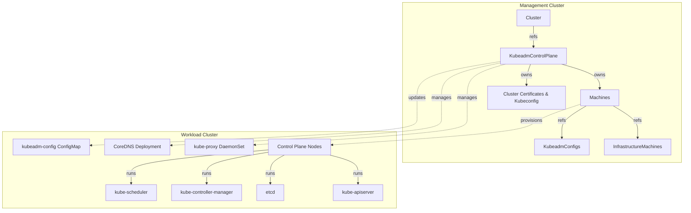
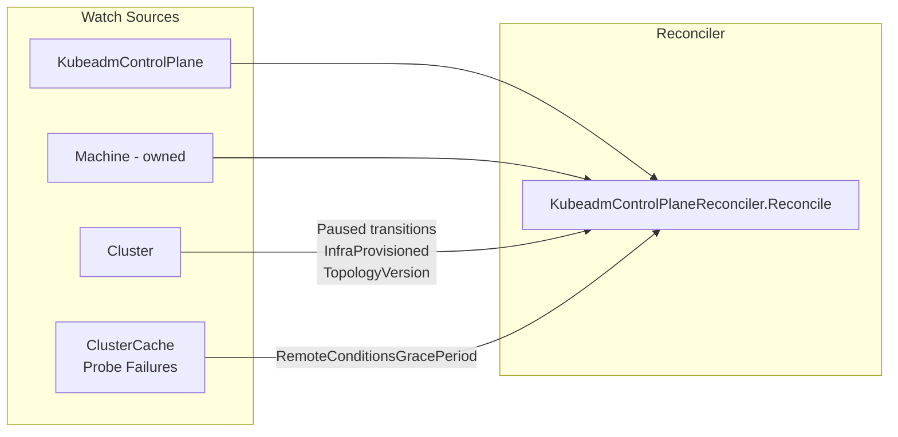
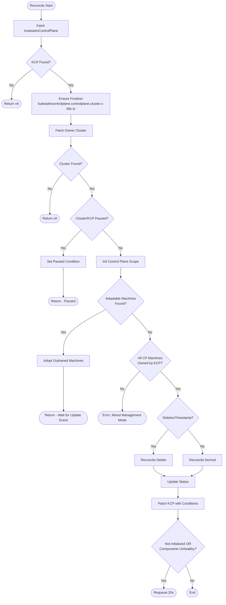
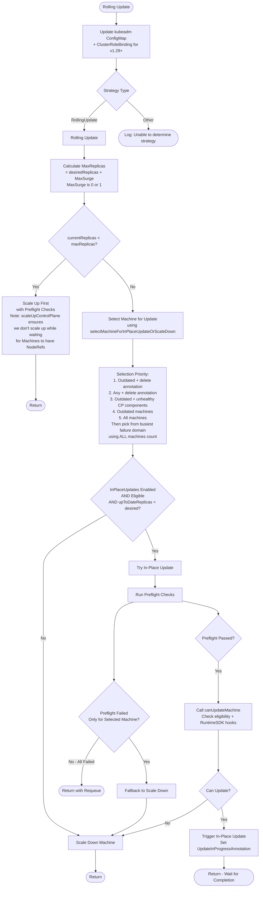
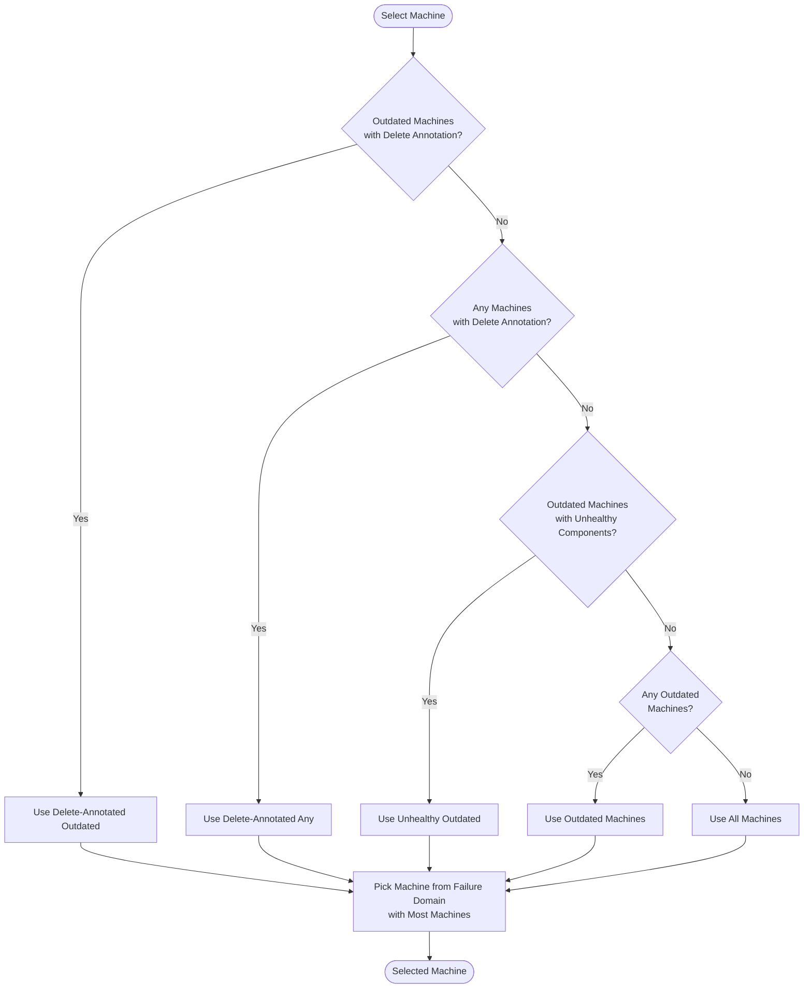
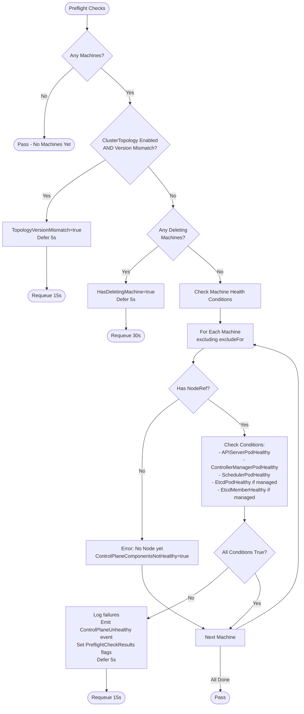
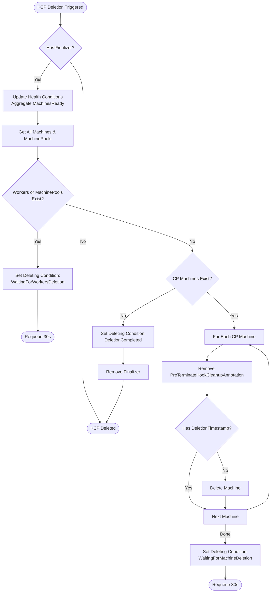

# KubeadmControlPlane Controller Documentation

> **Generated**: January 31, 2026  
> **Source**: `controlplane/kubeadm/internal/controllers/`

## Table of Contents

- [Overview](#overview)
- [Quick Reference](#quick-reference)
- [Architecture](#architecture)
- [Controller Watches](#controller-watches)
- [Reconciliation Flow](#reconciliation-flow)
- [Normal Reconciliation Flow](#normal-reconciliation-flow)
- [Rolling Update Strategy](#rolling-update-strategy)
- [Machine Selection for Scale Down / In-Place Update](#machine-selection-for-scale-down--in-place-update)
- [Kubernetes Reconciler Transition Tables (KRTT)](#kubernetes-reconciler-transition-tables-krtt)
- [Preflight Checks Detail](#preflight-checks-detail)
- [Error Handling and Requeue Strategies](#error-handling-and-requeue-strategies)
- [Key Conditions](#key-conditions)
- [Annotations Used](#annotations-used)
- [Status Fields](#status-fields)
- [Finalizer Logic](#finalizer-logic)
- [Key Constants](#key-constants)
- [References](#references)

## Overview

The `KubeadmControlPlaneReconciler` manages the lifecycle of Kubernetes control plane nodes provisioned via kubeadm. It:

- **Adopts** orphaned control plane `Machine` objects when safe (only when KCP is not being deleted).
- **Ensures** control plane infrastructure references and cluster certificates exist.
- **Bootstraps** the first control plane node (kubeadm init with `isJoin=false`).
- **Scales** control plane replicas up (kubeadm join) and down with failure domain balancing.
- **Rolls out** changes (Kubernetes version, kubeadm config, infra template changes) via RollingUpdate strategy.
- **Optionally updates in-place** (feature-gated via `InPlaceUpdates`, extension-driven via Runtime SDK hooks). Requires `RuntimeClient` when enabled.
- **Remediates** unhealthy control plane machines while preserving etcd quorum.
- **Handles deletions** with finalizers (`kubeadmcontrolplane.controlplane.cluster.x-k8s.io`) and pre-terminate hooks.
- **Manages etcd** membership including leadership forwarding and member removal during scale-down/remediation.
- **Updates** kube-proxy and CoreDNS in the workload cluster.
- **Tracks** certificate expiries on KubeadmConfig annotations.
- **Syncs** in-place mutable fields from KCP to Machines, InfrastructureMachines, and KubeadmConfigs.

## Quick Reference

| Operation | Requeue After | Key Condition |
|:---|:---|:---|
| Delete waiting | 30s | `deleteRequeueAfter` |
| Preflight failed | 15s | `preflightFailedRequeueAfter` (with 5s defer) |
| Certificate missing | 30s | `dependentCertRequeueAfter` |
| Not initialized | 20s | Polling for kubeadm-config |
| Components unhealthy | 20s | Polling for health |
| ClusterCache connecting | Exponential backoff | Return error if < 5 failures |

## Architecture



## Controller Watches



## Reconciliation Flow



## Normal Reconciliation Flow

```mermaid
flowchart TD
    Start([Reconcile Normal]) --> ReconcileExternal[Reconcile External Infra Ref]
    ReconcileExternal --> CheckInfra{InfrastructureProvisioned?}
    CheckInfra --> |No| SetUnknownInfra[Set EtcdClusterHealthy & ControlPlaneComponentsHealthy<br/>to Unknown - InspectionFailed]
    SetUnknownInfra --> WaitInfra([Return - Watch-based Requeue])
    CheckInfra --> |Yes| ReconcileCerts[Reconcile Cluster Certificates<br/>Generate if missing, fix owner refs]
    
    ReconcileCerts --> CheckEndpoint{ControlPlaneEndpoint<br/>Valid?}
    CheckEndpoint --> |No| SetUnknownEndpoint[Set EtcdClusterHealthy & ControlPlaneComponentsHealthy<br/>to Unknown - InspectionFailed]
    SetUnknownEndpoint --> WaitEndpoint([Return - Watch-based Requeue])
    CheckEndpoint --> |Yes| ReconcileKubeconfig[Reconcile Kubeconfig Secret]
    
    ReconcileKubeconfig --> KubeconfigMissing{Kubeconfig<br/>Missing Cert?}
    KubeconfigMissing --> |Yes| RequeueKube([Requeue 30s - dependentCertRequeueAfter])
    KubeconfigMissing --> |No| SyncMachines[Sync Machines, InfraMachines, KubeadmConfigs]
    
    SyncMachines --> |Sync deletion timeouts<br/>for deleting machines<br/>Update ControlPlane.Machines<br/>and MachinesNotUpToDate| AggregateV1Beta1[Aggregate MachinesReady V1Beta1 Condition]
    AggregateV1Beta1 --> ReconcileConditions[Reconcile CP & Machine Health Conditions<br/>+ Machine UpToDate Condition]
    ReconcileConditions --> ReconcileEtcd[Reconcile Etcd Members<br/>Remove orphan members only if<br/>EtcdClusterHealthy != True AND<br/>no machines still provisioning]
    
    ReconcileEtcd --> PreTerminateHook[Handle Pre-Terminate Hook<br/>for Deleting Machines<br/>Pick oldest by deletionTimestamp]
    
    %% Note: reconcileEtcdMembers removes orphan members when EtcdClusterHealthyCondition is NOT True
    %% This ensures etcd member removal only happens when there's a mismatch between members and nodes
    PreTerminateHook --> HookBlocked{Hook Blocked?}
    HookBlocked --> |Yes| RequeueHook([Requeue 30s - deleteRequeueAfter])
    HookBlocked --> |No| CompleteTriggerInPlace{Trigger In-Place<br/>Update Pending?}
    
    CompleteTriggerInPlace --> |Yes| CompleteInPlace[Complete Trigger In-Place Update<br/>for Machines with UpdateInProgressAnnotation<br/>but UpdateMachine hook not yet pending]
    CompleteInPlace --> Return1([Return - Wait for Machine Update])
    CompleteTriggerInPlace --> |No| ReconcileUnhealthy[Reconcile Unhealthy Machines<br/>Remediation]
    
    ReconcileUnhealthy --> UnhealthyResult{Remediation<br/>Triggered?}
    UnhealthyResult --> |Yes| Return2([Return Requeue])
    UnhealthyResult --> |No| WaitInPlace{In-Place Update<br/>In Progress?}
    
    WaitInPlace --> |Yes| WaitForInPlace([Return - Wait for In-Place Completion<br/>via Machine watch, log "Waiting for in-place update"])
    WaitInPlace --> |No| CheckRollout{Machines Need<br/>Rollout?}
    
    CheckRollout --> |Yes| UpdateControlPlane[Update Control Plane<br/>Rolling Update Strategy]
    CheckRollout --> |No| CheckScale[Check Scaling]
    
    UpdateControlPlane --> Return3([Return])
    
    CheckScale --> ScaleCheck{Current vs Desired Replicas}
    ScaleCheck --> |replicas == 0 && desired > 0| Initialize[Initialize Control Plane<br/>kubeadm init]
    ScaleCheck --> |replicas < desired| ScaleUp[Scale Up<br/>kubeadm join]
    ScaleCheck --> |replicas > desired| ScaleDown[Scale Down<br/>Delete oldest in busiest FD]
    ScaleCheck --> |replicas == desired| PostUpdate[Post-Update Operations]
    
    Initialize --> Return4([Return Requeue])
    ScaleUp --> Return5([Return Requeue])
    ScaleDown --> Return6([Return Requeue])
    
    PostUpdate --> UpdateKubeProxy[Update kube-proxy DaemonSet]
    UpdateKubeProxy --> UpdateCoreDNS[Update CoreDNS Deployment]
    UpdateCoreDNS --> ReconcileCertExpiry[Reconcile Certificate Expiries<br/>on KubeadmConfig annotations]
    ReconcileCertExpiry --> End([End])
```

## Rolling Update Strategy



## Machine Selection for Scale Down / In-Place Update



---

## Kubernetes Reconciler Transition Tables (KRTT)

### 1. Initialization Phase

| Observed Status | Desired Spec | Trigger / Condition | Reconciliation Action | Resulting Status |
|:---|:---|:---|:---|:---|
| `Machines=0`, `Cluster.Status.InfrastructureProvisioned=true`, `ControlPlaneEndpoint` valid | `KCP.Spec.Replicas > 0` | First reconcile with ready infrastructure | Create first `Machine` with kubeadm init (`isJoin=false`), select failure domain | `ScalingUpCondition=True`, Machine created, Requeue |
| `Machines=0`, `Cluster.Status.InfrastructureProvisioned=false` | `KCP.Spec.Replicas > 0` | Infrastructure not ready | Set `EtcdClusterHealthy=Unknown`, `ControlPlaneComponentsHealthy=Unknown` (InspectionFailed) | Wait for infrastructure via watch |
| `Machines=0`, `ControlPlaneEndpoint` not valid | `KCP.Spec.Replicas > 0` | Endpoint not set | Set `EtcdClusterHealthy=Unknown`, `ControlPlaneComponentsHealthy=Unknown` (InspectionFailed) | Wait for endpoint via watch |
| `Machines>=1`, `status.initialization.controlPlaneInitialized=false` | any | Workload cluster not yet reporting kubeadm-config | Query workload cluster for `kubeadm-config` ConfigMap via `ClusterStatus()` | `Initialized=False`, Requeue 20s |
| `Machines>=1`, kubeadm-config ConfigMap exists | any | Workload cluster has kubeadm-config | Set `status.initialization.controlPlaneInitialized=true` | `Initialized=True` (once set, never reverted) |

### 2. Scale Up Operations

| Observed Status | Desired Spec | Trigger / Condition | Reconciliation Action | Resulting Status |
|:---|:---|:---|:---|:---|
| `len(Machines) < Spec.Replicas`, `len(Machines) > 0` | `KCP.Spec.Replicas > current` | User increases replicas | Run preflight checks (no deleting machines, all health conditions True) | Proceed or requeue |
| Preflight passes | `KCP.Spec.Replicas > current` | Control plane stable | Create new `Machine` with kubeadm join (`isJoin=true`), balance failure domains | `ScalingUpCondition=True`, Machine created, Requeue |
| Deleting machine exists | `KCP.Spec.Replicas > current` | `HasDeletingMachine()=true` | Log waiting message, defer next reconcile 5s | Requeue 30s (`deleteRequeueAfter`) |
| Health condition False/Unknown on any Machine | `KCP.Spec.Replicas > current` | Preflight check fails on health | Log failures, emit ControlPlaneUnhealthy event, defer 5s | Requeue 15s (`preflightFailedRequeueAfter`) |
| Machine without NodeRef | `KCP.Spec.Replicas > current` | Preflight check fails on nodeRef | Log "Machine does not have a corresponding Node yet" | Requeue 15s (`preflightFailedRequeueAfter`) |
| ClusterTopology enabled, `Cluster.Spec.Topology.Version != KCP.Spec.Version` AND not matching `ClusterTopologyUpgradeStepAnnotation` | Scale up | Version mismatch during upgrade | Log waiting for version propagation, defer 5s | Requeue 15s (`preflightFailedRequeueAfter`) |

### 3. Scale Down Operations

| Observed Status | Desired Spec | Trigger / Condition | Reconciliation Action | Resulting Status |
|:---|:---|:---|:---|:---|
| `len(Machines) > Spec.Replicas` | `KCP.Spec.Replicas < current` | User decreases replicas | Run preflight checks (excluding target machine) | Proceed or requeue |
| Preflight passes | `KCP.Spec.Replicas < current` | Control plane stable | Select machine via `selectMachineForInPlaceUpdateOrScaleDown` (failure-domain balancing) | `ScalingDownCondition=True` |
| Etcd managed, machine selected | `KCP.Spec.Replicas < current` | Ready to delete | Forward etcd leadership to newest machine (not necessarily healthy, just newest) | Leadership moved |
| Machine selected, leadership forwarded | `KCP.Spec.Replicas < current` | Ready for deletion | Delete machine (set deletionTimestamp). NOTE: etcd member removal happens via pre-terminate hook after drain & volume detach complete | Machine deleting, Requeue |

### 4. Rolling Update Operations

| Observed Status | Desired Spec | Trigger / Condition | Reconciliation Action | Resulting Status |
|:---|:---|:---|:---|:---|
| Any machine not up-to-date (`MachineUpToDateCondition=False`) | KCP spec changed | Spec/Template/version delta detected by `controlPlane.MachinesNeedingRollout()` | Update kubeadm ConfigMap + ensure cluster-admin RBAC for K8s v1.29+ | `RollingOutCondition=True`, `MachinesSpecUpToDateV1Beta1Condition=False` |
| `currentReplicas < maxReplicas` (maxReplicas = desired + MaxSurge) | Rollout in progress | MaxSurge allows surge | Scale up first via `scaleUpControlPlane` (with preflight) | New machine created, Requeue |
| `currentReplicas >= maxReplicas` | Rollout in progress | At capacity | Select machine via `selectMachineForInPlaceUpdateOrScaleDown` | Machine selected for in-place or delete |
| Machine has delete annotation (`cluster.x-k8s.io/delete-machine`) | Rollout in progress | User requested specific deletion | Prioritize annotated machine in selection | Annotated machine processed first |
| Machine has unhealthy control plane components | Rollout in progress | Health degraded | Prioritize unhealthy outdated machine | Unhealthy machine selected first |
| All machines up-to-date | Spec stable | Rollout complete | Mark `MachinesSpecUpToDateV1Beta1Condition=True` | `RollingOutCondition=False` |

### 5. In-Place Update Operations (Feature Gated: `InPlaceUpdates`)

| Observed Status | Desired Spec | Trigger / Condition | Reconciliation Action | Resulting Status |
|:---|:---|:---|:---|:---|
| `MachineUpToDateCondition=False`, `EligibleForInPlaceUpdate=true` | Spec changed | Feature gate enabled, `upToDateReplicas < desired`, exactly one `CanUpdateMachine` extension handler registered, all required objects (DesiredMachine, CurrentInfraMachine, DesiredInfraMachine, CurrentKubeadmConfig, DesiredKubeadmConfig) available | Run preflight checks | Proceed or fallback to scale-down |
| Preflight passes | In-place allowed | Control plane stable | Call `canUpdateMachine`: check if all required objects are available + exactly one RuntimeSDK CanUpdateMachine hook registered + call `CanUpdateMachine` RuntimeSDK hook | Proceed or fallback |
| `CanUpdateMachine` hook returns true | In-place approved | Extension approves (after applying patches, current matches desired) | Call `triggerInPlaceUpdate`: 1) Set `cluster.x-k8s.io/update-in-progress` annotation on Machine first and wait for cache sync, 2) Write desired InfraMachine via SSA with UpdateInProgressAnnotation (without labels/annotations except ClonedFrom), 3) Write desired KubeadmConfig via SSA with UpdateInProgressAnnotation (without labels/annotations, remove initConfiguration if needed), 4) Write desired Machine via SSA, 5) Mark `UpdateMachine` hook pending via hooks.MarkAsPending and wait for cache sync | `MachineUpToDateCondition=False` (reason: UpToDateUpdating), `MachineUpdatingCondition` set by Machine controller |
| `cluster.x-k8s.io/update-in-progress` annotation exists, `UpdateMachine` hook pending | In-place running | Update triggered | Wait for Machine controller to complete and call `UpdateMachine` hook via `MachinesToCompleteInPlaceUpdate()` | Requeue via Machine watch |
| Machine controller completes, annotation removed | Desired met | In-place update done | Machine becomes up-to-date | `MachineUpToDateCondition=True` |
| `canUpdateMachine` returns false OR preflight fails only for target | In-place denied | Extension or eligibility fails | Fallback to `scaleDownControlPlane` | Machine deleted (rollout path) |
| `UpdateInProgressAnnotation` set but `UpdateMachine` hook not yet pending | Incomplete trigger | `triggerInPlaceUpdate` failed partway | Complete triggering via `MachinesToCompleteTriggerInPlaceUpdate()`: rewrite InfraMachine, KubeadmConfig, Machine and mark hook pending | Update completed or error |

### 6. Remediation Operations

> **Machine Selection Priority for Remediation** (`getMachineToBeRemediated` via `pickMachineToBeRemediated`):
> 1. Machine with `cluster.x-k8s.io/remediate-machine` annotation
> 2. Machine without `nodeRef` (provisioning failed - no CP components exist, cannot get further info)
> 3. Machine with unhealthy etcd member (`EtcdMemberHealthyCondition != True`) - if managed etcd  
> 4. Machine with unhealthy etcd pod (`EtcdPodHealthyCondition != True`) - if managed etcd  
> 5. Machine with unhealthy API server (`APIServerPodHealthyCondition != True`)
> 6. Machine with unhealthy controller-manager (`ControllerManagerPodHealthyCondition != True`)
> 7. Machine with unhealthy scheduler (`SchedulerPodHealthyCondition != True`)
> 8. Oldest machine (tie-breaker: alphabetical by name)
>
> **Note**: If only one unhealthy machine exists, it is selected immediately without sorting.

| Observed Status | Desired Spec | Trigger / Condition | Reconciliation Action | Resulting Status |
|:---|:---|:---|:---|:---|
| `MachineHealthCheckSucceeded=False`, `MachineOwnerRemediated=False` | Machine healthy | MHC marks unhealthy, KCP is owner | Select machine via `getMachineToBeRemediated` (see priority above) | `RemediatingCondition=True` |
| Machine healthy again (was unhealthy) | any | `MachineHealthCheckSucceeded=True` AND `MachineOwnerRemediated=False` AND Machine not deleting | Clean up: delete `MachineOwnerRemediated` condition | Condition removed |
| `RemediationInProgressAnnotation` exists, no new machine created | any | Another remediation in progress | Check if annotation stale; if not stale, skip remediation | Wait for current remediation |
| ClusterTopology enabled, `Cluster.Spec.Topology.Version != KCP.Spec.Version` | Topology upgrade pending | Version mismatch | Skip remediation; Log "waiting for version upgrade to be propagated" | `MachineOwnerRemediated=False`, reason: `RemediationDeferred` |
| `len(Machines) <= 1` | Maintain quorum | Single replica | Skip remediation, log reason | `MachineOwnerRemediated=False`, reason: `CannotBeRemediated` |
| Healthy machine still provisioning (`!NodeRef && !Deleting && Healthy`) | Stable control plane | Transitional state | Defer remediation | `MachineOwnerRemediated=False`, reason: `RemediationDeferred` |
| Deleting machine exists | Stable control plane | Transitional state | Defer remediation | `MachineOwnerRemediated=False`, reason: `RemediationDeferred` |
| RetryPeriod not expired | Avoid thrash | Recent remediation failure | Defer remediation via `checkRetryLimits` | `MachineOwnerRemediated=False`, reason: `RemediationDeferred` |
| MaxRetry exceeded | Limit retries | Max retries hit | Stop remediation | `MachineOwnerRemediated=False`, reason: `CannotBeRemediated` |
| Etcd managed, removing would lose quorum | Preserve quorum | `canSafelyRemoveEtcdMember()=false` | Skip remediation; Log "removing this machine could result in etcd quorum loss" | `MachineOwnerRemediated=False`, reason: `CannotBeRemediated` |
| Etcd managed, no healthy machine for leadership | Cannot forward leadership | All other machines unhealthy | Skip remediation; Log "no healthy machine to forward etcd leadership to" | `MachineOwnerRemediated=False`, reason: `CannotBeRemediated` |
| Safe to remediate, etcd managed | Proceed | All checks pass | Forward etcd leadership to `HealthyMachines().Newest()`, delete machine, set `RemediationInProgressAnnotation` on KCP. NOTE: etcd member removal happens via pre-terminate hook | `MachineOwnerRemediated=False`, reason: `MachineDeleting`, Requeue |
| New Machine created after remediation | Remediation completing | `Machine.CreationTimestamp > RemediationInProgressAnnotation.Timestamp` | Remove `RemediationInProgressAnnotation` from KCP (annotation is stale) | Annotation removed, remediation complete |

### 7. Pre-Terminate Hook Operations

> **Note**: The pre-terminate hook annotation is `pre-terminate.delete.hook.machine.cluster.x-k8s.io/kcp-cleanup`. This hook ensures etcd membership cleanup occurs after node drain and volume detach complete but before Machine deletion. The KCP pre-terminate hook is designed to be executed last, ensuring kubelet is still working while other pre-terminate hooks run.

| Observed Status | Desired Spec | Trigger / Condition | Reconciliation Action | Resulting Status |
|:---|:---|:---|:---|:---|
| `Machine.DeletionTimestamp != nil`, no `PreTerminateHookCleanupAnnotation` | Machine being deleted | Another deleting machine without hook exists | Wait for that machine to complete deletion first (deterministic: one at a time) | Requeue 30s |
| `Machine.DeletionTimestamp != nil`, has hook, other non-KCP pre-terminate hooks exist (K8s >= v1.31 only) | Machine being deleted | Other pre-terminate hooks pending | Wait for other hooks to complete first (KCP hook runs last) | Requeue 30s |
| `MachineDeletingCondition` is not True or `Reason != WaitingForPreTerminateHook` | Machine being deleted | Machine controller not yet waiting for hook | Wait for Machine controller to complete drain & volume detach | Requeue 30s |
| Machine deleting, waiting for hook, `len(Machines) > 1`, etcd managed | Safe cleanup | Ready for cleanup | Forward etcd leadership to newest non-deleting Machine + remove etcd member via `RemoveEtcdMemberForMachine` | Etcd member removed |
| Cleanup complete OR etcd not managed OR single machine OR no non-deleting machine for leadership | Deleting | Remove hook | Remove `PreTerminateHookCleanupAnnotation` from Machine | Machine deletion proceeds |

### 8. Deletion Flow (KCP Deletion)

| Observed Status | Desired Spec | Trigger / Condition | Reconciliation Action | Resulting Status |
|:---|:---|:---|:---|:---|
| `KCP.DeletionTimestamp != nil`, workers or MachinePools exist | Delete KCP | `len(allMachines) != len(CPMachines)` OR `len(MachinePools) > 0` | Wait for workers deletion | `DeletingCondition=True`, reason: `WaitingForWorkersDeletion`, Requeue 30s |
| Only control plane machines remain | Delete KCP | Workers gone | For each Machine: remove `PreTerminateHookCleanupAnnotation`, delete Machine | Machines deleting |
| Machines being deleted | Delete KCP | Machines have deletionTimestamp | Wait for Machine deletion | `DeletingCondition=True`, reason: `WaitingForMachineDeletion`, Requeue 30s |
| All CP machines deleted (`len(Machines) == 0`) | Delete KCP | No CP machines left | Remove finalizer `kubeadmcontrolplane.controlplane.cluster.x-k8s.io` | `DeletingCondition=True`, reason: `DeletionCompleted`, KCP deleted |

### 9. Certificates & Kubeconfig

| Observed Status | Desired Spec | Trigger / Condition | Reconciliation Action | Resulting Status |
|:---|:---|:---|:---|:---|
| Cluster certificates missing | Certificates required | First reconcile or secret missing | Generate certificates via `secret.NewCertificatesForInitialControlPlane().LookupOrGenerateCached()` using SecretCachingClient | `CertificatesAvailableCondition=True` |
| Certificate controllerRef wrong | KCP owns certs | Owner ref mismatch | Fix owner ref via `ensureCertificatesOwnerRef` | Ownership corrected |
| Certificate generation fails | Certificates required | Error during generation | Set `CertificatesAvailableV1Beta1Condition=False`, `CertificatesAvailableCondition=Unknown` | Error logged |
| Kubeconfig secret missing | Kubeconfig required | First reconcile | Create kubeconfig secret | Secret created |
| Kubeconfig depends on missing certificate | Kubeconfig required | Cert not found | Return early | Requeue 30s (`dependentCertRequeueAfter`) |
| Certificate expiry not annotated on KubeadmConfig | Expiry tracking | Machine has NodeRef, no annotation, CP initialized | Fetch expiry from workload cluster via `GetAPIServerCertificateExpiry`, set annotation | `MachineCertificatesExpiryDateAnnotation` set |

### 10. Health & Conditions

| Observed Status | Desired Spec | Trigger / Condition | Reconciliation Action | Resulting Status |
|:---|:---|:---|:---|:---|
| `ControlPlaneInitialized=false` OR `InitializedCondition` not True | Need remote status | Cannot inspect workload cluster | Overwrite health conditions to `Unknown` with `InspectionFailed` reasons | `EtcdClusterHealthy=Unknown`, `ControlPlaneComponentsHealthy=Unknown` |
| ClusterCache `LastProbeSuccessTime.IsZero()` AND `ConsecutiveFailures < 5` | Need remote status | Controller starting or new cluster | Set conditions to `Unknown` (ConnectionDown) only if NOT already set (Overwrite=false); Message: "Remote connection not established yet" | Keep last known status if exists, otherwise set Unknown; Return error to trigger exponential backoff requeue |
| `time.Since(maxTime(LastProbeSuccess, InitializedTime)) > RemoteConditionsGracePeriod` (min 2m) | Need remote status | Grace period exceeded | Overwrite health conditions to `Unknown` with `ConnectionDown` reasons; Message includes last probe success time | All health conditions Unknown |
| ClusterCache returns `ErrClusterNotConnected` within grace period | Need remote status | Temporary connection error | Set conditions to `Unknown` only if not already set (preserve last known); Message includes last probe success time | Keep last known status; Return error |
| Workload cluster reachable | Health check required | Successful ClusterCache connection | Call `workloadCluster.UpdateStaticPodConditions()` + `UpdateEtcdConditions()` | Conditions reflect actual Pod/etcd health |
| Static pod pending/failed/missing | Component health | Pod inspection | Set corresponding Machine condition (e.g., `APIServerPodHealthy=False`) | Aggregated to `ControlPlaneComponentsHealthy` |
| Etcd member unhealthy or missing | Etcd health | Etcd inspection | Set `EtcdMemberHealthy=False` on Machine | Aggregated to `EtcdClusterHealthy` |

---

## Preflight Checks Detail



---

## Error Handling and Requeue Strategies

| Scenario | Error Type | Requeue Strategy | Duration | Notes |
|:---|:---|:---|:---|:---|
| KCP not found | NotFound | No requeue | - | Normal deletion case |
| Cluster not found | NotFound | No requeue | - | Cluster may be deleted |
| Cluster/KCP paused | Paused | No requeue | - | Watch-based resume |
| Adoptable machines found | Adoption | No requeue | - | Wait for update event |
| Mixed management mode | Error | Return error | Exponential backoff | Cannot operate with non-owned CP machines |
| Infrastructure not ready | Waiting | No requeue | - | Watch-based resume via Cluster |
| ControlPlane endpoint not set | Waiting | No requeue | - | Watch-based resume |
| Dependent certificate missing (kubeconfig) | Waiting | Requeue | 30s | `dependentCertRequeueAfter` |
| Preflight: Deleting machine exists | Waiting | Requeue | 30s | `deleteRequeueAfter`, defer 5s |
| Preflight: Health checks failed | Waiting | Requeue | 15s | `preflightFailedRequeueAfter`, defer 5s |
| Preflight: Topology version mismatch | Waiting | Requeue | 15s | `preflightFailedRequeueAfter`, defer 5s |
| KCP deletion waiting for workers | Waiting | Requeue | 30s | `deleteRequeueAfter` |
| KCP deletion waiting for CP machines | Waiting | Requeue | 30s | `deleteRequeueAfter` |
| Pre-terminate hook: another machine without hook | Waiting | Requeue | 30s | `deleteRequeueAfter`, process one machine at a time (oldest deletionTimestamp) |
| Pre-terminate hook: other hooks exist (K8s >=1.31) | Waiting | Requeue | 30s | `deleteRequeueAfter`, KCP hook runs last |
| Pre-terminate hook: Machine not yet waiting | Waiting | Requeue | 30s | `deleteRequeueAfter` |
| Control plane not initialized | Polling | Requeue | 20s | Check for kubeadm-config |
| Control plane components unhealthy | Polling | Requeue | 20s | For MachineSet preflight |
| ClusterCache not connected yet (<5 failures) | Transient | Return error | Exponential backoff | Connection establishing |
| Workload cluster connection failed (within grace) | Error | Return error | Exponential backoff | Preserve last known status; Message includes last probe success time |
| Workload cluster connection failed (grace exceeded) | Error | Return error | Exponential backoff | Overwrite to Unknown; Message includes last probe success time |
| In-place update in progress | Waiting | No requeue | - | Watch-based on Machine changes via `MachinesToCompleteInPlaceUpdate()`, log "Waiting for in-place update" |
| Incomplete in-place trigger | Retry | No requeue | - | Via `MachinesToCompleteTriggerInPlaceUpdate()`, complete writing objects |
| Remediation in progress (annotation set) | Waiting | No requeue | - | Wait for new Machine |
| Machine NotFound during sync | NotFound | No requeue | - | Machine deleted, next reconcile gets updated list |
| Generic reconciliation error | Error | Return error | Exponential backoff | Controller-runtime handles |

---

## Key Conditions

### KubeadmControlPlane Conditions (v1beta2)

> **Note**: The controller maintains both v1beta2 conditions (new format using `metav1.Condition`) and v1beta1 conditions (legacy format using `clusterv1.Condition`) for backward compatibility.

| Condition | Description | Set By |
|:---|:---|:---|
| `Available` | Control plane has minimum required replicas available and etcd quorum (if managed). True when at least 1 Machine has all healthy CP components (API server, controller-manager, scheduler + etcd if managed). For managed etcd: also requires etcd members list available and members matching machines. Not set to true until 2 minutes after initialization to allow etcd to stabilize. Partial unavailability surfaced after 10s delay (using shouldSurfaceWhenAvailableTrue). | `setAvailableCondition` |
| `Initialized` | Control plane is functional enough to accept requests (kubeadm-config ConfigMap exists). Set once, never reverted. | `setInitializedCondition` |
| `CertificatesAvailable` | All required cluster certificates exist (ca, sa, front-proxy, etcd, apiserver-etcd-client). | `reconcileClusterCertificates` |
| `EtcdClusterHealthy` | Aggregated from Machine `EtcdMemberHealthy` conditions plus quorum checks. Not set for external etcd. | `reconcileControlPlaneAndMachinesConditions` |
| `ControlPlaneComponentsHealthy` | Aggregated from Machine `APIServerPodHealthy`, `ControllerManagerPodHealthy`, `SchedulerPodHealthy`, `EtcdPodHealthy` conditions. | `reconcileControlPlaneAndMachinesConditions` |
| `MachinesReady` | Aggregated from Machine `Ready` conditions. | `setMachinesReadyCondition` |
| `MachinesUpToDate` | Aggregated from Machine `UpToDate` conditions. New machines excluded for 10s after creation to prevent condition flicker during provisioning. | `setMachinesUpToDateCondition` |
| `RollingOut` | True if at least one machine is not up-to-date (excluding in-place updates in progress). | `setRollingOutCondition` |
| `ScalingUp` | True if `len(Machines) < Spec.Replicas`. Message includes preflight check blockers if any. | `setScalingUpCondition` |
| `ScalingDown` | True if `len(Machines) > Spec.Replicas`. Message includes preflight check blockers if any. | `setScalingDownCondition` |
| `Remediating` | True if any machine has `MachineHealthCheckSucceeded=False` AND `MachineOwnerRemediated=False`. | `setRemediatingCondition` |
| `Deleting` | True when KCP has deletionTimestamp. Shows progress (waiting for workers, waiting for machines, completed). | `setDeletingCondition` |
| `Paused` | True when Cluster or KCP has paused annotation. | `paused.EnsurePausedCondition` |

### Machine Conditions (set by KCP)

| Condition | Description | Set By |
|:---|:---|:---|
| `UpToDate` | Machine configuration matches desired KCP spec. False with `NotUpToDate` reason lists differences (each prefixed with '* '). False with `UpToDateUpdating` reason during in-place update (shows "In-place update in progress" or MachineUpdating condition message if available, prefixed with '* '). | `reconcileMachineUpToDateCondition` |
| `APIServerPodHealthy` | kube-apiserver pod is running on this machine's node. | `workloadCluster.UpdateStaticPodConditions` |
| `ControllerManagerPodHealthy` | kube-controller-manager pod is running. | `workloadCluster.UpdateStaticPodConditions` |
| `SchedulerPodHealthy` | kube-scheduler pod is running. | `workloadCluster.UpdateStaticPodConditions` |
| `EtcdPodHealthy` | etcd pod is running (only for managed etcd). | `workloadCluster.UpdateStaticPodConditions` |
| `EtcdMemberHealthy` | etcd member on this machine is healthy and in sync (only for managed etcd). | `workloadCluster.UpdateEtcdConditions` |
| `MachineOwnerRemediated` | Set by KCP during remediation. False with reasons: `CannotBeRemediated` (quorum/retries), `RemediationDeferred` (transitional), `MachineDeleting` (deletion in progress), `InternalError` (controller error). Cleaned up when machine becomes healthy. | `reconcileUnhealthyMachines` |

### Condition Reasons

| Reason | Used For | Description |
|:---|:---|:---|
| `InspectionFailed` | Health conditions | Cannot inspect workload cluster (not initialized, error) |
| `ConnectionDown` | Health conditions | ClusterCache connection to workload cluster lost |
| `Healthy` / `NotHealthy` | Etcd/CP components | Health status of components |
| `Running` / `Provisioning` / `Failed` / `DoesNotExist` | Pod conditions | Static pod status |
| `NotUpToDate` | MachineUpToDate | Machine spec differs from desired |
| `UpToDateUpdating` | MachineUpToDate | In-place update in progress |
| `UpToDate` | MachineUpToDate | Machine matches desired spec |
| `CannotBeRemediated` | MachineOwnerRemediated | Remediation not possible (quorum would be lost, single replica, max retries exceeded, no healthy machine available to forward etcd leadership) |
| `RemediationDeferred` | MachineOwnerRemediated | Remediation delayed (healthy machine still provisioning, deleting machine exists, retry period not expired, topology version mismatch) |
| `MachineDeleting` | MachineOwnerRemediated | Machine being deleted as remediation |
| `InternalError` | MachineOwnerRemediated | An error occurred during remediation processing |
| `WaitingForWorkersDeletion` | Deleting Condition | KCP is waiting for worker Machines/MachinePools to be deleted |
| `WaitingForMachineDeletion` | Deleting Condition | KCP is waiting for control plane Machines to be deleted |
| `DeletionCompleted` | Deleting Condition | KCP deletion is completed |
| `InternalError` | Deleting Condition | An error occurred during KCP deletion |
| `NotScalingUp` / `ScalingUp` | ScalingUp | Scaling state |
| `NotScalingDown` / `ScalingDown` | ScalingDown | Scaling state |
| `NotRollingOut` / `RollingOut` | RollingOut | Rollout state |
| `NotRemediating` / `Remediating` | Remediating | Remediation state |
| `NotDeleting` | Deleting | KCP not being deleted |
| `CertificatesAvailable` | CertificatesAvailable | All certificates are available |
| `CertificatesInternalError` | CertificatesAvailable | Error during certificate generation |
| `Initialized` / `NotInitialized` | Initialized | Control plane initialization state |

---

## Annotations Used

| Annotation | Purpose | Set By |
|:---|:---|:---|
| `controlplane.cluster.x-k8s.io/remediation-in-progress` | Tracks ongoing remediation to prevent concurrent remediations. Contains JSON with timestamp and machine info. | KCP during `reconcileUnhealthyMachines` |
| `pre-terminate.delete.hook.machine.cluster.x-k8s.io/kcp-cleanup` | Pre-terminate hook annotation for etcd cleanup before machine deletion. Machine controller waits at this hook after drain completes. | KCP on Machine creation (via `cloneConfigsAndGenerateMachine`) |
| `cluster.x-k8s.io/delete-machine` | User annotation to prioritize machine for deletion during scale-down or rollout | User |
| `cluster.x-k8s.io/remediate-machine` | User annotation to prioritize machine for remediation | User |
| `machine.cluster.x-k8s.io/certificates-expiry` | Certificate expiry date on KubeadmConfig (RFC3339 format) | KCP `reconcileCertificateExpiries` |
| `cluster.x-k8s.io/update-in-progress` | Indicates an in-place update is in progress. Set on Machine first (wait for cache sync), then InfraMachine (via SSA), then KubeadmConfig (via SSA). Machine controller waits for this annotation on all three objects before starting the in-place update. | KCP `triggerInPlaceUpdate` |
| `cluster.x-k8s.io/cloned-from-name` | Name of the template the InfraMachine was cloned from | KCP `createInfraMachine` |
| `cluster.x-k8s.io/cloned-from-groupkind` | GroupKind of the template the InfraMachine was cloned from | KCP `createInfraMachine` |

---

## Status Fields

| Field | Type | Description |
|:---|:---|:---|
| `replicas` | *int32 | Total number of owned machines |
| `readyReplicas` | *int32 | Number of machines with `Ready=True` condition |
| `availableReplicas` | *int32 | Number of machines with `Available=True` condition |
| `upToDateReplicas` | *int32 | Number of machines with `UpToDate=True` condition |
| `selector` | string | Label selector for machines (`cluster.x-k8s.io/cluster-name=<cluster>,cluster.x-k8s.io/control-plane-name=<kcp>`) |
| `version` | string | Lowest Kubernetes version among machines (from `machine.spec.version`) |
| `initialization.controlPlaneInitialized` | bool | Whether kubeadm init has completed (kubeadm-config exists) |
| `observedGeneration` | int64 | Generation observed by controller (set by patch helper) |
| `deprecated.v1beta1.readyReplicas` | int32 | V1Beta1: Ready nodes from workload cluster status |
| `deprecated.v1beta1.unavailableReplicas` | int32 | V1Beta1: `replicas - readyNodes` |
| `deprecated.v1beta1.updatedReplicas` | int32 | V1Beta1: Same as `upToDateReplicas` |

---

## Finalizer Logic

The KubeadmControlPlane controller uses the finalizer `kubeadmcontrolplane.controlplane.cluster.x-k8s.io` to ensure proper cleanup:



---

## Key Constants

| Constant | Value | Description |
|:---|:---|:---|
| `deleteRequeueAfter` | 30s | Requeue duration when waiting for machine deletion |
| `preflightFailedRequeueAfter` | 15s | Requeue duration when preflight checks fail |
| `dependentCertRequeueAfter` | 30s | Requeue duration when dependent certificate missing |
| `RemoteConditionsGracePeriod` | default 5m, min 2m | Grace period before overwriting health conditions to Unknown on connection loss. Counted from the later of LastProbeSuccessTime and ControlPlaneInitialized condition transition time (on KCP, not Cluster). Minimum 2m is enforced to ensure ClusterCache always drops connection before grace period (worst case: FailureThreshold × (Interval + Timeout) = 5×(10s+5s) = 75s plus buffer). Configurable via `--remote-conditions-grace-period` flag. Within grace period: preserves last known status. After grace period: overwrites all health conditions to Unknown with ConnectionDown reason and message showing last probe success time. |
| `kcpManagerName` | `capi-kubeadmcontrolplane` | SSA field manager name |
| `kcpMetadataManagerName` | `capi-kubeadmcontrolplane-metadata` | SSA field manager for labels/annotations |

> **Note**: Starting with CAPI v1.12, managed field structure changed. `capi-kubeadmcontrolplane-metadata` owns labels/annotations, while `capi-kubeadmcontrolplane` owns everything else. Migration from legacy format (CAPI ≤ v1.11) is automatic via `ssa.MigrateManagedFields` in `syncMachines`. This migration code can be removed in CAPI v1.15 per the n-3 upgrade policy.

---

## References

- [KubeadmControlPlane API Types](../../api/controlplane/kubeadm/v1beta2/)
- [Machine API Types](../../api/core/v1beta2/)
- [KubeadmConfig Bootstrap Types](../../api/bootstrap/kubeadm/v1beta2/)
- [Cluster API Book - Control Plane](https://cluster-api.sigs.k8s.io/developer/architecture/controllers/control-plane)
- [KEP: KubeadmControlPlane](https://github.com/kubernetes-sigs/cluster-api/blob/main/docs/proposals/20191017-kubeadm-based-control-plane.md)
- [In-Place Updates Feature](https://cluster-api.sigs.k8s.io/tasks/experimental-features/in-place-updates)
- [Runtime SDK Hooks](https://cluster-api.sigs.k8s.io/tasks/experimental-features/runtime-sdk/)
- [MachineHealthCheck](https://cluster-api.sigs.k8s.io/tasks/automated-machine-management/healthchecking)

---

## Source Files

| File | Description |
|:---|:---|
| [controller.go](../../controlplane/kubeadm/internal/controllers/controller.go) | Main reconciler implementation |
| [scale.go](../../controlplane/kubeadm/internal/controllers/scale.go) | Scale up/down and preflight checks |
| [update.go](../../controlplane/kubeadm/internal/controllers/update.go) | Rolling update logic |
| [remediation.go](../../controlplane/kubeadm/internal/controllers/remediation.go) | Unhealthy machine remediation |
| [status.go](../../controlplane/kubeadm/internal/controllers/status.go) | Status and condition management |
| [helpers.go](../../controlplane/kubeadm/internal/controllers/helpers.go) | Kubeconfig reconciliation, certificates expiries, machine creation/update |
| [inplace.go](../../controlplane/kubeadm/internal/controllers/inplace.go) | In-place update orchestration |
| [inplace_canupdatemachine.go](../../controlplane/kubeadm/internal/controllers/inplace_canupdatemachine.go) | RuntimeSDK hook for in-place eligibility |
| [inplace_trigger.go](../../controlplane/kubeadm/internal/controllers/inplace_trigger.go) | Triggering in-place updates |
| [consts.go](../../controlplane/kubeadm/internal/controllers/consts.go) | Constants (requeue durations) |
