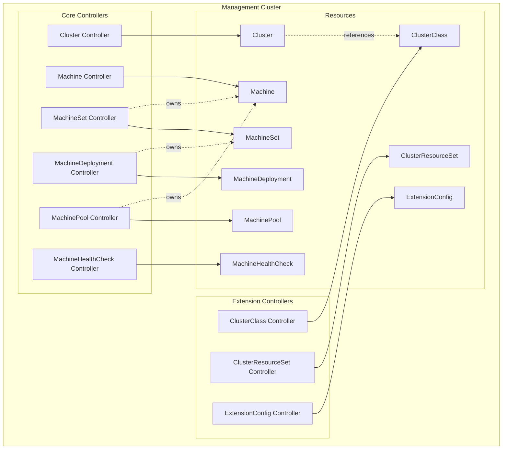
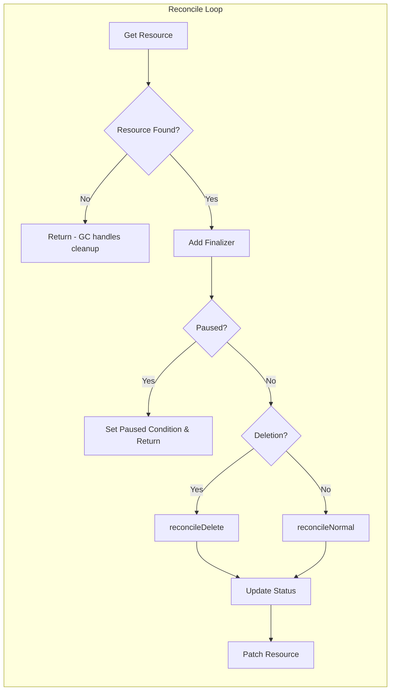

# Cluster API Internal Controllers Documentation

This documentation provides a comprehensive overview of the internal controllers in Cluster API (CAPI), using **Kubernetes Reconciler Transition Tables (KRTT)** and **Mermaid diagrams** to illustrate the reconciliation logic.

## Table of Contents

1. [Overview](#overview)
2. [Controller Architecture](#controller-architecture)
3. [Cluster Controller](cluster_controller.md)
4. [Machine Controller](machine_controller.md)
5. [MachineSet Controller](machineset_controller.md)
6. [MachineDeployment Controller](machinedeployment_controller.md)
7. [MachinePool Controller](machinepool_controller.md)
8. [MachineHealthCheck Controller](machinehealthcheck_controller.md)
9. [ClusterClass Controller](clusterclass_controller.md)
10. [ClusterResourceSet Controller](clusterresourceset_controller.md)
11. [ExtensionConfig Controller](extensionconfig_controller.md)

---

## Overview

Cluster API uses a collection of controllers that work together to manage the lifecycle of Kubernetes clusters. Each controller follows the Kubernetes controller pattern: watch resources, compare desired state with actual state, and reconcile differences.

## Controller Architecture

All controllers in CAPI follow a consistent architecture pattern:

### Common Patterns

1. **Finalizers**: All controllers add finalizers to ensure cleanup during deletion
2. **Pause Handling**: All controllers respect the pause annotation and condition
3. **Status Updates**: Controllers update status in a deferred function to ensure consistency
4. **Patch Helper**: All controllers use patch helpers to minimize conflicts
5. **Phase-based Reconciliation**: Controllers execute multiple reconciliation phases in sequence
6. **Condition Management**: Controllers use both v1beta1 (deprecated) and v1beta2 conditions
7. **External Object Tracking**: Controllers track and watch external objects (infra, bootstrap)

---

## KRTT Format Reference

This documentation uses **Kubernetes Reconciler Transition Tables (KRTT)** to describe reconciliation logic:

| Column | Description |
|--------|-------------|
| **Observed Status** | Current state of the resource `Status` (or Conditions) as observed in the cluster |
| **Desired Spec** | The intended state defined by the user in the `Spec` |
| **Trigger / Condition** | The specific event, delta, or error that triggered this reconcile loop |
| **Reconciliation Action** | The idempotent logic executed by the controller to align actual with desired |
| **Resulting Status** | The updated `Status` and `Conditions` set after a successful action |

### KRTT Usage Rules

1. **Idempotency**: Actions must be safe to repeat if the controller restarts
2. **Conditions**: Use "Resulting Status" to track granular lifecycle stages (e.g., `Ready=True`)
3. **Deletions**: Always include a row for `DeletionTimestamp != nil` to document Finalizer logic
4. **Error Handling**: Explicitly define what happens (and the Requeue strategy) when an action fails

---

## Quick Reference: Controller Responsibilities

| Controller | Primary Resource | Key Responsibilities |
|------------|-----------------|---------------------|
| **Cluster** | `Cluster` | Manages cluster lifecycle, infrastructure, control plane |
| **Machine** | `Machine` | Manages machine lifecycle, bootstrap, infrastructure, node |
| **MachineSet** | `MachineSet` | Manages replica count, creates/deletes machines |
| **MachineDeployment** | `MachineDeployment` | Manages rollout strategy, creates/manages MachineSets |
| **MachinePool** | `MachinePool` | Manages pool of machines (provider-specific scaling) |
| **MachineHealthCheck** | `MachineHealthCheck` | Monitors machine health, triggers remediation |
| **ClusterClass** | `ClusterClass` | Validates templates, manages variables |
| **ClusterResourceSet** | `ClusterResourceSet` | Applies resources to matching clusters |
| **ExtensionConfig** | `ExtensionConfig` | Manages runtime extension discovery |

---

## Navigation

- [Cluster Controller →](cluster_controller.md)
- [Machine Controller →](machine_controller.md)
- [MachineSet Controller →](machineset_controller.md)
- [MachineDeployment Controller →](machinedeployment_controller.md)
- [MachinePool Controller →](machinepool_controller.md)
- [MachineHealthCheck Controller →](machinehealthcheck_controller.md)
- [ClusterClass Controller →](clusterclass_controller.md)
- [ClusterResourceSet Controller →](clusterresourceset_controller.md)
- [ExtensionConfig Controller →](extensionconfig_controller.md)
