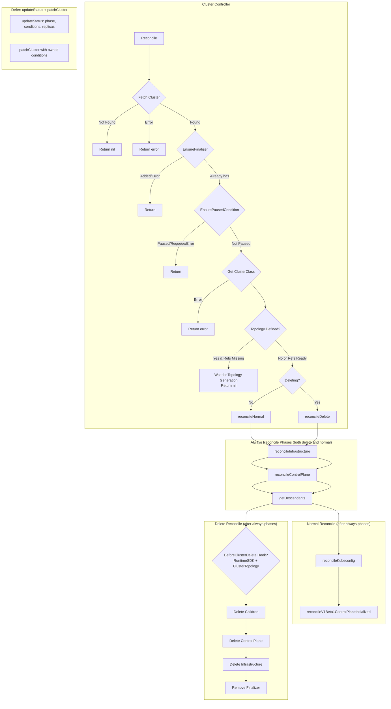
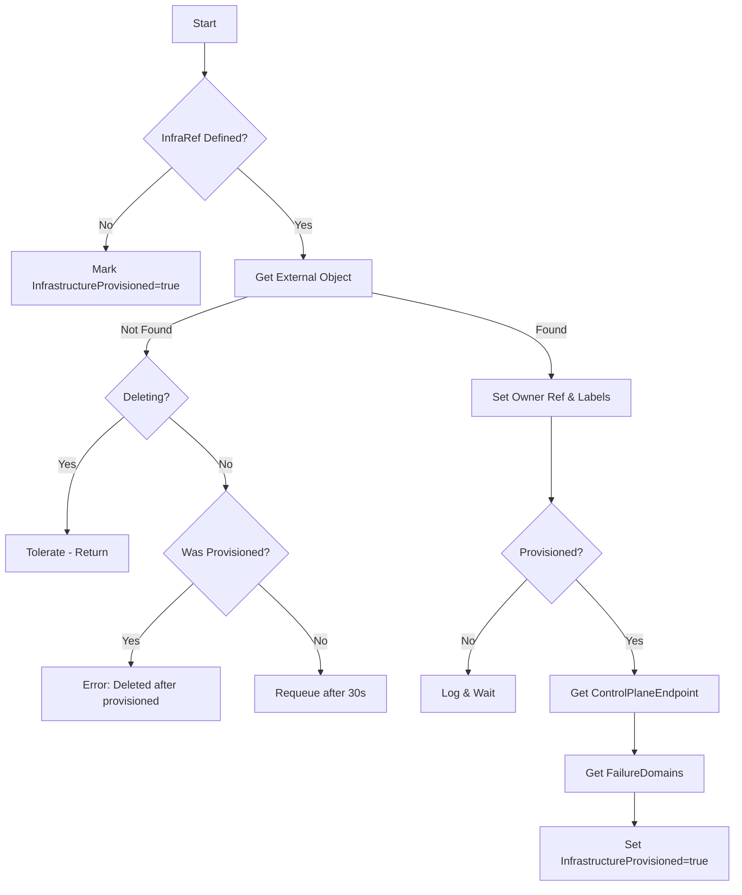
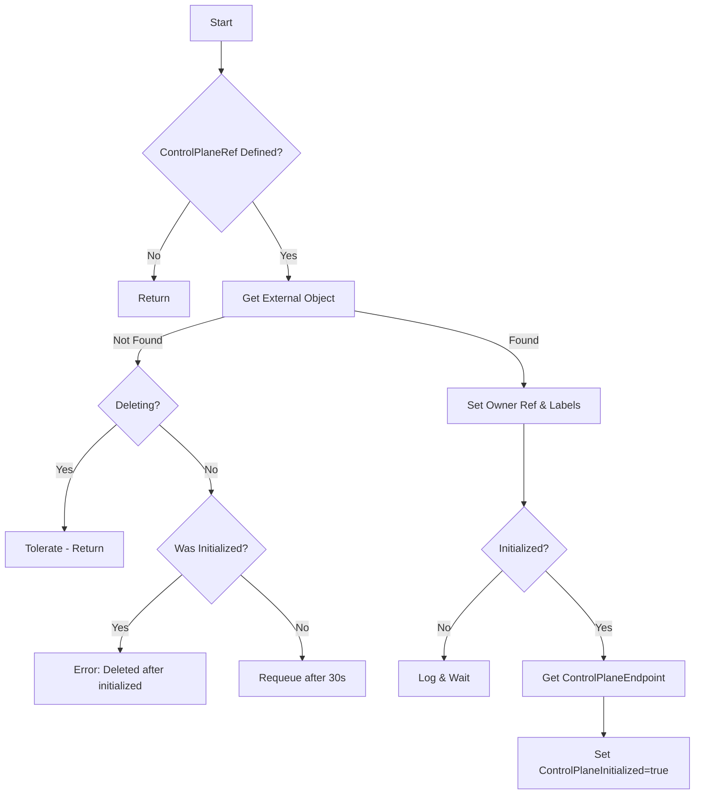
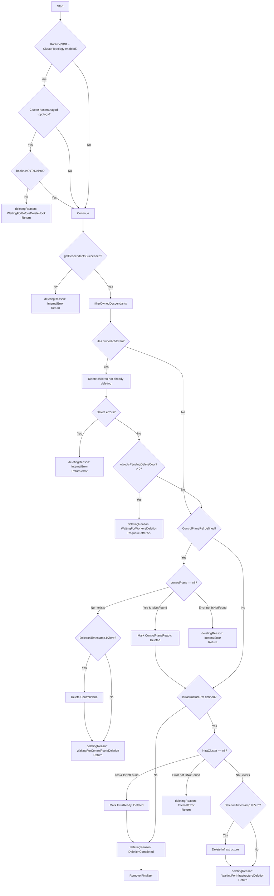

# Cluster Controller

The Cluster Controller manages the lifecycle of `Cluster` resources, coordinating infrastructure provisioning, control plane initialization, and cluster-wide operations.

## Overview

## Reconciliation Phases

### 1. reconcileInfrastructure

Reconciles the `spec.infrastructureRef` object.

### 2. reconcileControlPlane

Reconciles the `spec.controlPlaneRef` object.

### 3. reconcileDelete

Handles cluster deletion with proper ordering. The controller follows a strict deletion sequence:
1. Wait for BeforeClusterDelete hook (if RuntimeSDK + ClusterTopology enabled)
2. Delete all descendant resources (MachineDeployments, MachineSets, Machines, MachinePools)
3. Delete ControlPlane object
4. Delete Infrastructure object
5. Remove finalizer

**Note:** The `deletingReason` and `deletingMessage` are stored in the scope and used later by `setDeletingCondition` in `updateStatus`.

## KRTT - Kubernetes Reconciler Transition Table

### Normal Reconciliation

| Observed Status | Desired Spec | Trigger / Condition | Reconciliation Action | Resulting Status |
|:---|:---|:---|:---|:---|
| Cluster not found | - | Object deleted | Return nil (no-op) | - |
| Cluster without finalizer | Any | Object fetched | Add `cluster.cluster.x-k8s.io` finalizer, return | Cluster with finalizer |
| Cluster paused | Any | Paused annotation or spec | `EnsurePausedCondition` sets condition | Paused=True |
| Topology defined, refs missing | Topology defined | Initial with ClusterClass | Log and return nil (wait for topology controller) | No change |
| Phase=Pending, No InfraRef | InfraRef not defined | No infra template | Mark InfrastructureProvisioned=true, V1Beta1 InfrastructureReady=True | Phase=Provisioning |
| Phase=Pending | InfraRef defined | Initial creation | Get infra object, set owner ref + cluster label | InfrastructureReady mirrors infra |
| InfrastructureReady=False | InfraRef defined | Infra not found (not deleting) | Requeue after 30s | No change |
| InfrastructureReady=False | InfraRef defined | Infra provisioned=true | Copy ControlPlaneEndpoint, FailureDomains | InfrastructureProvisioned=True |
| ControlPlaneRef defined | ControlPlaneRef defined | CP not found (not deleting) | Requeue after 30s | ControlPlaneReady=False |
| ControlPlaneRef defined | ControlPlaneRef defined | CP initialized=true | Copy ControlPlaneEndpoint | ControlPlaneInitialized=True |
| No ControlPlaneRef | Endpoint valid | CP initialized, no Kubeconfig secret | Generate Kubeconfig secret | Kubeconfig created |
| No ControlPlaneRef | - | No CP ref, active machines | Check for control plane machine with NodeRef | ControlPlaneInitialized=True when found |
| Phase=Provisioning | All ready | Infra provisioned + CP initialized | setPhase | Phase=Provisioned |

### Deletion Reconciliation

| Observed Status | Desired Spec | Trigger / Condition | Reconciliation Action | Resulting Status |
|:---|:---|:---|:---|:---|
| DeletionTimestamp!=nil | - | User deletes Cluster | Run alwaysReconcile phases first | Deleting condition pending |
| RuntimeSDK + ClusterTopology | Managed topology | ok-to-delete annotation missing | Set deletingReason: WaitingForBeforeDeleteHook | Deleting=WaitingForBeforeDeleteHook |
| getDescendants failed | - | Error listing descendants | Set deletingReason: InternalError, return | Deleting=InternalError |
| Has owned descendants | - | Children exist | Delete owned (MD, MS, Machines, MP) not already deleting | Continue cleanup |
| objectsPendingDeleteCount > 0 | - | Descendants still deleting | Set deletingReason: WaitingForWorkersDeletion | Deleting=WaitingForWorkersDeletion, Requeue 5s |
| No descendants | ControlPlaneRef defined | CP still exists | Delete ControlPlane, set deletingReason: WaitingForControlPlaneDeletion | Deleting=WaitingForControlPlaneDeletion |
| CP deleted/not found | InfrastructureRef defined | Infra still exists | Delete Infrastructure, set deletingReason: WaitingForInfrastructureDeletion | Deleting=WaitingForInfrastructureDeletion |
| CP & Infra gone | - | All cleanup done | Set deletingReason: DeletionCompleted, remove finalizer | Object deleted by GC |

### Error Handling

| Observed Status | Desired Spec | Trigger / Condition | Reconciliation Action | Resulting Status |
|:---|:---|:---|:---|:---|
| Finalizer add failed | Any | Patch error | Return error | Requeue with backoff |
| ClusterClass fetch failed | Topology defined | ClusterClass not found/error | Return error | Requeue with backoff |
| InfrastructureProvisioned=true | InfraRef defined | Infra object not found (not deleting) | Return error - "deleted after being provisioned" | Error logged, requeue |
| ControlPlaneInitialized=true | CPRef defined | CP object not found (not deleting) | Return error - "deleted after being initialized" | Error logged, requeue |
| Any | - | External object fetch error | Requeue after 30s (if not found) or error | Condition reflects state |
| Any | - | Generic API error | Requeue with error | Error logged, requeue |
| Deleting | - | filterOwnedDescendants error | Set deletingReason: InternalError | Deleting=InternalError |
| Deleting | - | Delete child error | Set deletingReason: InternalError, return error | Deleting=InternalError, requeue |

## Status Fields

The Cluster controller manages the following status fields:

| Field | Description |
|-------|-------------|
| `status.phase` | Current phase: Pending, Provisioning, Provisioned, Deleting, Failed |
| `status.initialization.infrastructureProvisioned` | Whether infrastructure is provisioned |
| `status.initialization.controlPlaneInitialized` | Whether control plane is initialized |
| `status.failureDomains` | Available failure domains from infrastructure |
| `status.controlPlane.replicas` | Current number of control plane replicas |
| `status.controlPlane.readyReplicas` | Number of ready control plane replicas |
| `status.controlPlane.availableReplicas` | Number of available control plane replicas |
| `status.controlPlane.upToDateReplicas` | Number of up-to-date control plane replicas |
| `status.controlPlane.desiredReplicas` | Desired number of control plane replicas |
| `status.workers.replicas` | Total worker machine replicas |
| `status.workers.readyReplicas` | Number of ready worker replicas |
| `status.workers.availableReplicas` | Number of available worker replicas |
| `status.workers.upToDateReplicas` | Number of up-to-date worker replicas |
| `status.workers.desiredReplicas` | Desired number of worker replicas |

## Conditions

### V1Beta2 Conditions

| Condition | Description |
|-----------|-------------|
| `InfrastructureReady` | Infrastructure cluster is provisioned and ready |
| `ControlPlaneAvailable` | Control plane is available |
| `ControlPlaneInitialized` | First control plane machine has NodeRef |
| `ControlPlaneMachinesReady` | All control plane machines are ready |
| `ControlPlaneMachinesUpToDate` | All control plane machines match desired spec |
| `WorkersAvailable` | Worker resources are available |
| `WorkerMachinesReady` | All worker machines are ready |
| `WorkerMachinesUpToDate` | All worker machines match desired spec |
| `RemoteConnectionProbe` | Health of connection to workload cluster |
| `RollingOut` | A rollout is in progress |
| `ScalingUp` | Cluster is scaling up |
| `ScalingDown` | Cluster is scaling down |
| `Remediating` | Unhealthy machines are being remediated |
| `Deleting` | Set during deletion with progress details |
| `Available` | Overall cluster availability (summary) |
| `Paused` | Set when cluster is paused |

### V1Beta1 Conditions (Deprecated)

| Condition | Description |
|-----------|-------------|
| `Ready` | Summary condition of ControlPlaneReady + InfrastructureReady |
| `ControlPlaneReady` | Mirrors control plane object's ready condition |
| `InfrastructureReady` | Mirrors infrastructure object's ready condition |
| `ControlPlaneInitialized` | Control plane is initialized |

## Watches

The Cluster controller watches:

1. **Cluster** - Primary resource
2. **Machine** - Control plane machines for initialization check
3. **MachineDeployment** - For status aggregation
4. **MachinePool** - For status aggregation (if feature enabled)
5. **ClusterCache** - For remote connection health

---

[← Back to Index](README.md) | [Next: Machine Controller →](machine_controller.md)
