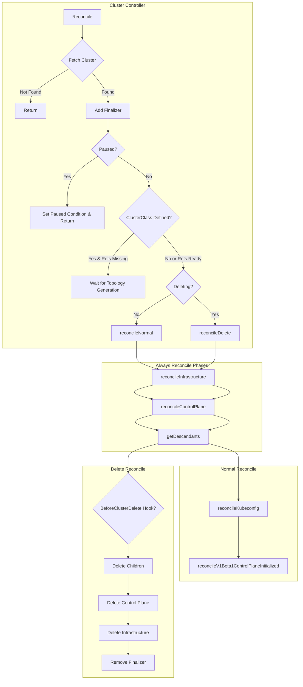
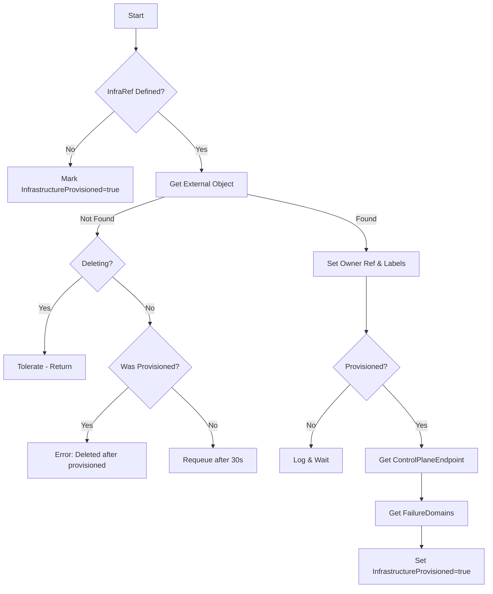
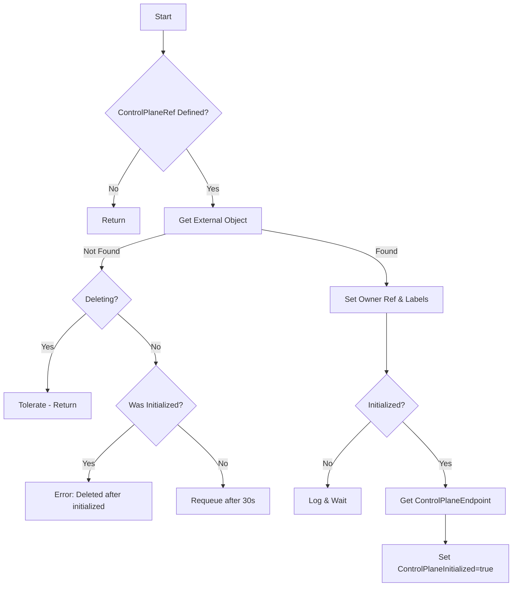
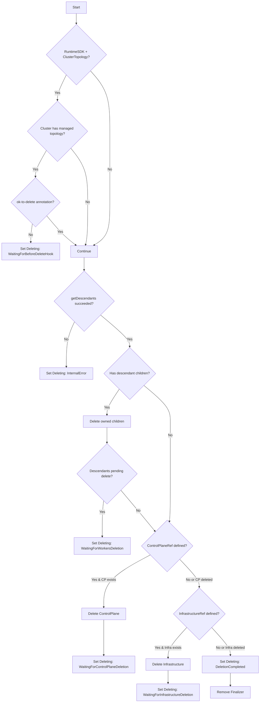

# Cluster Controller

The Cluster Controller manages the lifecycle of `Cluster` resources, coordinating infrastructure provisioning, control plane initialization, and cluster-wide operations.

## Overview

## Reconciliation Phases

### 1. reconcileInfrastructure

Reconciles the `spec.infrastructureRef` object.

### 2. reconcileControlPlane

Reconciles the `spec.controlPlaneRef` object.

### 3. reconcileDelete

Handles cluster deletion with proper ordering. The controller follows a strict deletion sequence:
1. Wait for BeforeClusterDelete hook (if RuntimeSDK + ClusterTopology enabled)
2. Delete all descendant resources (MachineDeployments, MachineSets, Machines, MachinePools)
3. Delete ControlPlane object
4. Delete Infrastructure object
5. Remove finalizer

## KRTT - Kubernetes Reconciler Transition Table

### Normal Reconciliation

| Observed Status | Desired Spec | Trigger / Condition | Reconciliation Action | Resulting Status |
|:---|:---|:---|:---|:---|
| Phase=Pending, No InfraRef | InfraRef not defined | Initial creation | Skip infra reconciliation, mark InfrastructureProvisioned=true | Phase=Provisioning |
| Phase=Pending | InfraRef defined | Initial creation | Get/create infrastructure object, set owner reference | Phase=Provisioning, InfrastructureReady=False |
| InfrastructureReady=False | InfraRef defined | Infra object created | Watch infra object, wait for provisioned=true | No change, requeue |
| InfrastructureReady=False | InfraRef defined | Infra reports provisioned=true | Copy ControlPlaneEndpoint, FailureDomains to Cluster | InfrastructureProvisioned=True |
| ControlPlaneReady=False | ControlPlaneRef defined | Infra ready | Get/create control plane object, set owner reference | ControlPlaneReady condition mirrors CP |
| ControlPlaneReady=False | ControlPlaneRef defined | CP reports initialized=true | Copy ControlPlaneEndpoint to Cluster | ControlPlaneInitialized=True |
| ControlPlaneReady=True | Valid endpoint | CP initialized, no Kubeconfig | Generate Kubeconfig secret (if no CP ref) | Kubeconfig secret created |
| Phase=Provisioning | All refs ready | Infra provisioned + endpoint valid | Update phase | Phase=Provisioned |

### Deletion Reconciliation

| Observed Status | Desired Spec | Trigger / Condition | Reconciliation Action | Resulting Status |
|:---|:---|:---|:---|:---|
| DeletionTimestamp!=nil | - | User deletes Cluster | Check BeforeClusterDelete hook (if RuntimeSDK) | Deleting condition set |
| Has descendants | - | Children exist | Delete owned MachineDeployments, MachineSets, Machines | Requeue after 5s |
| No worker descendants | ControlPlaneRef exists | CP still present | Delete ControlPlane object | Wait for CP deletion |
| No CP | InfraRef exists | Infra still present | Delete Infrastructure object | Wait for Infra deletion |
| No CP, No Infra | - | All children gone | Remove finalizer | Object deleted by GC |

### Error Handling

| Observed Status | Desired Spec | Trigger / Condition | Reconciliation Action | Resulting Status |
|:---|:---|:---|:---|:---|
| InfrastructureProvisioned=true | InfraRef defined | Infra object not found | Return error - infra deleted after provisioned | Error logged |
| ControlPlaneInitialized=true | CPRef defined | CP object not found | Return error - CP deleted after initialized | Error logged |
| Any | - | Generic API error | Requeue with error | Error logged, requeue |
| Any | - | Object paused | Set Paused condition, return | Paused=True |

## Status Fields

The Cluster controller manages the following status fields:

| Field | Description |
|-------|-------------|
| `status.phase` | Current phase: Pending, Provisioning, Provisioned, Deleting, Failed |
| `status.initialization.infrastructureProvisioned` | Whether infrastructure is provisioned |
| `status.initialization.controlPlaneInitialized` | Whether control plane is initialized |
| `status.failureDomains` | Available failure domains from infrastructure |
| `status.controlPlane.replicas` | Current number of control plane replicas |
| `status.controlPlane.readyReplicas` | Number of ready control plane replicas |
| `status.controlPlane.availableReplicas` | Number of available control plane replicas |
| `status.controlPlane.upToDateReplicas` | Number of up-to-date control plane replicas |
| `status.controlPlane.desiredReplicas` | Desired number of control plane replicas |
| `status.workers.replicas` | Total worker machine replicas |
| `status.workers.readyReplicas` | Number of ready worker replicas |
| `status.workers.availableReplicas` | Number of available worker replicas |
| `status.workers.upToDateReplicas` | Number of up-to-date worker replicas |
| `status.workers.desiredReplicas` | Desired number of worker replicas |

## Conditions

### V1Beta2 Conditions

| Condition | Description |
|-----------|-------------|
| `InfrastructureReady` | Infrastructure cluster is provisioned and ready |
| `ControlPlaneAvailable` | Control plane is available |
| `ControlPlaneInitialized` | First control plane machine has NodeRef |
| `ControlPlaneMachinesReady` | All control plane machines are ready |
| `ControlPlaneMachinesUpToDate` | All control plane machines match desired spec |
| `WorkersAvailable` | Worker resources are available |
| `WorkerMachinesReady` | All worker machines are ready |
| `WorkerMachinesUpToDate` | All worker machines match desired spec |
| `RemoteConnectionProbe` | Health of connection to workload cluster |
| `RollingOut` | A rollout is in progress |
| `ScalingUp` | Cluster is scaling up |
| `ScalingDown` | Cluster is scaling down |
| `Remediating` | Unhealthy machines are being remediated |
| `Deleting` | Set during deletion with progress details |
| `Available` | Overall cluster availability (summary) |
| `Paused` | Set when cluster is paused |

### V1Beta1 Conditions (Deprecated)

| Condition | Description |
|-----------|-------------|
| `Ready` | Summary condition of ControlPlaneReady + InfrastructureReady |
| `ControlPlaneReady` | Mirrors control plane object's ready condition |
| `InfrastructureReady` | Mirrors infrastructure object's ready condition |
| `ControlPlaneInitialized` | Control plane is initialized |

## Watches

The Cluster controller watches:

1. **Cluster** - Primary resource
2. **Machine** - Control plane machines for initialization check
3. **MachineDeployment** - For status aggregation
4. **MachinePool** - For status aggregation (if feature enabled)
5. **ClusterCache** - For remote connection health

---

[← Back to Index](README.md) | [Next: Machine Controller →](machine_controller.md)
