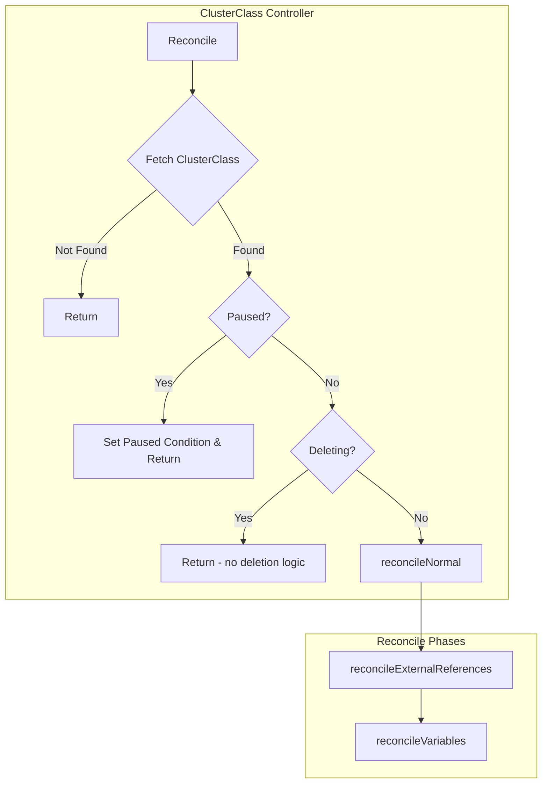
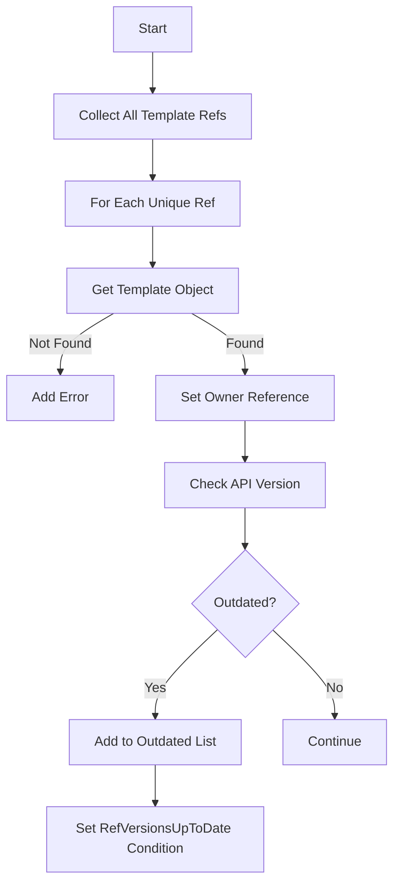
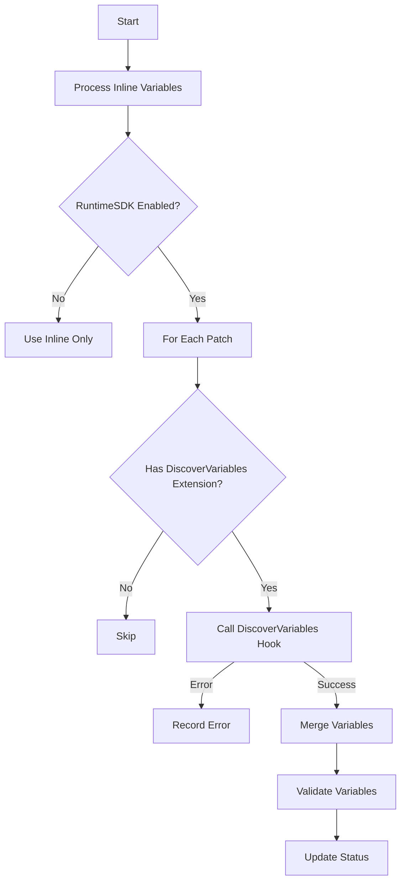
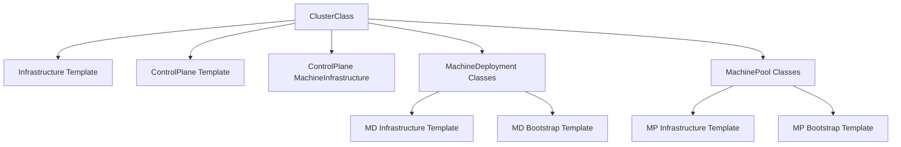
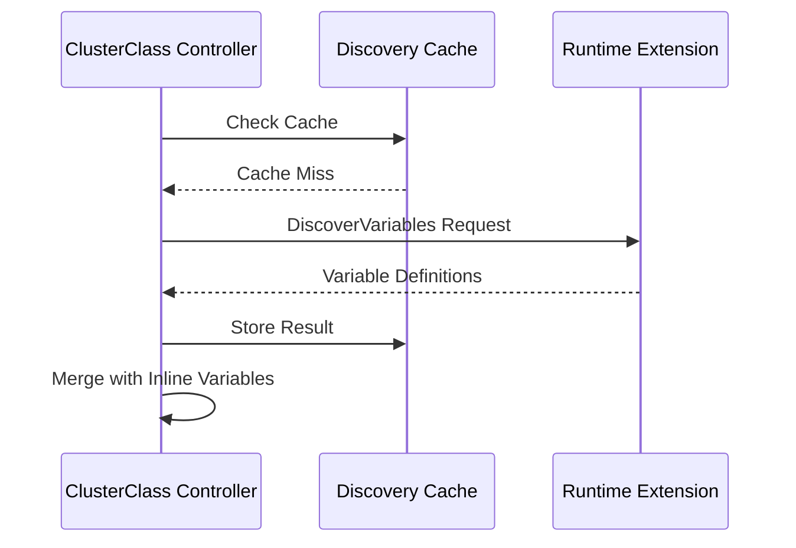
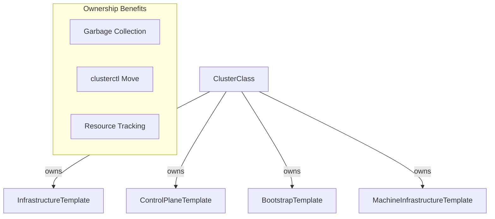
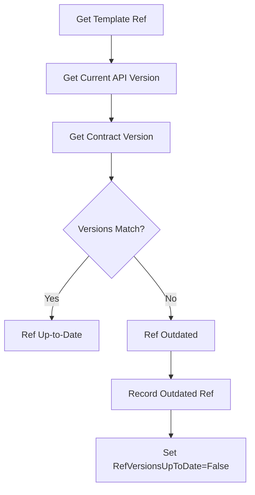

# ClusterClass Controller

The ClusterClass Controller manages `ClusterClass` resources, validating templates, managing variables, and ensuring external references are properly configured.

## Overview



## Reconciliation Phases

### 1. reconcileExternalReferences

Ensures all referenced templates are owned by the ClusterClass and checks for outdated API versions.



### 2. reconcileVariables

Processes inline variables and discovers variables from runtime extensions.



## KRTT - Kubernetes Reconciler Transition Table

### Normal Reconciliation

| Observed Status | Desired Spec | Trigger / Condition | Reconciliation Action | Resulting Status |
|:---|:---|:---|:---|:---|
| New ClusterClass | Templates defined | Initial creation | Get all templates, set owner refs | VariablesReconciled condition set |
| RefVersionsUpToDate=Unknown | Template refs defined | Templates found | Check API versions for each ref | RefVersionsUpToDate=True/False |
| RefVersionsUpToDate=False | Template refs with old API | Outdated refs detected | Log outdated refs | RefVersionsUpToDate=False with message |
| VariablesReady=Unknown | Inline variables defined | Variables to process | Validate inline variables | VariablesReady reflects validation |
| VariablesReady=Unknown | External patches defined | RuntimeSDK enabled | Call DiscoverVariables hooks | VariablesReady reflects discovery |
| Variables merged | All sources processed | Discovery complete | Validate all variables | VariablesReady=True if valid |

### Error Handling

| Observed Status | Desired Spec | Trigger / Condition | Reconciliation Action | Resulting Status |
|:---|:---|:---|:---|:---|
| Template not found | Template ref defined | Template missing | Log error, set condition | VariablesReconciled=False |
| DiscoverVariables failed | External patch defined | Extension error | Log error, continue | VariablesReconciled=False |
| Variable validation failed | Variables defined | Invalid schema | Set error condition | VariablesReady=False |
| Any | - | Generic API error | Requeue with error | Error logged, requeue |

## Template References

ClusterClass manages multiple template types:



## Variable Processing

### Inline Variables

```yaml
spec:
  variables:
    - name: imageRepository
      required: true
      schema:
        openAPIV3Schema:
          type: string
          default: "registry.k8s.io"
    - name: workerCount
      required: false
      schema:
        openAPIV3Schema:
          type: integer
          minimum: 1
          maximum: 100
```

### External Variable Discovery



## Status Fields

| Field | Description |
|-------|-------------|
| `status.variables` | List of all discovered variables with definitions |

## Conditions

| Condition | Description |
|-----------|-------------|
| `RefVersionsUpToDate` | Whether all template refs use current API versions |
| `VariablesReady` | Whether variables are valid and ready |
| `Paused` | Set when ClusterClass is paused |

### Variable Status Structure

```yaml
status:
  variables:
    - name: imageRepository
      definitions:
        - from: inline
          required: true
          schema:
            openAPIV3Schema:
              type: string
              default: "registry.k8s.io"
    - name: customVar
      definitions:
        - from: external-patch-name
          required: false
          schema:
            openAPIV3Schema:
              type: object
```

## Owner Reference Management



## API Version Check

The controller checks if template references are using the latest API version:



## Watches

The ClusterClass controller watches:

1. **ClusterClass** - Primary resource
2. **ExtensionConfig** - For variable discovery changes

---

[← Back to Index](README.md) | [Previous: MachineHealthCheck Controller](machinehealthcheck_controller.md) | [Next: ClusterResourceSet Controller →](clusterresourceset_controller.md)
