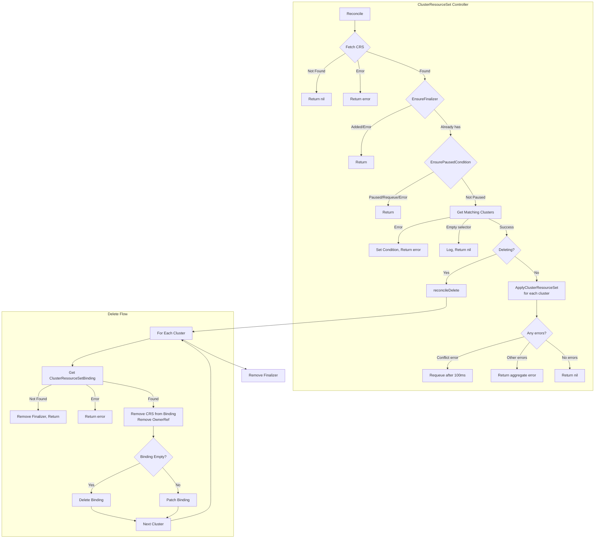
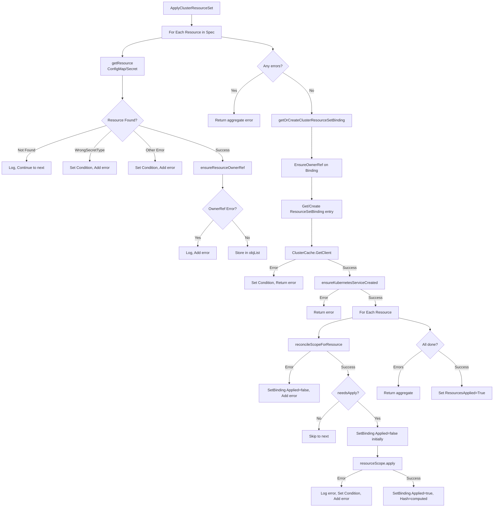
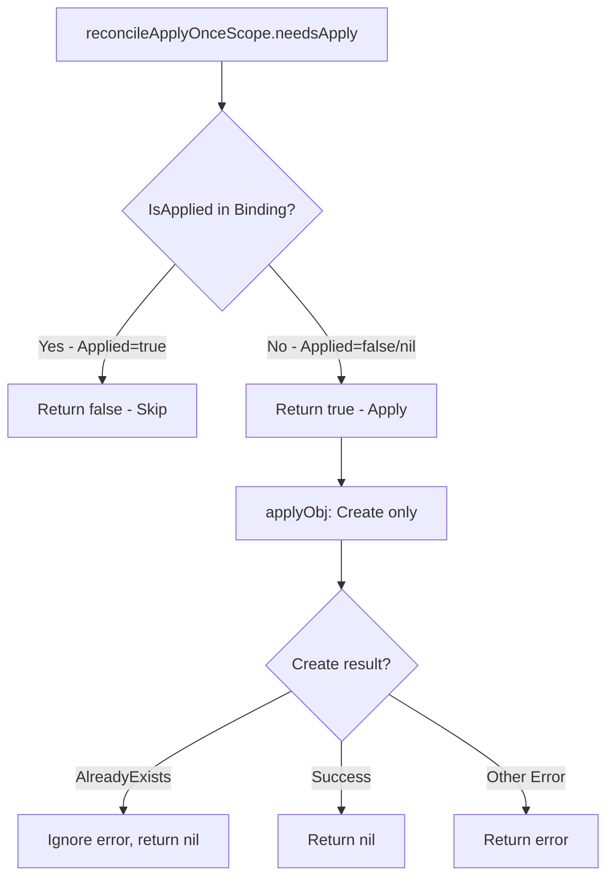
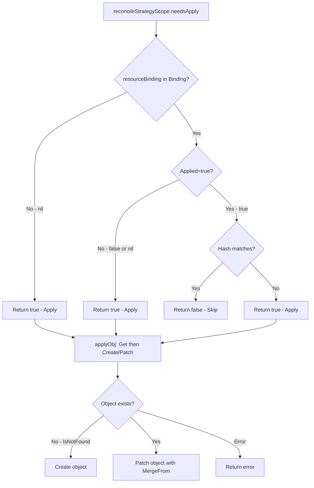
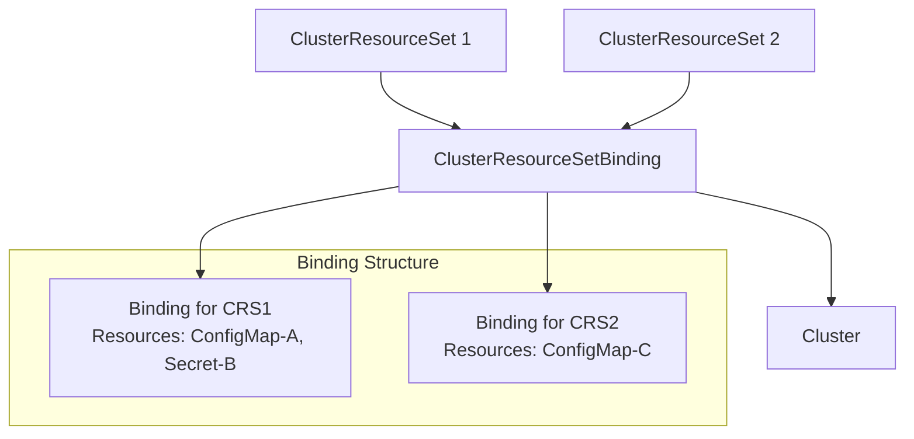
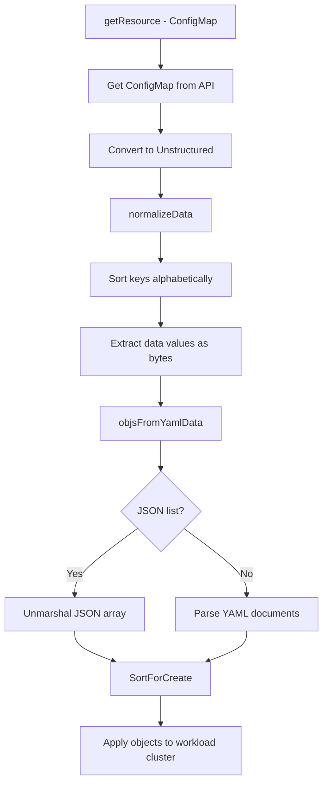
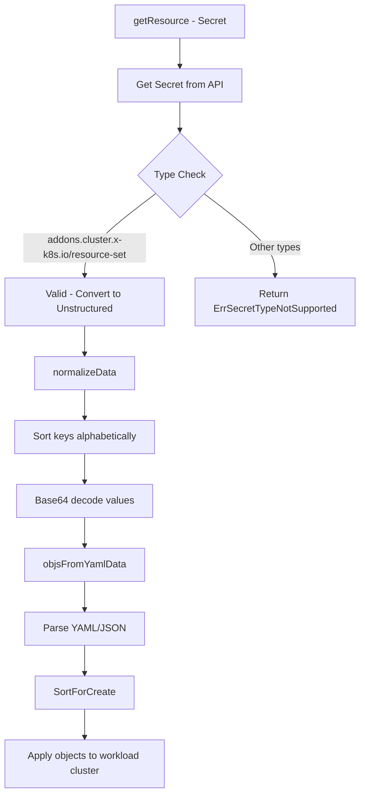
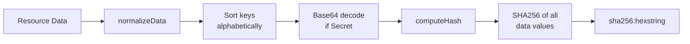
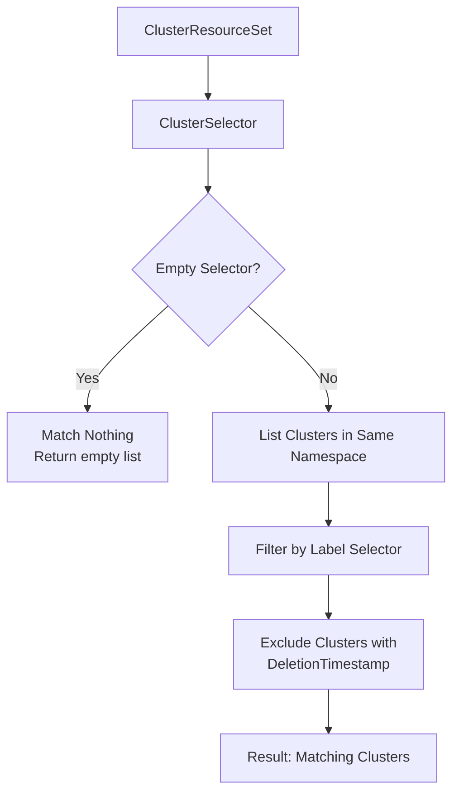

# ClusterResourceSet Controller

The ClusterResourceSet Controller manages `ClusterResourceSet` resources, applying ConfigMaps and Secrets to matching clusters based on label selectors. It uses `ClusterResourceSetBinding` to track which resources have been applied to which clusters.

## Overview



## Resource Application Flow



## KRTT - Kubernetes Reconciler Transition Table

### Main Reconcile Loop

| Observed Status | Desired Spec | Trigger / Condition | Reconciliation Action | Resulting Status |
|:---|:---|:---|:---|:---|
| CRS not found | - | Object deleted before reconcile | Return nil (no-op) | - |
| CRS without finalizer | Any | Object fetched | Add `addons.cluster.x-k8s.io` finalizer, return | CRS with finalizer |
| CRS paused | Any | Paused annotation or Cluster paused | `EnsurePausedCondition` sets condition, skip reconcile | Paused=True |
| Selector invalid | ClusterSelector defined | Invalid label selector | Set ResourcesApplied=False (InternalError), return error | ResourcesApplied=False, requeue with backoff |
| Selector empty | ClusterSelector={} | Empty selector | Log info, return nil (no clusters matched) | No change |
| DeletionTimestamp!=nil | - | User deletes CRS | Execute `reconcileDelete` | Finalizer removed, GC deletes |
| Matching clusters exist | Resources defined | Normal reconcile | Call `ApplyClusterResourceSet` per cluster | ResourcesApplied condition updated |
| Clusters with DeletionTimestamp | Resources defined | Cluster being deleted | Filter out deleting clusters | Continue with non-deleting clusters |

### ApplyClusterResourceSet Flow

| Observed Status | Desired Spec | Trigger / Condition | Reconciliation Action | Resulting Status |
|:---|:---|:---|:---|:---|
| Resource (Secret) wrong type | Resource defined | Secret.Type != `addons.cluster.x-k8s.io/resource-set` | Set condition, add to error list | ResourcesApplied=False (WrongSecretType) |
| Resource not found | Resource defined | ConfigMap/Secret missing (IsNotFound) | Log warning, continue to next (best effort) | Continue (partial application) |
| Resource retrieval error | Resource defined | Other Get error | Set condition (InternalError), add to error list | ResourcesApplied=False (InternalError) |
| OwnerRef missing on resource | Resource exists | Resource without CRS OwnerRef | Patch resource to add OwnerRef | Resource has OwnerRef |
| Binding not exists | Cluster matched | First CRS for this cluster | Create ClusterResourceSetBinding with OwnerRef | Binding created |
| Binding exists | Cluster matched | CRS already bound | Get existing binding | Binding reused |
| Remote client unavailable | - | ClusterCache.GetClient fails | Set ResourcesApplied=False (InternalError) | ResourcesApplied=False, return error |
| K8s service not ready | - | `kubernetes` Service not found in default ns | Return error, requeue | Retry on next reconcile |

### Resource Application (per resource)

| Observed Status | Desired Spec | Trigger / Condition | Reconciliation Action | Resulting Status |
|:---|:---|:---|:---|:---|
| Parse error | Any | `reconcileScopeForResource` fails (YAML parse, etc.) | Set Binding: Applied=false, Hash="", add to error list | ResourcesApplied=False |
| Not applied (ApplyOnce) | strategy=ApplyOnce | `IsApplied(ref)` returns false | Create objects in workload cluster | Binding: Applied=true, Hash set |
| Already applied (ApplyOnce) | strategy=ApplyOnce | `IsApplied(ref)` returns true | Skip (needsApply=false) | No change |
| Hash unchanged (Reconcile) | strategy=Reconcile | `Applied=true` AND Hash matches binding hash | Skip (needsApply=false) | No change |
| Hash changed (Reconcile) | strategy=Reconcile | Hash differs OR `Applied=false` | Get+Patch objects in workload cluster | Binding: Applied=true, new Hash |
| Not in binding (Reconcile) | strategy=Reconcile | `resourceBinding == nil` | Create/Patch objects | Binding: Applied=true, Hash set |
| Object not exists (Reconcile) | strategy=Reconcile | Object not in workload cluster | Create object | Binding updated |
| Object exists (Reconcile) | strategy=Reconcile | Object in workload cluster | Patch object with MergeFrom | Binding updated |
| Apply fails | Any | Create/Patch error | Log error, set Applied=false, add to error list | ResourcesApplied=False (NotApplied) |
| Apply succeeds (all) | Any | No errors | Set ResourcesApplied=True | ResourcesApplied=True (Applied) |

### Deletion Reconciliation

| Observed Status | Desired Spec | Trigger / Condition | Reconciliation Action | Resulting Status |
|:---|:---|:---|:---|:---|
| DeletionTimestamp!=nil | - | User deletes CRS | For each matching cluster: process binding | Start cleanup |
| Binding not found | - | Binding already deleted | Remove finalizer from CRS | CRS ready for GC |
| Binding has this CRS + others | - | Multiple CRS reference binding | Remove CRS entry, remove OwnerRef, Patch binding | Binding persists |
| Binding only has this CRS | - | Single CRS in binding | Delete entire ClusterResourceSetBinding | Binding deleted |
| All bindings processed | - | Cleanup complete | Remove finalizer from CRS | CRS deleted by GC |

### Error Handling

| Observed Status | Desired Spec | Trigger / Condition | Reconciliation Action | Resulting Status |
|:---|:---|:---|:---|:---|
| ClusterSelector parse error | ClusterSelector defined | Invalid selector syntax | Return error, set ResourcesApplied=False (InternalError) | ResourcesApplied=False, Requeue with backoff |
| ConfigMap/Secret not found | Resource defined | Missing resource (IsNotFound) | Log, continue to next (best effort) | Partial application |
| Secret wrong type | Resource defined | Type != resource-set | Set condition, add to error list | ResourcesApplied=False (WrongSecretType) |
| Resource retrieval error | Resource defined | Other Get error | Set condition (InternalError), add to error list | ResourcesApplied=False (InternalError) |
| YAML/JSON parse error | Resource defined | Invalid YAML/JSON in ConfigMap/Secret | Set Applied=false, Hash="", add to error list | ResourcesApplied=False |
| Remote cluster unreachable | - | ClusterCache.GetClient fails | Set condition (InternalError), return error | ResourcesApplied=False, Requeue |
| K8s service not found | - | `kubernetes` Service missing | Return error | Requeue |
| Binding patch conflict | - | Concurrent update by another CRS | Detect aggregate with single Conflict error | Requeue after 100ms (fixed interval) |
| Apply object fails | Any | Create/Patch error on workload cluster | Log error, set Applied=false, continue to next resource | Partial application, ResourcesApplied=False |
| Finalizer add error | Any | Patch fails when adding finalizer | Return error | Requeue with backoff |
| OwnerRef patch fails | Any | Patch resource owner ref fails | Add to error list | Continue with errors |

## Strategy Types

### ApplyOnce Strategy (Default)

The `ApplyOnce` strategy applies resources only once to a cluster. Even if the ConfigMap/Secret content changes, it will not be re-applied.



**Key characteristics:**
- Checks `ResourceSetBinding.IsApplied(resourceRef)` - if `Applied=true`, skip
- Uses `createUnstructured()` which only creates
- Ignores `AlreadyExists` errors (idempotent)
- Hash is stored but never used for comparison in this strategy

### Reconcile Strategy

The `Reconcile` strategy re-applies resources when their content changes, detected via hash comparison.



**Key characteristics:**
- Checks: `resourceBinding == nil || !Applied || Hash != computedHash`
- Uses `Get` then `Create` (if not found) or `Patch` (MergeFrom) for existing objects
- Updates hash in binding after successful apply
- ResourceVersion is set before patching to prevent conflicts

## ClusterResourceSetBinding

The binding tracks which resources have been applied to which clusters. It has the same name as the cluster.

```yaml
apiVersion: addons.cluster.x-k8s.io/v1beta2
kind: ClusterResourceSetBinding
metadata:
  name: my-cluster  # Same name as cluster
  namespace: default
  ownerReferences:
    - apiVersion: addons.cluster.x-k8s.io/v1beta2
      kind: ClusterResourceSet
      name: my-crs
      uid: xxx
spec:
  clusterName: my-cluster
  bindings:
    - clusterResourceSetName: my-crs
      resources:
        - name: my-configmap
          kind: ConfigMap
          applied: true
          hash: "sha256:abc123..."
          lastAppliedTime: "2025-01-15T10:00:00Z"
        - name: my-secret
          kind: Secret
          applied: true
          hash: "sha256:def456..."
          lastAppliedTime: "2025-01-15T10:00:00Z"
```



## Resource Processing

### ConfigMap Processing



### Secret Processing



**Note:** Only Secrets with type `addons.cluster.x-k8s.io/resource-set` are supported. `Opaque` type is NOT supported.

## Hash Computation

The hash is computed for change detection in the Reconcile strategy:



The hash is deterministic because:
1. Keys are sorted alphabetically
2. Each value is written to the hash in order
3. Format: `sha256:<hex-encoded-hash>`

## Status Fields

### ClusterResourceSet Status

| Field | Description |
|-------|-------------|
| `conditions` | Standard Kubernetes conditions (metav1.Condition) |
| `observedGeneration` | Last reconciled generation |
| `deprecated.v1beta1.conditions` | Legacy v1beta1 conditions (for backward compatibility) |

## Conditions

| Condition | Status | Reason | Description |
|-----------|--------|--------|-------------|
| `ResourcesApplied` | True | `Applied` | All resources successfully applied to all matching clusters |
| `ResourcesApplied` | False | `NotApplied` | Failed to apply at least one resource to at least one cluster |
| `ResourcesApplied` | False | `WrongSecretType` | Secret type is not `addons.cluster.x-k8s.io/resource-set` |
| `ResourcesApplied` | False | `InternalError` | Unexpected failure (selector parse, client error, resource retrieval error, etc.) |
| `Paused` | True | `Paused` | ClusterResourceSet is paused (via annotation or Cluster paused) |
| `Paused` | False | `NotPaused` | ClusterResourceSet is not paused |

### V1Beta1 Conditions (Legacy/Deprecated)

| Condition | Status | Reason | Description |
|-----------|--------|--------|-------------|
| `ResourcesApplied` | True | (no reason) | All resources successfully applied |
| `ResourcesApplied` | False | `ClusterMatchFailed` | Failed to match clusters with selector |
| `ResourcesApplied` | False | `WrongSecretType` | Secret type not supported |
| `ResourcesApplied` | False | `RetrievingResourceFailed` | Failed to get resource |
| `ResourcesApplied` | False | `RemoteClusterClientFailed` | Failed to get remote cluster client |
| `ResourcesApplied` | False | `ApplyFailed` | Failed to apply resource to cluster |

## Cluster Selection

```yaml
spec:
  clusterSelector:
    matchLabels:
      environment: production
    matchExpressions:
      - key: cluster.x-k8s.io/cluster-name
        operator: NotIn
        values: ["excluded-cluster"]
```



**Important:** An empty `ClusterSelector` matches **nothing**, not everything.

## Resource Definition

```yaml
apiVersion: addons.cluster.x-k8s.io/v1beta2
kind: ClusterResourceSet
metadata:
  name: my-crs
  namespace: default
spec:
  clusterSelector:
    matchLabels:
      cni: calico
  strategy: ApplyOnce  # or Reconcile (default: ApplyOnce)
  resources:
    - name: my-configmap
      kind: ConfigMap
    - name: my-secret
      kind: Secret
```

## Watches

The ClusterResourceSet controller watches:

| Resource | Watch Type | Handler | Predicate | Purpose |
|----------|------------|---------|-----------|---------|
| `ClusterResourceSet` | For (Primary) | Reconcile | ResourceHasFilterLabel | Main reconciliation trigger |
| `Cluster` | Watches | `clusterToClusterResourceSet` | ResourceHasFilterLabel | Trigger when cluster labels change or new cluster created |
| `ClusterCache` | WatchesRawSource | `clusterToClusterResourceSet` | - | Trigger when workload cluster connection changes |
| `ConfigMap` | WatchesMetadata | `resourceToClusterResourceSetFunc` | ResourceCreateOrUpdate | Trigger when ConfigMap created/updated |
| `Secret` | WatchesRawSource (partialSecretCache) | `resourceToClusterResourceSetFunc` | ResourceIsChanged + ResourceCreateOrUpdate | Trigger when Secret created/updated |

### Mapper Functions

**clusterToClusterResourceSet:**
- Lists all ClusterResourceSets in the same namespace
- For each CRS, checks if cluster labels match the selector
- Returns requests for matching CRS

**resourceToClusterResourceSetFunc:**
- If resource has CRS OwnerReferences, return those CRS names
- Otherwise, list all CRS in namespace and find those referencing this resource

## Finalizer

| Finalizer | Purpose |
|-----------|---------|
| `addons.cluster.x-k8s.io` | Ensures CRS entry is removed from all ClusterResourceSetBindings before deletion |

---

[← Back to Index](README.md) | [Previous: ClusterClass Controller](clusterclass_controller.md) | [Next: ExtensionConfig Controller →](extensionconfig_controller.md)
