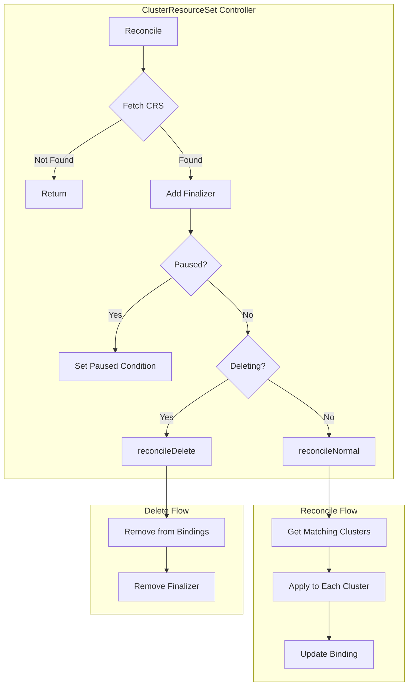
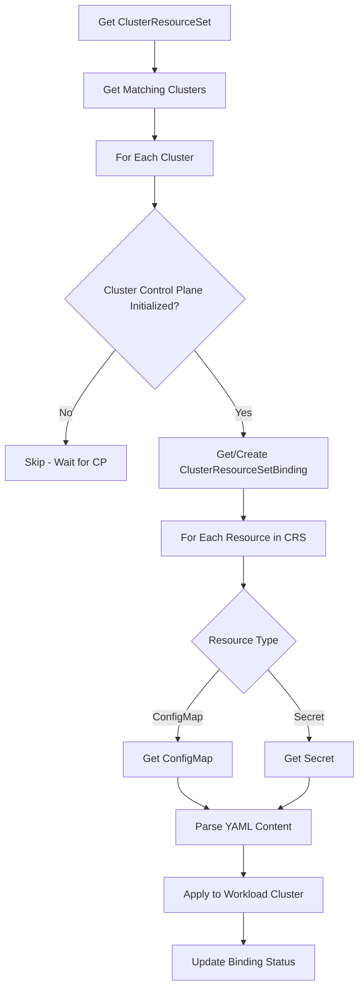
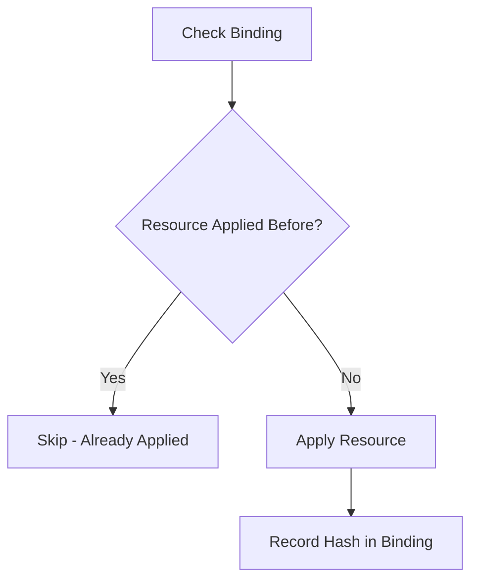
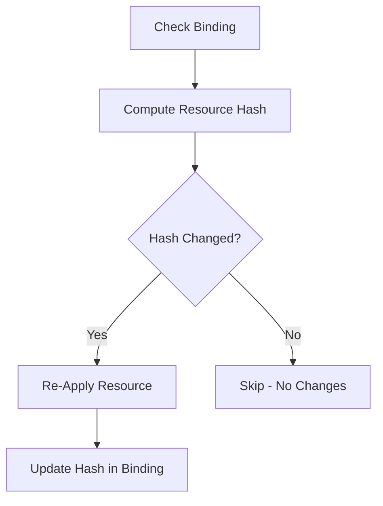
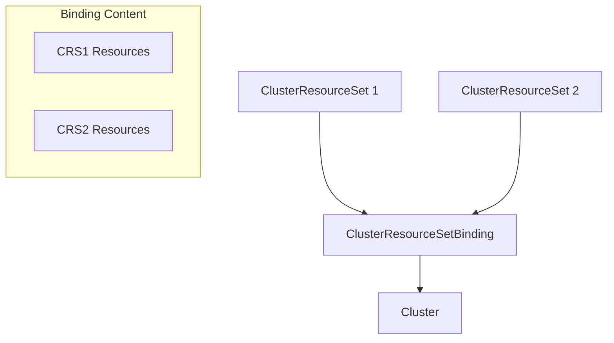
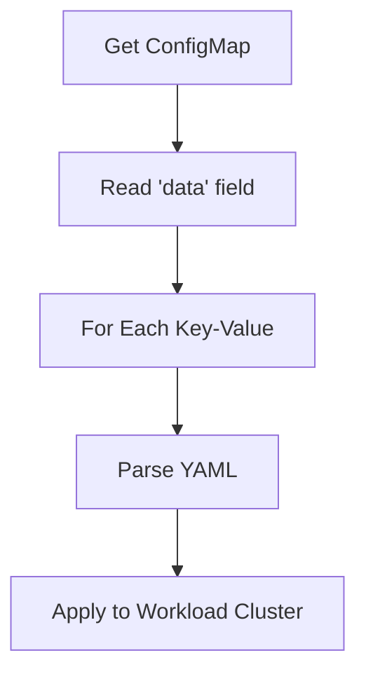
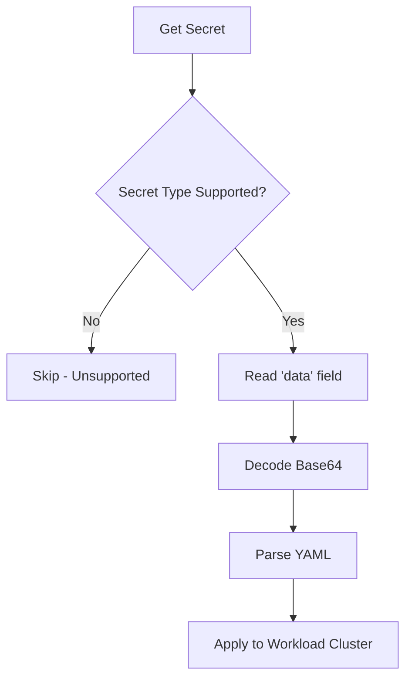
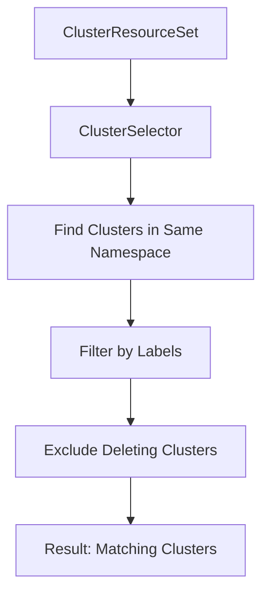

# ClusterResourceSet Controller

The ClusterResourceSet Controller manages `ClusterResourceSet` resources, applying ConfigMaps and Secrets to matching clusters based on label selectors.

## Overview



## Resource Application Flow



## KRTT - Kubernetes Reconciler Transition Table

### Normal Reconciliation

| Observed Status | Desired Spec | Trigger / Condition | Reconciliation Action | Resulting Status |
|:---|:---|:---|:---|:---|
| New CRS | ClusterSelector defined | Initial creation | Find matching clusters | ResourcesApplied=Unknown |
| Matching clusters found | Resources defined | Clusters match selector | Apply resources to clusters | ResourcesApplied in progress |
| Resources applied | strategy=ApplyOnce | First application | Record in binding, skip future applies | ResourcesApplied=True |
| Resources applied | strategy=Reconcile | Content changed | Re-apply resources | ResourcesApplied=True |
| No matching clusters | ClusterSelector defined | No clusters match | Set ResourcesApplied=True (vacuously) | ResourcesApplied=True |

### Resource Application

| Observed Status | Desired Spec | Trigger / Condition | Reconciliation Action | Resulting Status |
|:---|:---|:---|:---|:---|
| Resource not applied | ApplyOnce strategy | New cluster matches | Apply resource, record hash | Binding updated |
| Resource applied | ApplyOnce strategy | Resource changed | Skip re-application | No change |
| Resource applied | Reconcile strategy | Resource changed | Re-apply resource | Binding hash updated |
| Resource missing | Resource defined | ConfigMap/Secret not found | Log error, continue | ResourcesApplied=False |

### Deletion Reconciliation

| Observed Status | Desired Spec | Trigger / Condition | Reconciliation Action | Resulting Status |
|:---|:---|:---|:---|:---|
| DeletionTimestamp!=nil | - | User deletes CRS | Remove from all bindings | Bindings updated |
| Binding has other CRS | - | CRS removed from binding | Patch binding, remove CRS entry | Binding persists |
| Binding only has this CRS | - | CRS removed from binding | Delete binding | Binding deleted |
| All bindings processed | - | Cleanup complete | Remove finalizer | Object deleted by GC |

### Error Handling

| Observed Status | Desired Spec | Trigger / Condition | Reconciliation Action | Resulting Status |
|:---|:---|:---|:---|:---|
| Cluster selector invalid | - | Invalid selector | Log error, set condition | ResourcesApplied=False |
| Resource not found | Resource defined | ConfigMap/Secret missing | Log warning, continue | Partial application |
| Resource parse error | Resource defined | Invalid YAML | Log error, continue | Partial application |
| Apply conflict | - | Concurrent binding update | Requeue after 100ms | Retry application |
| Workload cluster unreachable | - | Connection error | Log error, set condition | ResourcesApplied=False |

## Strategy Types

### ApplyOnce Strategy



### Reconcile Strategy



## ClusterResourceSetBinding

The binding tracks which resources have been applied to which clusters:

```yaml
apiVersion: addons.cluster.x-k8s.io/v1beta2
kind: ClusterResourceSetBinding
metadata:
  name: my-cluster  # Same name as cluster
  namespace: default
spec:
  bindings:
    - clusterResourceSetName: my-crs
      resources:
        - applied: true
          hash: "abc123..."
          kind: ConfigMap
          name: my-configmap
        - applied: true
          hash: "def456..."
          kind: Secret
          name: my-secret
```



## Resource Processing

### ConfigMap Processing



### Secret Processing



Supported Secret types:
- `addons.cluster.x-k8s.io/resource-set` (explicit type)
- `Opaque` (default type)

## Status Fields

ClusterResourceSet doesn't have many status fields, but uses conditions.

## Conditions

| Condition | Description |
|-----------|-------------|
| `ResourcesApplied` | Whether resources have been successfully applied |
| `Paused` | Set when ClusterResourceSet is paused |

## Cluster Selection

```yaml
spec:
  clusterSelector:
    matchLabels:
      environment: production
    matchExpressions:
      - key: cluster.x-k8s.io/cluster-name
        operator: NotIn
        values: ["excluded-cluster"]
```



## Resource Definition

```yaml
spec:
  strategy: ApplyOnce  # or Reconcile
  resources:
    - name: my-configmap
      kind: ConfigMap
    - name: my-secret
      kind: Secret
```

## Watches

The ClusterResourceSet controller watches:

1. **ClusterResourceSet** - Primary resource
2. **Cluster** - For matching clusters
3. **ConfigMap** - For resource changes
4. **Secret** - For resource changes (partial cache)
5. **ClusterCache** - For workload cluster connection

---

[← Back to Index](README.md) | [Previous: ClusterClass Controller](clusterclass_controller.md) | [Next: ExtensionConfig Controller →](extensionconfig_controller.md)
