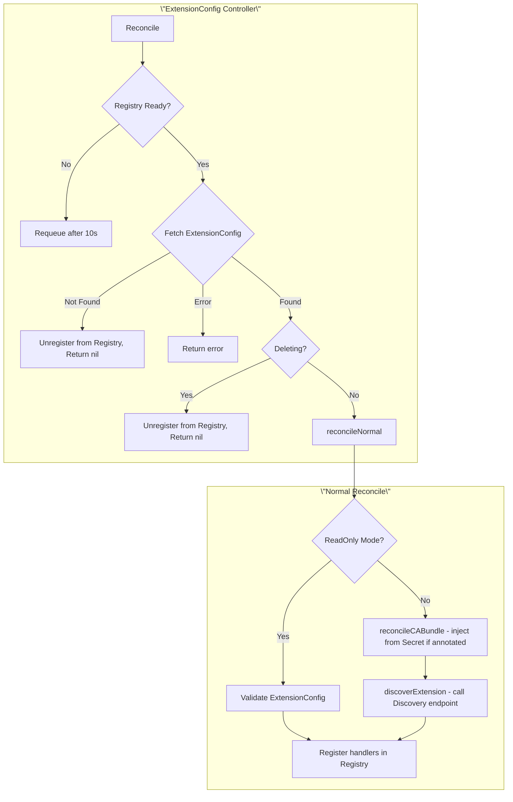
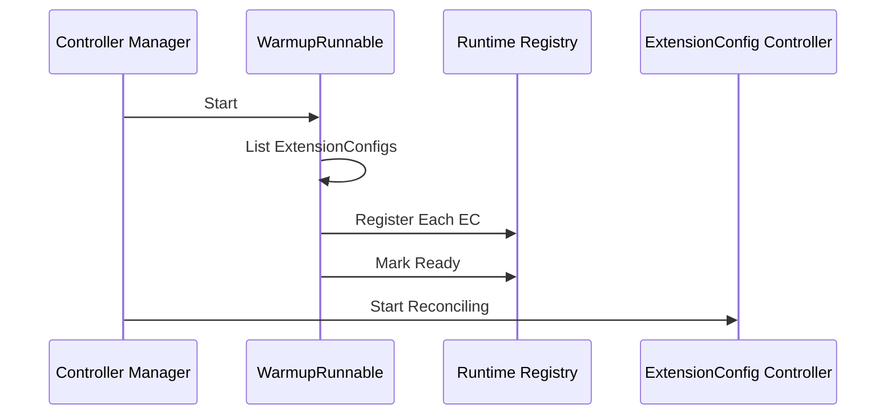
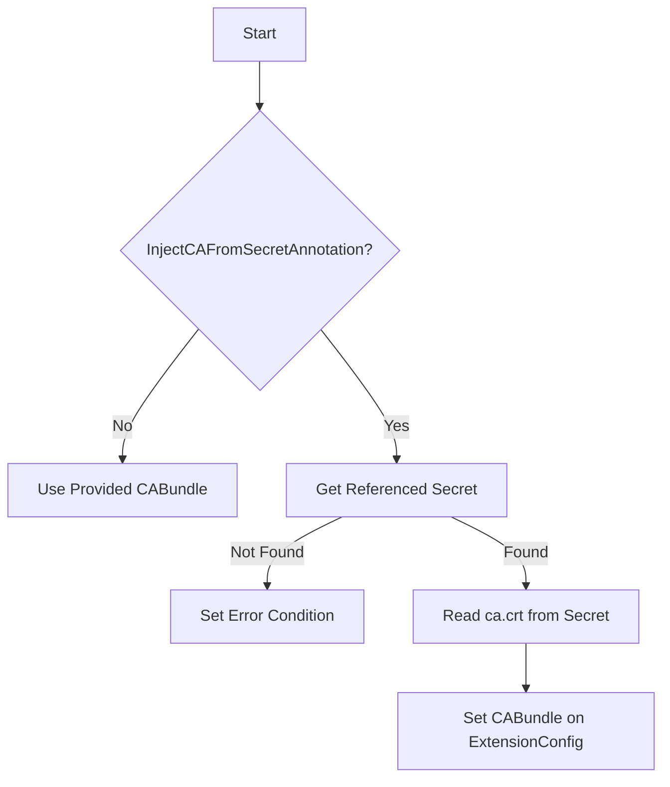
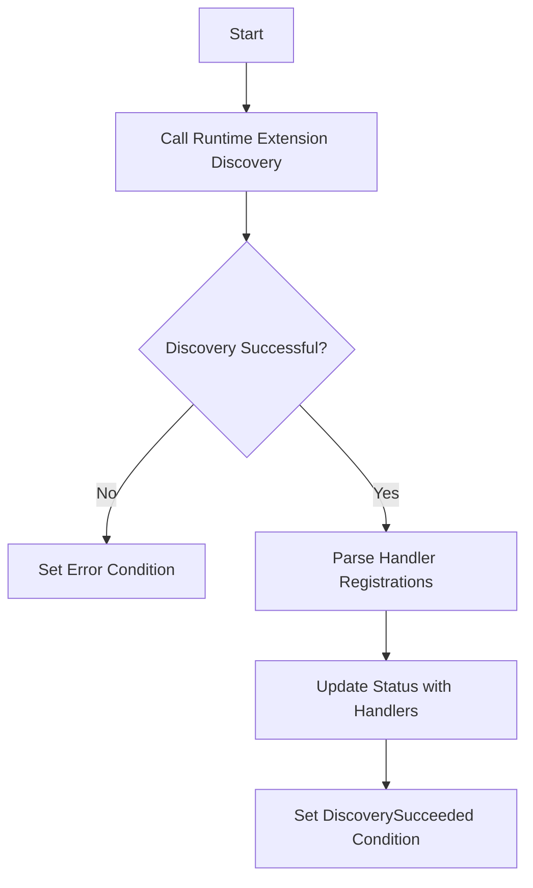
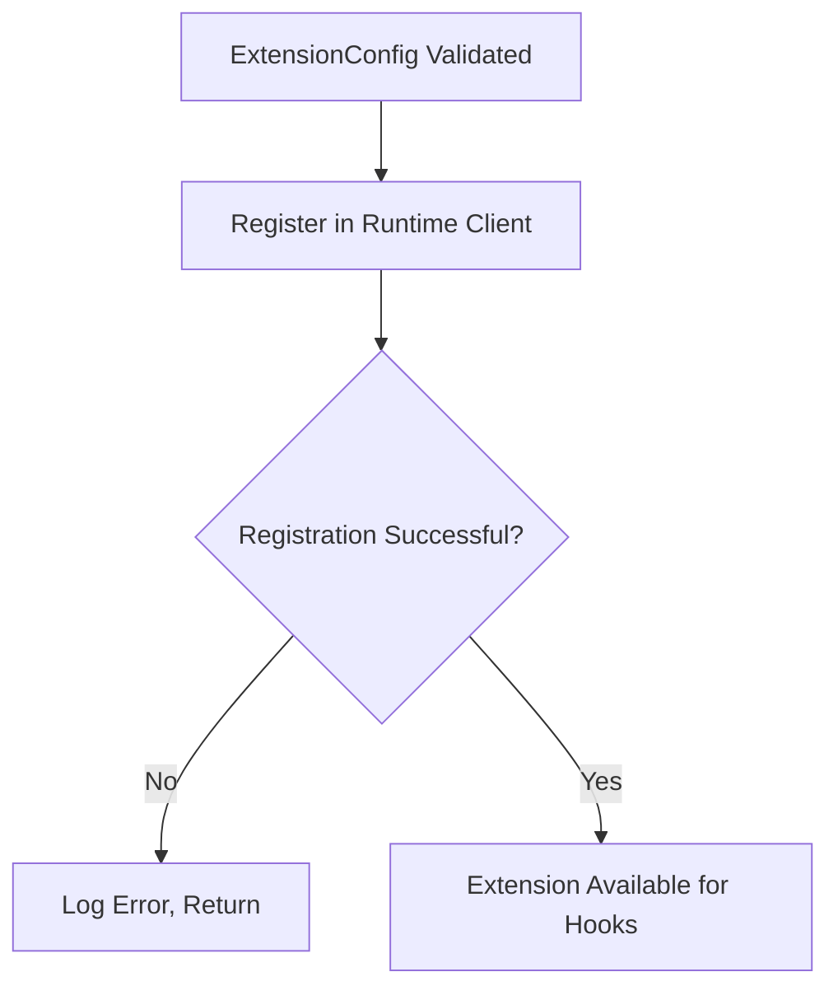
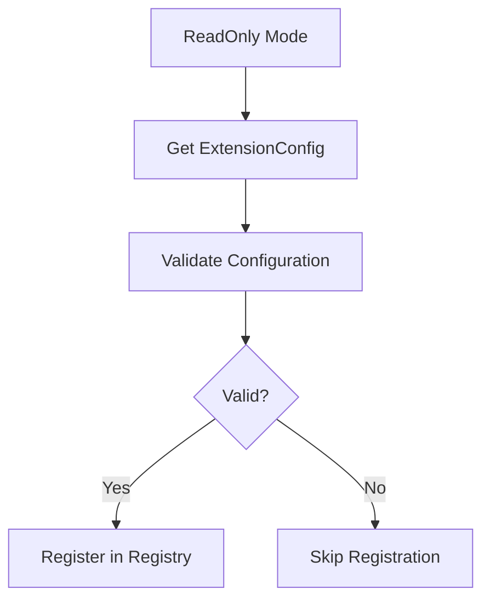
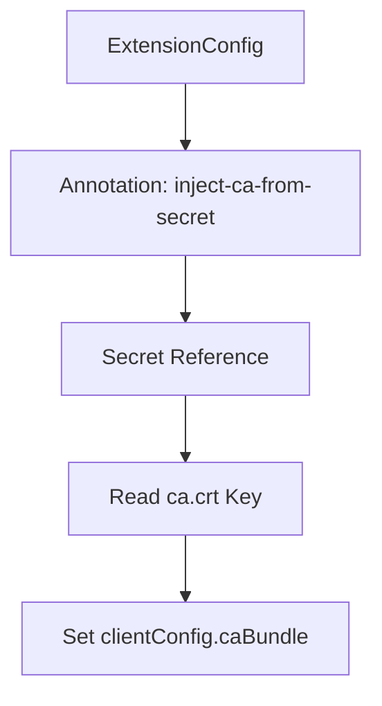
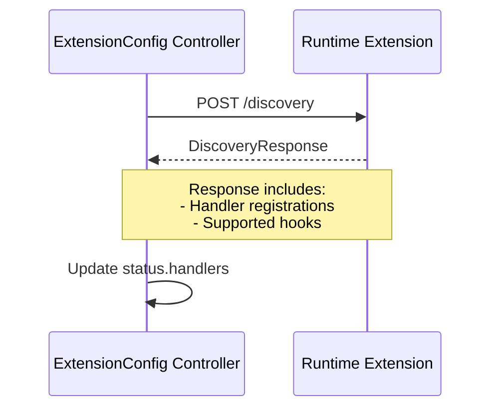
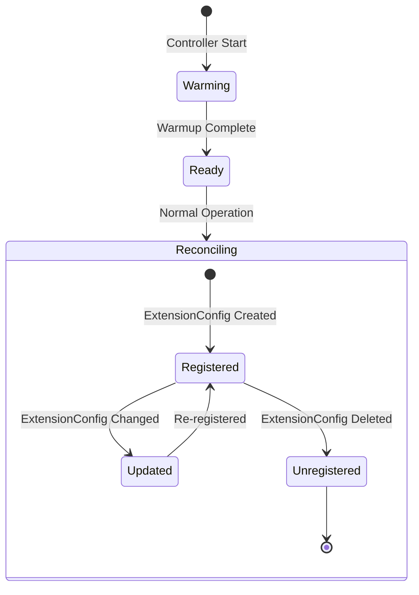

# ExtensionConfig Controller

The ExtensionConfig Controller manages `ExtensionConfig` resources, which configure runtime extensions for the Cluster API Runtime SDK.

## Overview



## Warmup Process

The controller has a warmup phase to ensure extensions are discovered before other controllers start reconciling:



## Reconciliation Phases

### 1. Reconcile CA Bundle

When not in ReadOnly mode, the controller can inject CA certificates from Secrets:



### 2. Discover Extensions



### 3. Register in Registry



## KRTT - Kubernetes Reconciler Transition Table

### Normal Reconciliation

| Observed Status | Desired Spec | Trigger / Condition | Reconciliation Action | Resulting Status |
|:---|:---|:---|:---|:---|
| Registry not ready | - | Controller startup | Requeue after 10s | Waiting for warmup |
| New ExtensionConfig | ClientConfig defined | Initial creation | Validate config | Validation in progress |
| Valid config | CA injection annotation | Secret exists | Inject CA from Secret | CABundle updated |
| CABundle set | ClientConfig valid | CA ready | Call Discovery endpoint | Handlers discovered |
| Handlers discovered | - | Discovery complete | Register in registry | Extension available |

### CA Bundle Injection

| Observed Status | Desired Spec | Trigger / Condition | Reconciliation Action | Resulting Status |
|:---|:---|:---|:---|:---|
| No CABundle | inject-ca-from-secret annotation | Secret exists | Read ca.crt, set CABundle | CABundle populated |
| No CABundle | inject-ca-from-secret annotation | Secret not found | Set error condition | Error logged |
| CABundle outdated | Secret changed | Secret updated | Re-read ca.crt, update CABundle | CABundle updated |

### Deletion Reconciliation

| Observed Status | Desired Spec | Trigger / Condition | Reconciliation Action | Resulting Status |
|:---|:---|:---|:---|:---|
| DeletionTimestamp!=nil | - | User deletes ExtensionConfig | Unregister from registry | Extension unavailable |
| Not found | - | Object deleted | Unregister from registry | Extension removed |

### Error Handling

| Observed Status | Desired Spec | Trigger / Condition | Reconciliation Action | Resulting Status |
|:---|:---|:---|:---|:---|
| Discovery failed | - | Extension unreachable | Log error, set condition | Discovered=False |
| Invalid handlers | - | Handler validation failed | Log error, set condition | Discovered=False |
| CA Secret not found | inject annotation set | Secret missing | Log error, set condition | Error condition |
| Any | - | Generic API error | Requeue with error | Error logged, requeue |

## ReadOnly Mode

In ReadOnly mode, the controller only validates and registers extensions without modifying them:



This mode is useful in multi-tenant environments where ExtensionConfigs are managed externally.

## CA Bundle Injection

The controller supports automatic CA bundle injection from Secrets:

```yaml
apiVersion: runtime.cluster.x-k8s.io/v1beta2
kind: ExtensionConfig
metadata:
  name: my-extension
  annotations:
    runtime.cluster.x-k8s.io/inject-ca-from-secret: my-namespace/my-ca-secret
spec:
  clientConfig:
    service:
      name: my-extension-service
      namespace: my-namespace
    # caBundle will be automatically populated
```



## Extension Discovery

When discovering extensions, the controller calls the extension's Discovery endpoint:



## Status Fields

| Field | Description |
|-------|-------------|
| `status.handlers` | List of discovered extension handlers |

### Handler Structure

```yaml
status:
  handlers:
    - name: before-cluster-create
      hookName: BeforeClusterCreate
      failurePolicy: Fail
      timeoutSeconds: 10
```

## Conditions

| Condition | Description |
|-----------|-------------|
| `Discovered` | Whether extension discovery succeeded |
| `Paused` | Set when ExtensionConfig is paused |

## ExtensionConfig Spec

```yaml
apiVersion: runtime.cluster.x-k8s.io/v1beta2
kind: ExtensionConfig
metadata:
  name: my-extension
spec:
  clientConfig:
    service:
      name: my-extension-webhook
      namespace: my-namespace
      port: 443
      path: /
    caBundle: <base64-encoded-ca-cert>
  namespaceSelector:
    matchLabels:
      environment: production
  settings:
    key1: value1
```

## Registry Lifecycle



## Watches

The ExtensionConfig controller watches:

1. **ExtensionConfig** - Primary resource
2. **Secret** - For CA bundle injection (when not in ReadOnly mode)

---

[← Back to Index](README.md) | [Previous: ClusterResourceSet Controller](clusterresourceset_controller.md)
