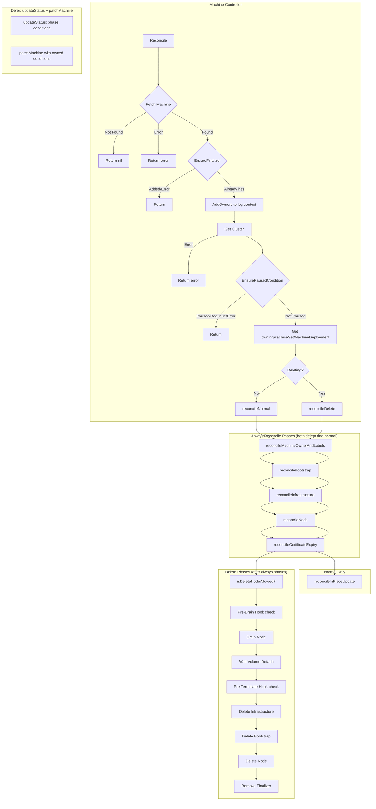
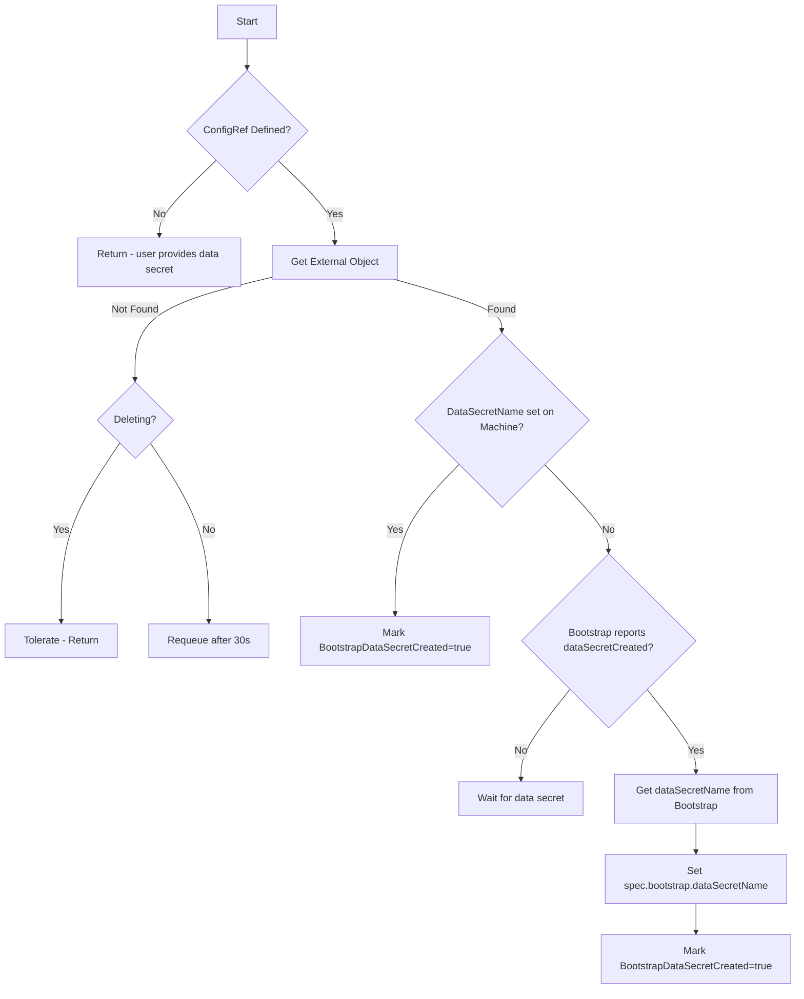
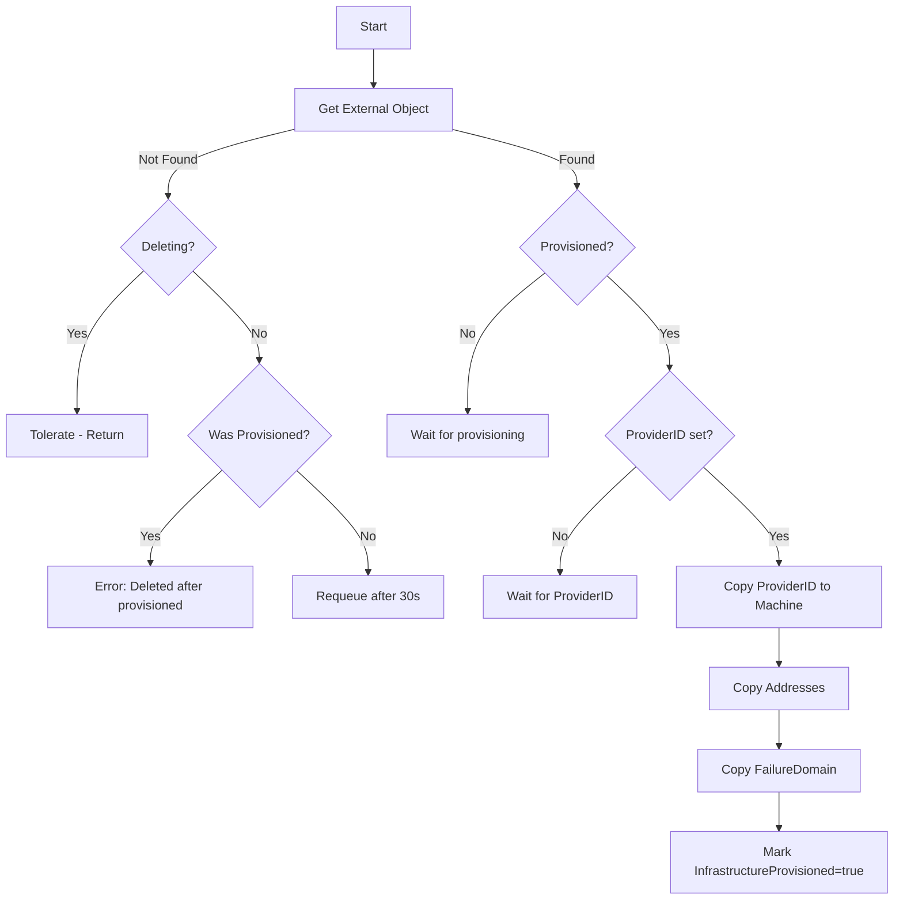
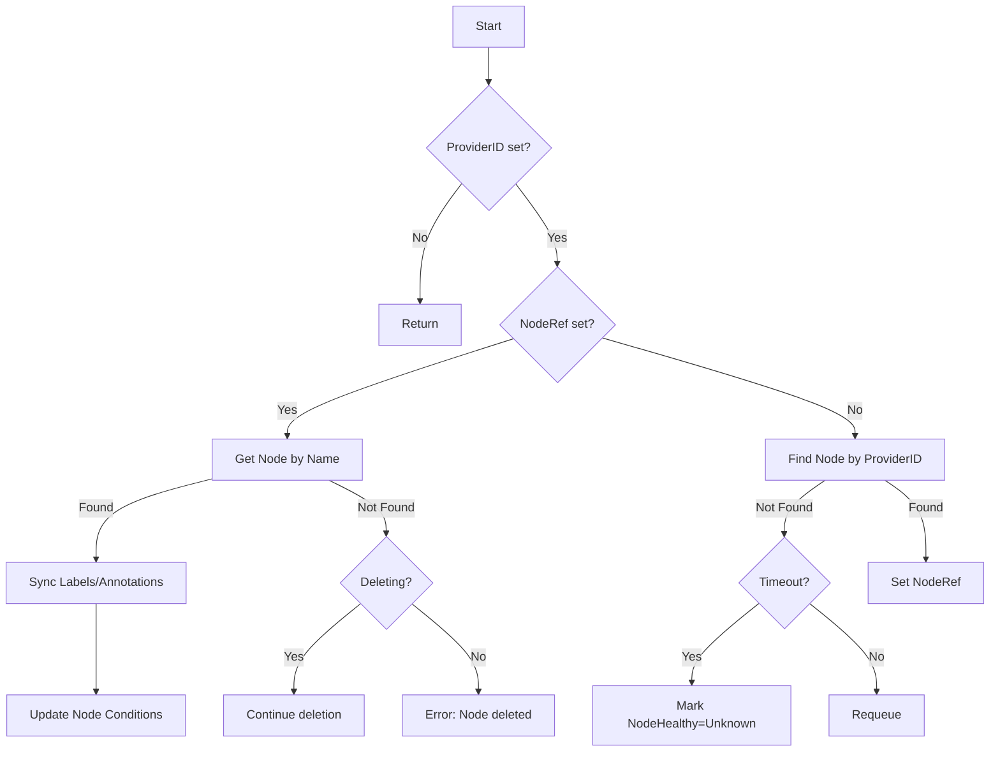
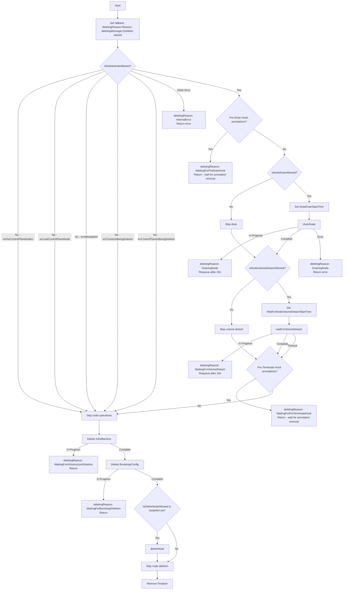
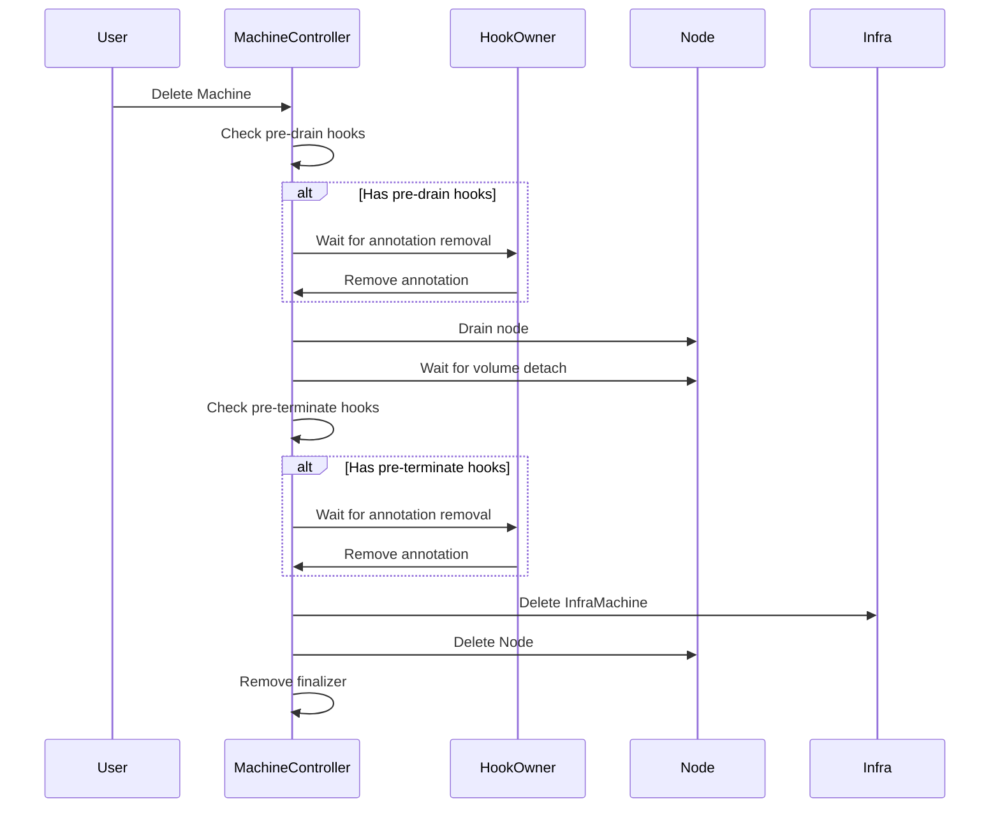

# Machine Controller

The Machine Controller manages the lifecycle of individual `Machine` resources, coordinating bootstrap configuration, infrastructure provisioning, node association, and machine deletion with proper cleanup.

## Overview

## Reconciliation Phases

### 1. reconcileBootstrap

Reconciles the `spec.bootstrap.configRef` object.

### 2. reconcileInfrastructure

Reconciles the `spec.infrastructureRef` object.

### 3. reconcileNode

Associates the Machine with a Kubernetes Node.

### 4. reconcileDelete

Handles machine deletion with ordered cleanup.

## KRTT - Kubernetes Reconciler Transition Table

### Normal Reconciliation

| Observed Status | Desired Spec | Trigger / Condition | Reconciliation Action | Resulting Status |
|:---|:---|:---|:---|:---|
| Machine not found | - | Object deleted | Return nil (no-op) | - |
| Machine without finalizer | Any | Object fetched | Add `machine.cluster.x-k8s.io` finalizer, return | Machine with finalizer |
| Machine paused | Any | Paused annotation or Cluster paused | `EnsurePausedCondition` sets condition | Paused=True |
| Stand-alone machine | No MachineSet owner | First reconcile | Set Cluster as owner reference | Machine has Cluster owner |
| Phase=Pending | Bootstrap.ConfigRef defined | Initial creation | Get bootstrap object, set owner ref, watch | BootstrapConfigReady mirrors bootstrap |
| BootstrapReady=False | ConfigRef defined | Bootstrap created | Wait for dataSecretCreated | BootstrapReady=False |
| BootstrapReady=False | ConfigRef defined | dataSecretCreated=true on bootstrap | Get dataSecretName, set on Machine.spec | BootstrapDataSecretCreated=True |
| InfrastructureReady=False | InfraRef defined | Bootstrap ready | Get infra object, set owner ref, watch | InfrastructureReady mirrors infra |
| InfrastructureReady=False | InfraRef defined | Infra provisioned=true | Wait for ProviderID and addresses | InfrastructureReady=False |
| InfrastructureReady=False | InfraRef defined | ProviderID set | Copy ProviderID, addresses, failureDomain | InfrastructureProvisioned=True |
| NodeRef=nil | ProviderID set | Infra ready | Find node by ProviderID via ClusterCache | NodeRef set if found |
| NodeRef set | - | Node exists | Sync labels/annotations to node | NodeReady/NodeHealthy updated |
| Phase=Provisioning | All ready | Node associated | setPhase in updateStatus | Phase=Running |

### Deletion Reconciliation

| Observed Status | Desired Spec | Trigger / Condition | Reconciliation Action | Resulting Status |
|:---|:---|:---|:---|:---|
| DeletionTimestamp!=nil | - | User deletes Machine | Run alwaysReconcile phases first, then reconcileDelete | Deleting=True (default reason) |
| isDeleteNodeAllowed=false | - | errNoControlPlaneNodes/errLastControlPlaneNode/etc | Skip node operations (drain, volume detach, node delete) | Continue to infra delete |
| Has pre-drain hook annotation | - | Annotation with prefix `pre-drain.delete.hook.machine` | Wait for hook owner to remove annotation | Deleting reason=WaitingForPreDrainHook |
| No pre-drain hooks | NodeRef set | isNodeDrainAllowed=true | Set NodeDrainStartTime, start node drain | DrainingSucceeded=False |
| Draining in progress | - | Pods being evicted | Continue draining, handle timeouts per MachineDrainRules | Deleting reason=DrainingNode |
| Draining complete | - | All pods evicted/skipped | Mark DrainingSucceeded=True | DrainingSucceeded=True |
| isNodeVolumeDetachAllowed=true | - | Drain complete | Set WaitForNodeVolumeDetachStartTime, wait for volumes | Deleting reason=WaitingForVolumeDetach |
| Waiting for volumes | - | CSI volumes still attached | Wait for volume detachment with timeout | Deleting reason=WaitingForVolumeDetach |
| Volumes detached or timeout | - | All volumes detached OR timeout exceeded | Check pre-terminate hooks | VolumeDetachSucceeded=True |
| Has pre-terminate hook annotation | - | Annotation with prefix `pre-terminate.delete.hook.machine` | Wait for hook owner to remove annotation | Deleting reason=WaitingForPreTerminateHook |
| No pre-terminate hooks | InfraRef exists | Pre-terminate complete | Delete infrastructure object | Deleting reason=WaitingForInfrastructureDeletion |
| Infra deleted | Bootstrap.ConfigRef exists | Infra gone | Delete bootstrap config | Deleting reason=WaitingForBootstrapDeletion |
| Bootstrap deleted | NodeRef set & allowed | Bootstrap gone | Delete Kubernetes node (with retry) | Deleting reason=DeletingNode |
| Node deleted | - | Node gone or not allowed | Remove finalizer | Object deleted by GC |

### Error Handling

| Observed Status | Desired Spec | Trigger / Condition | Reconciliation Action | Resulting Status |
|:---|:---|:---|:---|:---|
| InfrastructureProvisioned=true | InfraRef defined | Infra object not found | Set FailureReason, return error | FailureReason=InvalidConfiguration |
| NodeRef set | - | Node not found (not deleting) | Set FailureMessage | NodeHealthy=Unknown |
| Any | - | Drain timeout exceeded | Skip remaining drain | Continue to volume detach |
| Any | - | Volume detach timeout exceeded | Skip volume wait | Continue to pre-terminate |
| Any | - | Node deletion timeout exceeded | Skip node deletion | Remove finalizer anyway |
| Any | - | Generic API error | Requeue with error | Error logged, requeue |

## Status Fields

| Field | Description |
|-------|-------------|
| `status.phase` | Current phase: Pending, Provisioning, Running, Deleting, Failed |
| `status.nodeRef` | Reference to the associated Kubernetes Node |
| `status.addresses` | Machine addresses from infrastructure |
| `status.initialization.bootstrapDataSecretCreated` | Whether bootstrap data secret exists |
| `status.initialization.infrastructureProvisioned` | Whether infrastructure is provisioned |
| `status.certificatesExpiryDate` | Expiry date of machine certificates (control plane) |
| `status.deletion.nodeDrainStartTime` | When node drain started |
| `status.deletion.waitForNodeVolumeDetachStartTime` | When volume detach wait started |

## Conditions

### V1Beta2 Conditions

| Condition | Description |
|-----------|-------------|
| `BootstrapConfigReady` | Mirrors bootstrap config's Ready condition |
| `InfrastructureReady` | Mirrors infrastructure machine's Ready condition |
| `NodeReady` | Mirrors the Node's Ready condition |
| `NodeHealthy` | Overall node health based on multiple node conditions |
| `Deleting` | Set during deletion with progress details |
| `Updating` | Set during in-place updates (if feature enabled) |
| `UpToDate` | Whether machine matches desired spec |
| `Ready` | Summary of all conditions |
| `Available` | Whether machine is available for workloads |
| `Paused` | Set when machine or cluster is paused |

### V1Beta1 Conditions (Deprecated)

| Condition | Description |
|-----------|-------------|
| `Ready` | Summary condition with step counter during provisioning |
| `BootstrapReady` | Mirrors bootstrap config Ready state |
| `InfrastructureReady` | Mirrors infrastructure Ready state |
| `DrainingSucceeded` | Whether node drain completed successfully |
| `MachineHealthCheckSucceeded` | Set by MachineHealthCheck controller |
| `MachineOwnerRemediated` | Signals owner to remediate machine |

## Deletion Lifecycle Hooks

The Machine controller supports lifecycle hooks during deletion:

### Hook Annotations

| Annotation Prefix | Phase | Description |
|------------------|-------|-------------|
| `pre-drain.delete.hook.machine.cluster.x-k8s.io/` | Before drain | Blocks node drain until removed |
| `pre-terminate.delete.hook.machine.cluster.x-k8s.io/` | Before infra delete | Blocks infrastructure deletion until removed |

## Watches

The Machine controller watches:

1. **Machine** - Primary resource
2. **Cluster** - For pause propagation and control plane initialization
3. **MachineSet** - For owner relationship
4. **MachineDeployment** - For owner relationship
5. **ClusterCache** - For workload cluster connection (node operations)

---

[← Back to Index](README.md) | [Previous: Cluster Controller](cluster_controller.md) | [Next: MachineSet Controller →](machineset_controller.md)
