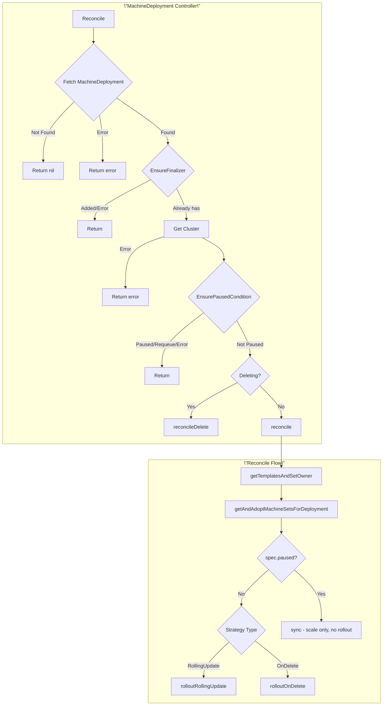
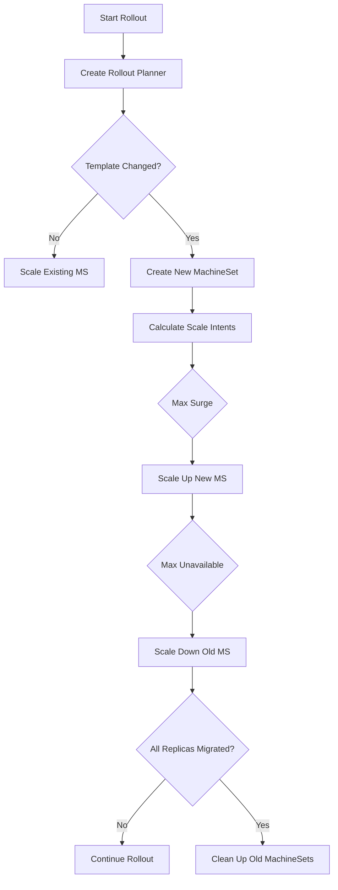
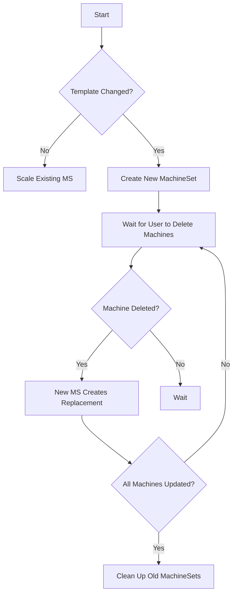
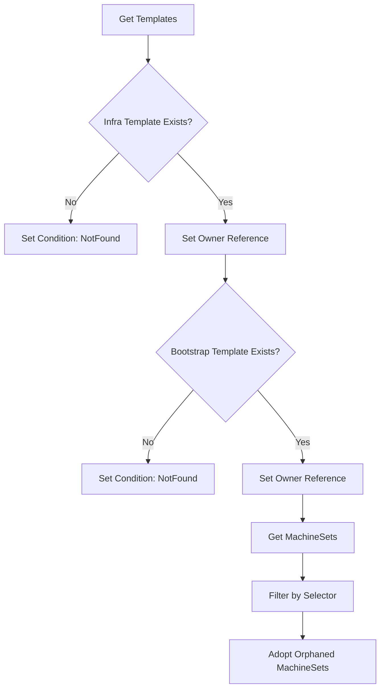
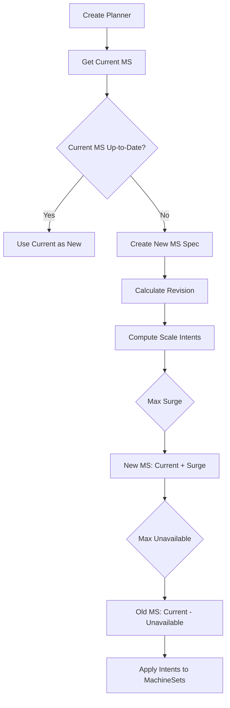
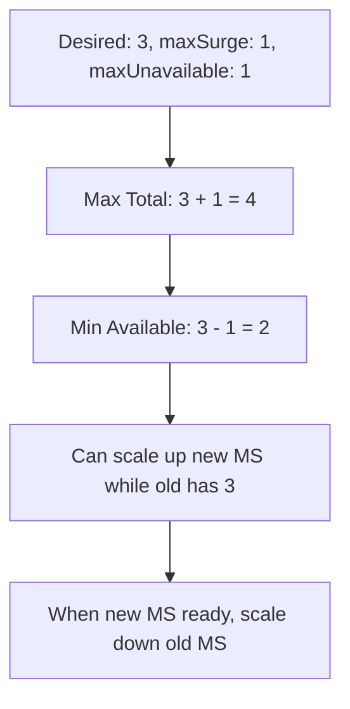
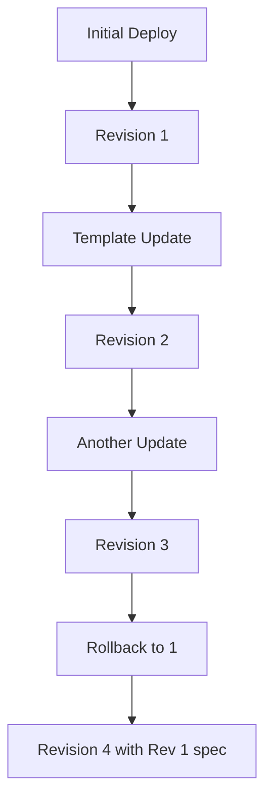

# MachineDeployment Controller

The MachineDeployment Controller manages `MachineDeployment` resources, implementing rollout strategies (RollingUpdate, OnDelete) to update machines in a controlled manner.

## Overview



## Rollout Strategies

### RollingUpdate Strategy



### OnDelete Strategy



## Reconciliation Details

### Template and MachineSet Management



### Rollout Planner Logic



## KRTT - Kubernetes Reconciler Transition Table

### Normal Reconciliation - RollingUpdate

| Observed Status | Desired Spec | Trigger / Condition | Reconciliation Action | Resulting Status |
|:---|:---|:---|:---|:---|
| No MachineSets | Replicas=3 | Initial creation | Create MachineSet with 3 replicas | RollingOut=False, Replicas=0→3 |
| 1 MS, Replicas=3 | Replicas=5 | User scales up | Update MachineSet replicas to 5 | ScalingUp=True |
| 1 MS, Replicas=5 | Replicas=3 | User scales down | Update MachineSet replicas to 3 | ScalingDown=True |
| 1 MS, Replicas=3 | Template changed | User updates template | Create new MS, start rollout | RollingOut=True |
| Old MS=3, New MS=0 | maxSurge=1 | Rollout started | Scale new MS to 1 | New MS Replicas=1 |
| Old MS=3, New MS=1 | maxUnavailable=1 | New machine ready | Scale old MS to 2 | Old MS Replicas=2 |
| Old MS=0, New MS=3 | - | Rollout complete | Clean up old MachineSet | RollingOut=False |

### Normal Reconciliation - OnDelete

| Observed Status | Desired Spec | Trigger / Condition | Reconciliation Action | Resulting Status |
|:---|:---|:---|:---|:---|
| 1 MS, Replicas=3 | Template changed | User updates template | Create new MS with 0 replicas | NewMS created |
| Old MS=3, New MS=0 | - | User deletes old machine | Old MS creates replacement in new MS | New MS Replicas=1 |
| Old MS=2, New MS=1 | - | User continues deleting | Continue migration | Progressive update |
| Old MS=0, New MS=3 | - | All machines migrated | Delete old MachineSet | RollingOut=False |

### Deletion Reconciliation

| Observed Status | Desired Spec | Trigger / Condition | Reconciliation Action | Resulting Status |
|:---|:---|:---|:---|:---|
| DeletionTimestamp!=nil | - | User deletes MD | Delete all owned MachineSets | Deleting=True |
| Has owned MachineSets | - | MachineSets still exist | Wait for MS deletion | Deleting=True |
| No owned MachineSets | - | All MS gone | Remove finalizer | Object deleted by GC |

### Error Handling

| Observed Status | Desired Spec | Trigger / Condition | Reconciliation Action | Resulting Status |
|:---|:---|:---|:---|:---|
| Template not found | Rollout requested | Template missing | Block rollout, set condition | Available=False |
| MachineSet creation failed | Rollout requested | API error | Log error, requeue | Error logged |
| Any | - | Generic API error | Requeue with error | Error logged, requeue |

## RollingUpdate Parameters

```yaml
spec:
  rollout:
    strategy:
      type: RollingUpdate
      rollingUpdate:
        maxSurge: 1          # Max machines above desired during rollout
        maxUnavailable: 0    # Max machines below desired during rollout
        deletePolicy: Oldest # Which machines to delete first
```

### MaxSurge and MaxUnavailable Calculation



## Status Fields

| Field | Description |
|-------|-------------|
| `status.replicas` | Total replicas across all MachineSets |
| `status.readyReplicas` | Ready replicas across all MachineSets |
| `status.availableReplicas` | Available replicas across all MachineSets |
| `status.upToDateReplicas` | Replicas matching current template |
| `status.unavailableReplicas` | Unavailable replicas |
| `status.selector` | Label selector in string form |

## Conditions

| Condition | Description |
|-----------|-------------|
| `Available` | Whether minimum available replicas are met |
| `MachinesReady` | Aggregated ready state of all machines |
| `MachinesUpToDate` | Whether all machines match current template |
| `RollingOut` | Whether a rollout is in progress |
| `ScalingUp` | Whether scaling up |
| `ScalingDown` | Whether scaling down |
| `Remediating` | Whether unhealthy machines are being remediated |
| `Deleting` | Set during deletion |

## Revision Management

MachineDeployments track revisions through annotations:

| Annotation | Description |
|------------|-------------|
| `deployment.cluster.x-k8s.io/revision` | Current revision number |
| `deployment.cluster.x-k8s.io/revision-history` | Previous revision numbers |



## MachineSet Naming

MachineSets created by MachineDeployment use a hash-based naming scheme:

```
<machinedeployment-name>-<template-hash>
```

The template hash ensures:
- Unique name per template version
- Consistent naming across reconciliations
- Easy identification of current vs old MachineSets

---

[← Back to Index](README.md) | [Previous: MachineSet Controller](machineset_controller.md) | [Next: MachinePool Controller →](machinepool_controller.md)
