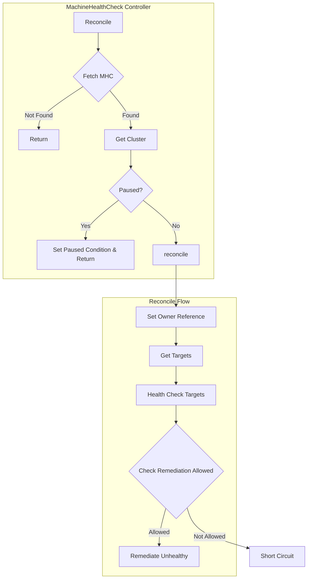
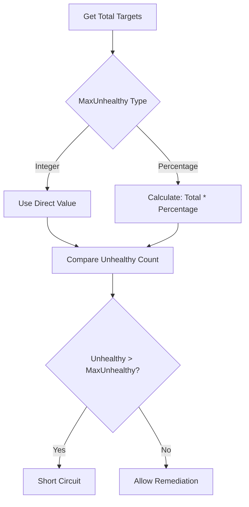

# MachineHealthCheck Controller

The MachineHealthCheck Controller monitors the health of machines and triggers remediation when machines become unhealthy based on configurable health checks.

## Overview



## Health Checking Flow


## Remediation Logic


## KRTT - Kubernetes Reconciler Transition Table

### Health Checking

| Observed Status | Desired Spec | Trigger / Condition | Reconciliation Action | Resulting Status |
|:---|:---|:---|:---|:---|
| Machine without NodeRef | - | NodeStartupTimeout not exceeded | Wait for node association | HealthCheckSucceeded=Unknown |
| Machine without NodeRef | - | NodeStartupTimeout exceeded | Mark machine unhealthy | HealthCheckSucceeded=False |
| Machine with NodeRef | - | Node not found | Mark machine unhealthy | HealthCheckSucceeded=False |
| Machine with NodeRef | - | Node Ready=True | Mark machine healthy | HealthCheckSucceeded=True |
| Machine with NodeRef | - | Node Ready=False, timeout not exceeded | Wait for node recovery | HealthCheckSucceeded=Unknown |
| Machine with NodeRef | - | Node Ready=False, timeout exceeded | Mark machine unhealthy | HealthCheckSucceeded=False |

### Remediation Decision

| Observed Status | Desired Spec | Trigger / Condition | Reconciliation Action | Resulting Status |
|:---|:---|:---|:---|:---|
| Unhealthy count ≤ maxUnhealthy | unhealthyLessThanOrEqualTo set | Within threshold | Allow remediation | RemediationAllowed=True |
| Unhealthy count > maxUnhealthy | unhealthyLessThanOrEqualTo set | Over threshold | Short circuit | RemediationAllowed=False |
| Unhealthy count in range | unhealthyInRange set | Within range | Allow remediation | RemediationAllowed=True |
| Unhealthy count not in range | unhealthyInRange set | Outside range | Short circuit | RemediationAllowed=False |

### Remediation Execution

| Observed Status | Desired Spec | Trigger / Condition | Reconciliation Action | Resulting Status |
|:---|:---|:---|:---|:---|
| Machine unhealthy | Remediation allowed | No owner controller | Delete machine directly | Machine deleted |
| Machine unhealthy | Remediation allowed | Has MachineSet owner | Set MachineOwnerRemediated condition | Owner handles deletion |
| Machine unhealthy | Remediation allowed | Has ControlPlane owner | Set MachineOwnerRemediated condition | Owner handles deletion |
| Machine unhealthy | External remediation | ExternalRemediationTemplate set | Create remediation request | External controller handles |

### Error Handling

| Observed Status | Desired Spec | Trigger / Condition | Reconciliation Action | Resulting Status |
|:---|:---|:---|:---|:---|
| Can't get cluster | - | Cluster not found | Log error, requeue | Error logged |
| Can't list machines | - | API error | Log error, requeue | Error logged |
| Can't get node | - | Remote cluster error | Mark node as unavailable | NodeHealthy=Unknown |

## Health Check Configuration

```yaml
apiVersion: cluster.x-k8s.io/v1beta2
kind: MachineHealthCheck
metadata:
  name: my-mhc
  namespace: default
spec:
  clusterName: my-cluster
  selector:
    matchLabels:
      cluster.x-k8s.io/deployment-name: my-deployment
  
  # Node startup timeout (v1beta2 structure)
  nodeStartupTimeout: 5m
  
  # Unhealthy conditions to check
  unhealthyConditions:
    - type: Ready
      status: "False"
      timeout: 5m
    - type: Ready
      status: "Unknown"
      timeout: 5m
  
  # Remediation threshold using triggerIf
  triggerIf:
    unhealthyLessThanOrEqualTo: "100%"  # Short-circuit threshold
    # OR use unhealthyInRange for range-based threshold
    # unhealthyInRange: "0-40%"
  
  # Optional: External remediation template
  remediationTemplate:
    apiVersion: infrastructure.cluster.x-k8s.io/v1beta2
    kind: MyRemediationTemplate
    name: my-remediation-template
```

## MaxUnhealthy Calculation



## External Remediation

When `spec.remediationTemplate` is set, the controller creates external remediation requests:


## Status Fields

| Field | Description |
|-------|-------------|
| `status.expectedMachines` | Total machines matching selector |
| `status.currentHealthy` | Number of healthy machines |
| `status.remediationsAllowed` | Number of remediations currently allowed |
| `status.targets` | List of machine names being monitored |

## Conditions

| Condition | Description |
|-----------|-------------|
| `RemediationAllowed` | Whether remediation is currently permitted |

### Machine Conditions Set by MHC

| Condition | Description |
|-----------|-------------|
| `HealthCheckSucceeded` | Whether health check passed |
| `MachineOwnerRemediated` | Signals owner to remediate machine |

## Target Selection

Machines are selected using a label selector:

```yaml
spec:
  selector:
    matchLabels:
      cluster.x-k8s.io/deployment-name: my-md
    matchExpressions:
      - key: node-role.kubernetes.io/control-plane
        operator: DoesNotExist
```

## Unhealthy Conditions

The MHC checks multiple node conditions:


## Watches

The MachineHealthCheck controller watches:

1. **MachineHealthCheck** - Primary resource
2. **Machine** - Machines matching the selector
3. **Cluster** - For pause propagation
4. **Node** (remote) - For health status

---

[← Back to Index](README.md) | [Previous: MachinePool Controller](machinepool_controller.md) | [Next: ClusterClass Controller →](clusterclass_controller.md)
