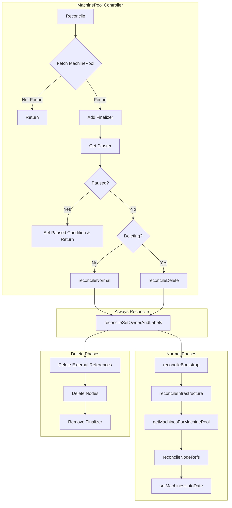
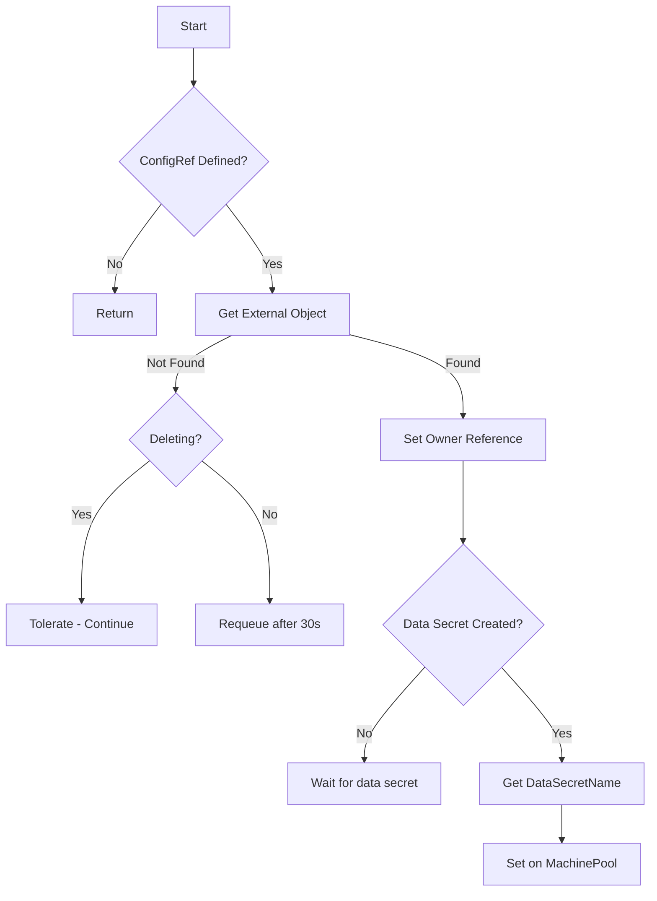
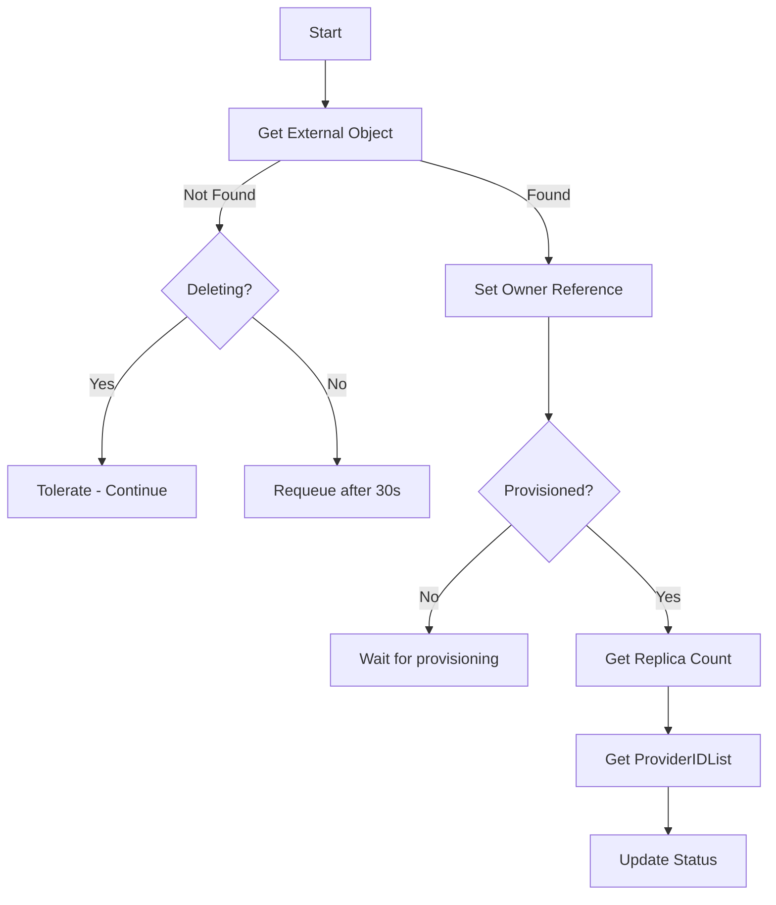
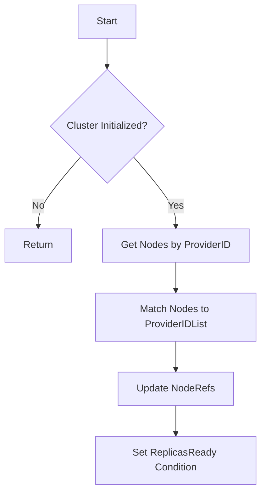
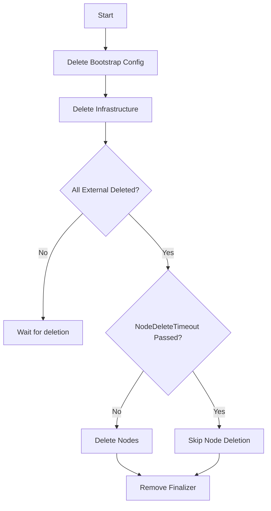
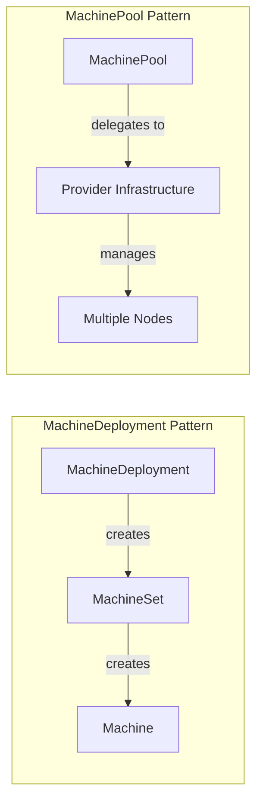
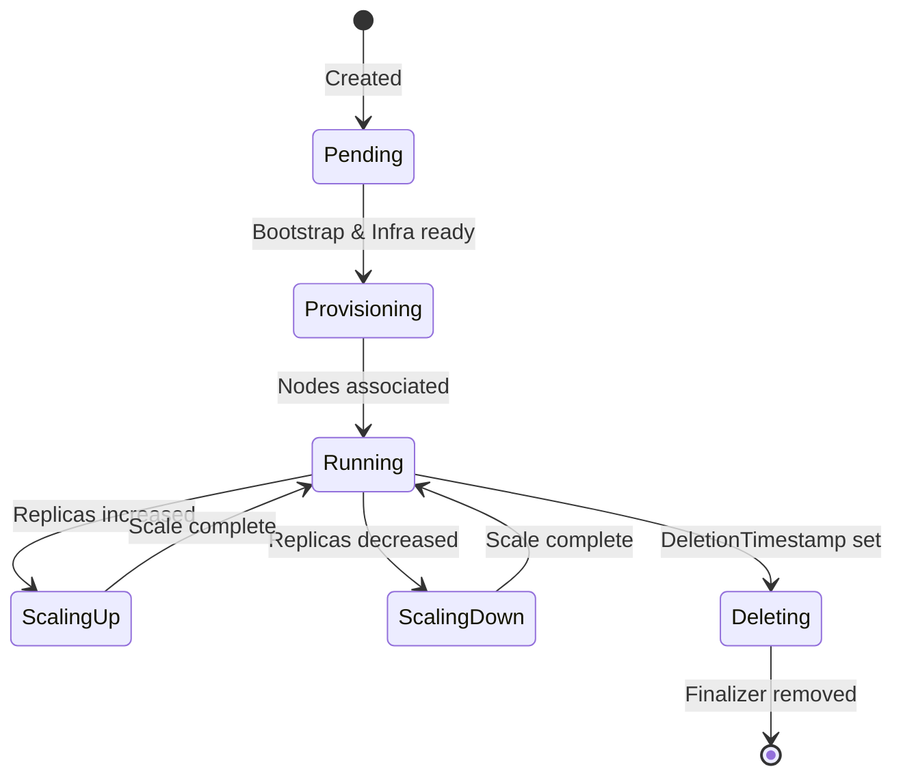

# MachinePool Controller

The MachinePool Controller manages `MachinePool` resources, which represent a pool of machines that are managed by a provider-specific autoscaler or scaling mechanism.

## Overview

## Reconciliation Phases

### 1. reconcileBootstrap

Reconciles the bootstrap configuration for the MachinePool.

### 2. reconcileInfrastructure

Reconciles the infrastructure reference for the MachinePool.

### 3. reconcileNodeRefs

Associates MachinePool with Kubernetes Nodes.

### 4. reconcileDelete

Handles MachinePool deletion.

## KRTT - Kubernetes Reconciler Transition Table

### Normal Reconciliation

| Observed Status | Desired Spec | Trigger / Condition | Reconciliation Action | Resulting Status |
|:---|:---|:---|:---|:---|
| Phase=Pending | Bootstrap.ConfigRef defined | Initial creation | Get bootstrap object, set owner ref | BootstrapReady mirrors bootstrap |
| BootstrapReady=False | ConfigRef defined | Bootstrap created | Wait for dataSecretCreated | BootstrapReady=False |
| BootstrapReady=True | InfraRef defined | Data secret ready | Get infra object, set owner ref | InfrastructureReady mirrors infra |
| InfrastructureReady=False | InfraRef defined | Infra created | Wait for provisioned=true | InfrastructureReady=False |
| InfrastructureReady=True | - | Infra provisioned | Get ProviderIDList, replica counts | Phase=Provisioning |
| NodeRefs=[] | ProviderIDList set | Infra ready | Find nodes by ProviderID | NodeRefs populated |
| Phase=Provisioning | All nodes associated | Nodes found | Update status | Phase=Running |
| Replicas < Desired | Desired replicas | Scale up request | Infrastructure handles scaling | Replicas increasing |
| Replicas > Desired | Desired replicas | Scale down request | Infrastructure handles scaling | Replicas decreasing |

### Deletion Reconciliation

| Observed Status | Desired Spec | Trigger / Condition | Reconciliation Action | Resulting Status |
|:---|:---|:---|:---|:---|
| DeletionTimestamp!=nil | - | User deletes MachinePool | Delete external references | External deletion started |
| External exists | - | Waiting for deletion | Wait for bootstrap/infra deletion | Continue waiting |
| External deleted | NodeRefs exist | External gone | Delete associated nodes | Nodes being deleted |
| Nodes deleted | - | All cleanup done | Remove finalizer | Object deleted by GC |
| NodeDeleteTimeout passed | - | Timeout exceeded | Skip node deletion | Remove finalizer |

### Error Handling

| Observed Status | Desired Spec | Trigger / Condition | Reconciliation Action | Resulting Status |
|:---|:---|:---|:---|:---|
| Bootstrap not found | ConfigRef defined | Bootstrap missing | Requeue after 30s | BootstrapReady=False |
| Infra not found | InfraRef defined | Infra missing | Requeue after 30s | InfrastructureReady=False |
| Node not found | ProviderID set | Node missing | Remove from NodeRefs | NodeRefs updated |
| Any | - | Generic API error | Requeue with error | Error logged, requeue |

## Key Differences from Machine/MachineSet

Key differences:
- **MachinePool**: Provider handles scaling, single resource manages multiple nodes
- **MachineSet**: CAPI handles scaling, one Machine per node

## Status Fields

| Field | Description |
|-------|-------------|
| `status.replicas` | Current number of replicas |
| `status.readyReplicas` | Number of ready replicas |
| `status.availableReplicas` | Number of available replicas |
| `status.upToDateReplicas` | Number of up-to-date replicas |
| `status.nodeRefs` | References to associated Kubernetes nodes |
| `status.phase` | Current phase: Pending, Provisioning, Running, etc. |

## Conditions

| Condition | Description |
|-----------|-------------|
| `BootstrapReady` | Mirrors bootstrap config's Ready condition |
| `InfrastructureReady` | Mirrors infrastructure's Ready condition |
| `ReplicasReady` | Whether all replicas are ready |
| `Ready` | Summary of all conditions |

## Phases

## Watches

The MachinePool controller watches:

1. **MachinePool** - Primary resource
2. **Cluster** - For pause propagation and cluster state
3. **Node** (remote) - For node association

---

[← Back to Index](README.md) | [Previous: MachineDeployment Controller](machinedeployment_controller.md) | [Next: MachineHealthCheck Controller →](machinehealthcheck_controller.md)
