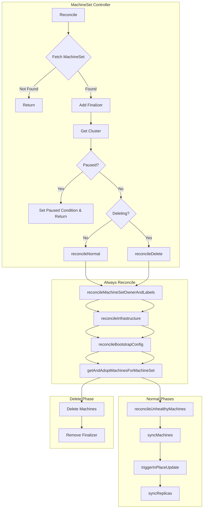
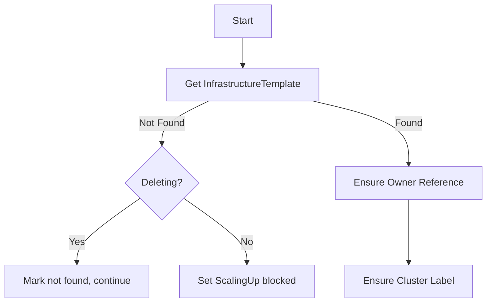
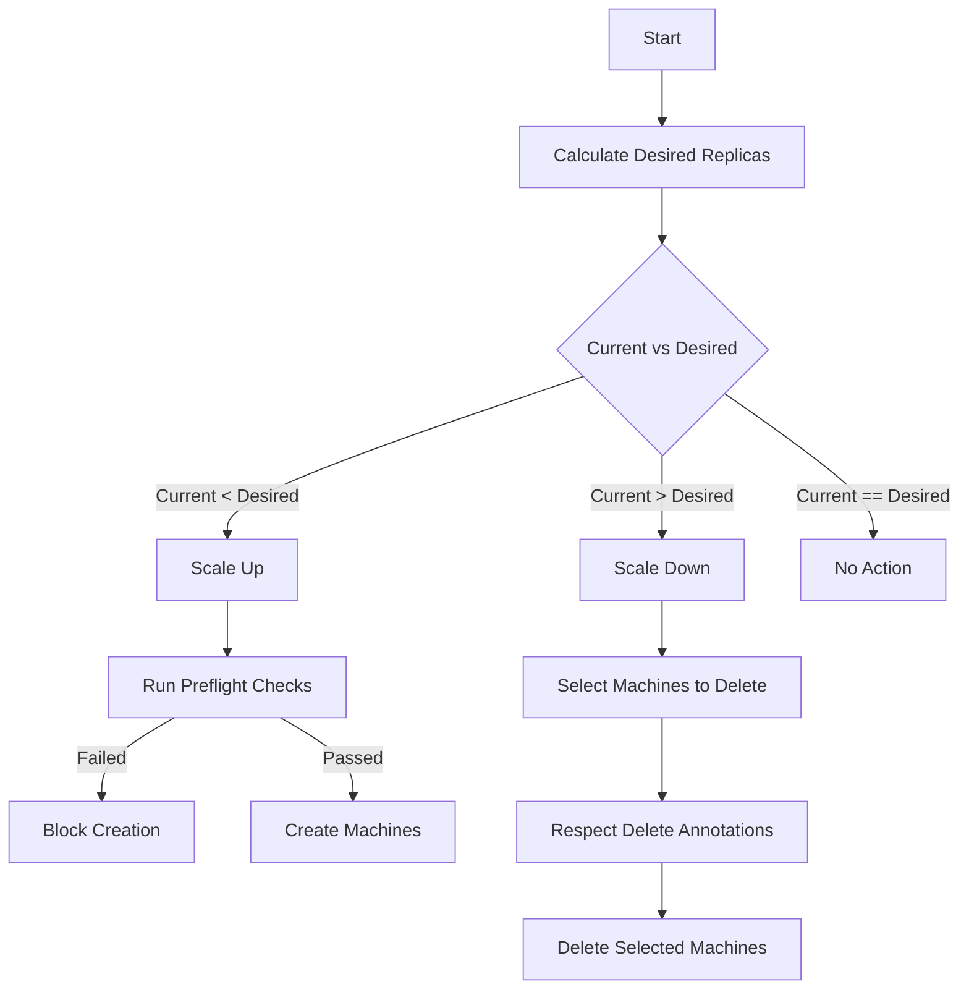
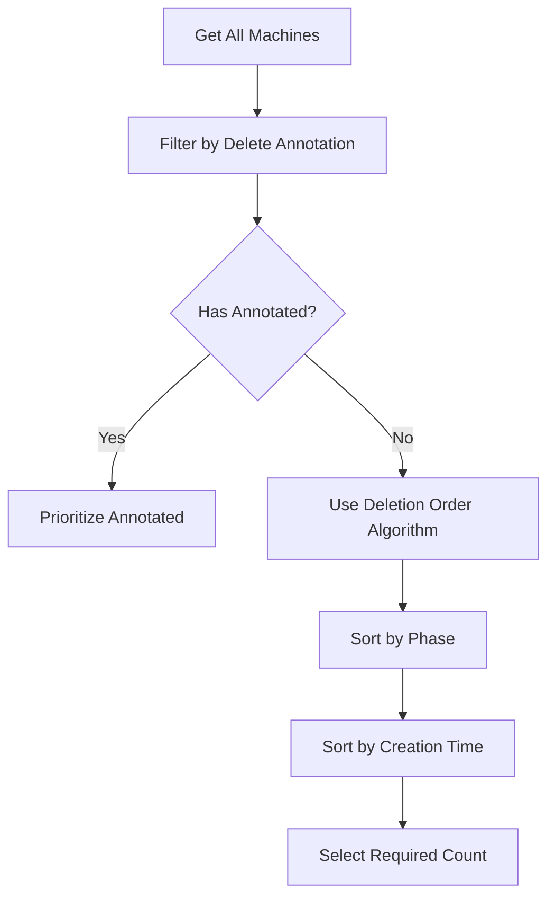
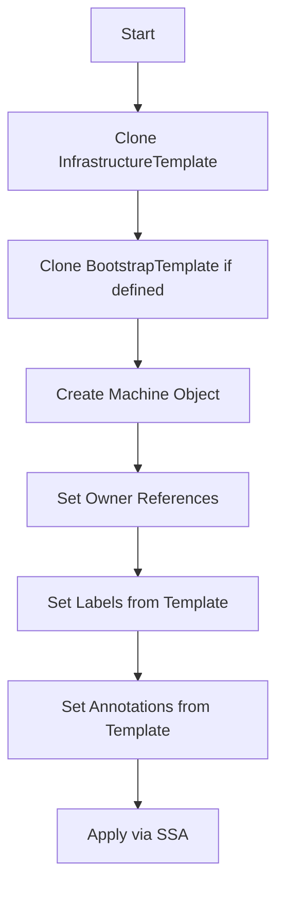
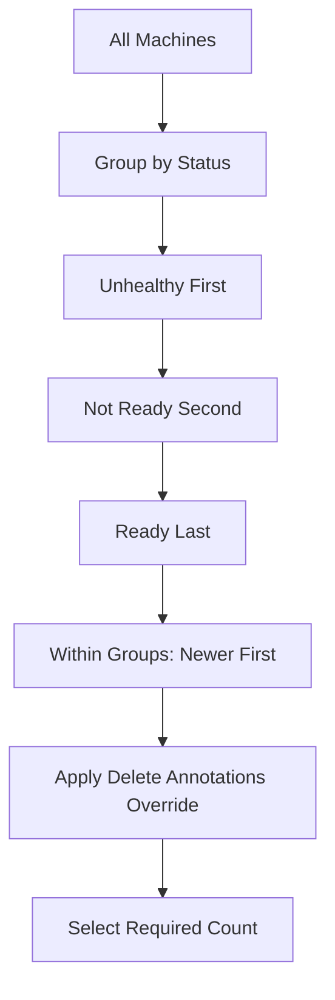

# MachineSet Controller

The MachineSet Controller manages `MachineSet` resources, ensuring the desired number of Machine replicas exist and handling machine creation, deletion, and updates.

## Overview



## Reconciliation Phases

### 1. reconcileInfrastructure

Ensures the infrastructure template exists and is properly owned.



### 2. syncReplicas

The core replica management logic.



### 3. Machine Selection for Deletion



## KRTT - Kubernetes Reconciler Transition Table

### Normal Reconciliation

| Observed Status | Desired Spec | Trigger / Condition | Reconciliation Action | Resulting Status |
|:---|:---|:---|:---|:---|
| Replicas=0 | Replicas=3 | Initial creation | Run preflight checks, create 3 Machines | ScalingUp=True, Replicas=0→3 |
| Replicas=1, ReadyReplicas=0 | Replicas=3 | Machine created but not ready | Wait for machines to become ready | ScalingUp=True |
| Replicas=3, ReadyReplicas=3 | Replicas=3 | All machines ready | Update replica counters | ScalingUp=False, AvailableReplicas=3 |
| Replicas=3 | Replicas=5 | User scales up | Create 2 new Machines | ScalingUp=True |
| Replicas=5 | Replicas=3 | User scales down | Select 2 Machines for deletion, delete them | ScalingDown=True |
| Replicas=3 | Replicas=3, Template changed | Template update | Wait for MachineDeployment to handle rollout | MachinesUpToDate=False |
| Has unhealthy machines | - | MHC marks machine | Delete machine if owner remediated | Remediating=True |

### Preflight Checks (Scale Up)

| Observed Status | Desired Spec | Trigger / Condition | Reconciliation Action | Resulting Status |
|:---|:---|:---|:---|:---|
| Templates exist | Scale up requested | Preflight: ControlPlaneIsStable | Check CP available replicas >= desired | ScalingUp blocked if CP not stable |
| Templates exist | Scale up requested | Preflight: KubeadmVersionSkew | Check version skew < 2 minor versions | ScalingUp blocked if skew too large |
| Templates exist | Scale up requested | Preflight: KubernetesVersionSkew | Check Kubernetes version compatibility | ScalingUp blocked if incompatible |
| All checks pass | Scale up requested | All preflights passed | Proceed with Machine creation | ScalingUp=True |

### Deletion Reconciliation

| Observed Status | Desired Spec | Trigger / Condition | Reconciliation Action | Resulting Status |
|:---|:---|:---|:---|:---|
| DeletionTimestamp!=nil | - | User deletes MachineSet | Delete all owned Machines | Deleting=True |
| Has owned Machines | - | Machines still exist | Wait for Machines to be deleted | Deleting=True |
| No owned Machines | - | All Machines gone | Remove finalizer | Object deleted by GC |

### Error Handling

| Observed Status | Desired Spec | Trigger / Condition | Reconciliation Action | Resulting Status |
|:---|:---|:---|:---|:---|
| InfraTemplate not found | Scale up requested | Template missing | Block scale up, set condition | MachinesCreated=False |
| BootstrapTemplate not found | Scale up requested | Template missing | Block scale up, set condition | MachinesCreated=False |
| Machine creation failed | Scale up requested | API error | Log error, continue with remaining | Partial creation |
| Any | - | Generic API error | Requeue with error | Error logged, requeue |

## Machine Creation

When creating new Machines, the controller:



### Machine Naming

Machines are named using a hash-based suffix to ensure uniqueness:

```
<machineset-name>-<random-suffix>
```

## Deletion Order Algorithm

The MachineSet controller uses a sophisticated algorithm to select machines for deletion:



Priority order for deletion:
1. Machines with `cluster.x-k8s.io/delete-machine` annotation
2. Machines in Failed phase
3. Machines in Deleting phase
4. Machines without NodeRef
5. Machines with NodeRef but not Ready
6. Machines by creation timestamp (newer first)

## Status Fields

| Field | Description |
|-------|-------------|
| `status.replicas` | Total number of non-terminated machines |
| `status.readyReplicas` | Number of machines with Ready=True |
| `status.availableReplicas` | Number of available machines |
| `status.upToDateReplicas` | Number of machines matching current template |
| `status.selector` | Label selector in string form |

## Conditions

| Condition | Description |
|-----------|-------------|
| `MachinesCreated` | Whether machine creation is proceeding successfully |
| `MachinesReady` | Aggregated ready state of all machines |
| `MachinesUpToDate` | Whether all machines match the current template |
| `ScalingUp` | Whether the MachineSet is scaling up |
| `ScalingDown` | Whether the MachineSet is scaling down |
| `Remediating` | Whether unhealthy machines are being remediated |
| `Deleting` | Set during MachineSet deletion |

## Watches

The MachineSet controller watches:

1. **MachineSet** - Primary resource
2. **Machine** - Owned machines
3. **Cluster** - For pause propagation
4. **MachineDeployment** - For owner relationship

---

[← Back to Index](README.md) | [Previous: Machine Controller](machine_controller.md) | [Next: MachineDeployment Controller →](machinedeployment_controller.md)
